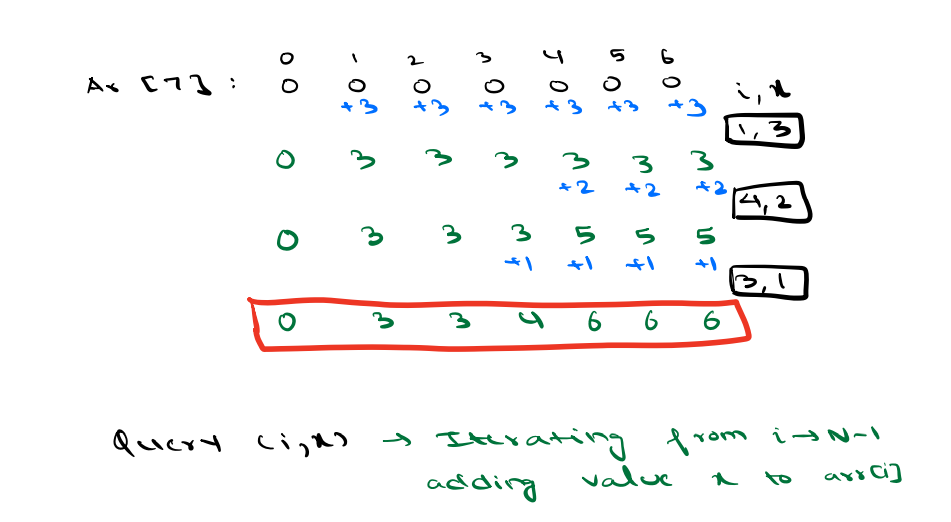
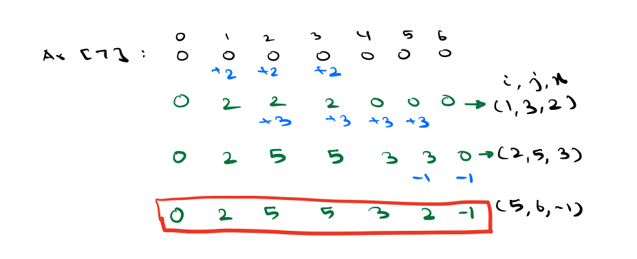
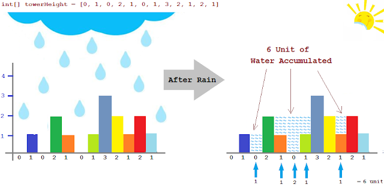

## Advance DSA Day 1 Arrays : 1 Dimensional

## Scope / Agenda
- [Maximum Subarray sum](#maximum-subarray-sum)
- [Queries 1](#queries-1)
- [Queries 2](#queries-2)
- [RainWater Trapping](#rainwater-trapping)
  

## Problems and solutions

1. [Assignments](../../../../problems/src/main/java/com/learning/scaler/advance/module1/array1d/assignment/)
2. [Additional Problems](../../../../problems/src/main/java/com/learning/scaler/advance/module1/array1d/additional/)
3. [Self Practise Problems](../../../../problems/src/main/java/com/learning/scaler/advance/module1/array1d/lecture/)

## Class Notes and Videos

1. [Class Notes](../../../class_Notes/Advance%20DSA%20Notes/1.%20Adv%20Arrays%201%20Dimesional(25-09-23).pdf)
2. [Class/lecture Video](https://www.youtube.com/watch?v=Z1tIb4Y4XVs)


## Maximum Subarray sum
    Problem Description
        Find the maximum sum of contiguous non-empty subarray within an array A of length N.

    Problem Constraints
        1 <= N <= 10^6
        -1000 <= A[i] <= 1000

    Input Format
        The first and the only argument contains an integer array, A.

    Output Format
        Return an integer representing the maximum possible sum of the contiguous subarray.

    Example Input
        Input 1:
            A = [1, 2, 3, 4, -10]
        Input 2:
            A = [-2, 1, -3, 4, -1, 2, 1, -5, 4]

    Example Output
        Output 1:
            10
        Output 2:
            6

    Example Explanation
    Explanation 1:
        The subarray [1, 2, 3, 4] has the maximum possible sum of 10.
    Explanation 2:
        The subarray [4,-1,2,1] has the maximum possible sum of 6.
### Solution approach
    Approach 1: Brute force
        Go through each subarray and find its sum and get the max out of it.
        TC : O(n^3)
        SC : O(1)
    Approach 2: Using prefix sum
        Calculate prefix sum
        Go through each subarray and find its sum using prefix sum and get the max out of it.
        TC : O(n^2)
        SC : O(n)  --> If we allow to modify existing array then O(1)
    Approach 3: Using carry forward technique
        Will start from first index of subarray and keep carrying prev subarray sum and add next element to it that will give us the next subarray sum result.
        Find max out of it
        TC : O(n^2)
        SC : O(1)
    Approach 4: Using kadanes algorithm
        Steps to follow:
            1. Initialize maxSum and currentSum as zero
            2. Start with first index and add it to current sum
            3. If currentSum >=0 then assign maxSum with max(maxSum,currentSum)
            4. If currentSum < 0 then  reset currentSum to zero and continue the process
        TC : O(n)
        SC : O(1)
### Psuedo code for kadens algo
```java
    int maxSum = 0, currentSum = 0;
    for(int i = 0; i < arr.length;i ++){
        currentSum += arr[i];
        maxSum = Math.max(maxSum,currentSum);
        if(currentSum <0) currentSum = 0;
    }
    return maxSum;
```
## Queries 1
    Problem Description:
        Given and array of integer with initial value as zero, return final array after Q queries
        Given Queries:
            (i,x) -> Add x to each element of the array starting from i


### Solution approach:
    Approach 1:
        1. Get index and value from queries and iterate through array.
        2. Add x to each index >= i
        TC : O(n * q)
        SC : O(1)
    Approach 2: Using prefix sum technique
        1. Iterate through queries and get index and respective value
        2. Add x to the respective index i
        3. Calculate prefix sum which will give us the final array 
### Psuedo code
```java
    public int[] performQueries(List<List<Integer>> queries){
        int[] result = new int[queries.size()];
        for(List<Integer> query : queries){
            result[query.get(o)] += query.get(1);
        }

        for(int i = 1; i < result.length;i++){
            result[i] += result[i-1];
        }
        return result;
    }
```
## Queries 2
    Problem Description:
        Given and array of integer with initial value as zero, return final array after Q queries
        Given Queries:
            (i,j,x) -> Add x to each element of the array starting from index i till index j

### Solution approach:
    Approach 1:
        1. Get start index, end index and value from queries and iterate through array.
        2. Add x to each index >= i and index <=j
        TC : O(n * q)
        SC : O(1)
    Approach 2: Using prefix sum technique
        1. Iterate through queries and get index and respective value
        2. Add x to the respective index i and subtract the same value from index j+1
        3. Calculate prefix sum which will give us the final array 
### Psuedo code
```java
    public int[] performQueries(List<List<Integer>> queries){
        int[] result = new int[A];
        for (int[] row : B) {
            int startIndex = row[0], endIndex = row[1], value = row[2];
            result[startIndex - 1] += value;
            if (endIndex < A) result[endIndex] -= value;
        }
        for (int i = 1; i < result.length; i++) {
            result[i] += result[i - 1];
        }
        return result;
    }
```
## RainWater Trapping
    Problem Description
        Given a vector A of non-negative integers representing an elevation map where the width of each bar is 1,
        compute how much water it is able to trap after raining.

    Problem Constraints
        1 <= |A| <= 100000

    Input Format
        First and only argument is the vector A

    Output Format
        Return one integer, the answer to the question

    Example Input
        Input 1:
            A = [0, 1, 0, 2]
        Input 2:
            A = [1, 2]

    Example Output
        Output 1:
            1
        Output 2:
            0

    Example Explanation
        Explanation 1:
            1 unit is trapped on top of the 3rd element.
        Explanation 2:
            No water is trapped.



### Solution approach
    If we look at example carefully, water stored between two building would be min height of left and right building of the respective building and subtract current building height from it.
    Approach 1:
        1. Take any index and find left max and right max of that index
        2. use this formula to calculate water trapped
            waterTrapped = min(leftMax, rightMax) - height of current index
        TC : O(n^2)
        SC : O(1)
    Approach 2:
        If we look at prev solution carefully, we are calculating leftMax and rightMax repeatedly.
        So we will try to find a way to calculate left max and right max once and use it again.
            1. In order to calculate left max for any index i, we will find max height of building from 0 to i -1.
            2. Similarry in order to calculate rightmax for any index i, we will finx max height of all the building from i + 1 to n
            3. Iterate through the array and calcualte water trapped for each index and sum it together to get the final result.
### Psuedo code
```java
    public static int trap(final int[] A) {
        int trappedWater = 0, size = A.length;
        int[] leftMax = new int[size], rightMax = new int[size];
        leftMax[0] = rightMax[size - 1] = 0;
        for (int i = 0; i < size; i++) {
            int lastIndex = size - 1 - i;
            leftMax[i] = i > 0 ? Math.max(leftMax[i - 1], A[i - 1]) : 0;
            rightMax[lastIndex] = lastIndex < (size - 1) ? Math.max(rightMax[lastIndex + 1], A[lastIndex + 1]) : 0;
        }

        for (int i = 0; i < size; i++) {
            int currentAns = Math.min(leftMax[i], rightMax[i]) - A[i];
            if (currentAns > 0) trappedWater += currentAns;
        }
        return trappedWater;
    }
```
