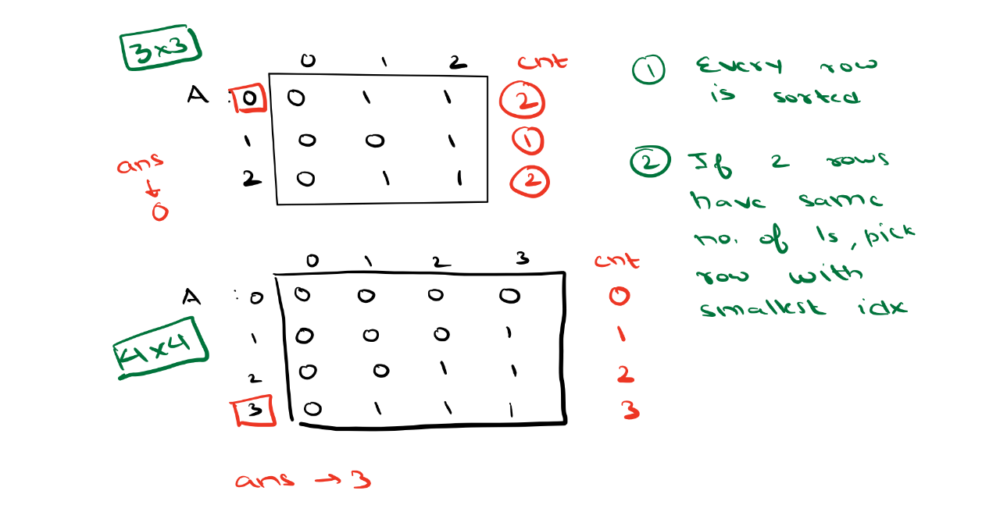
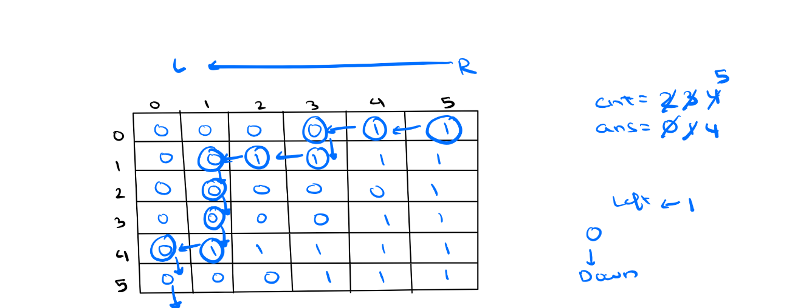
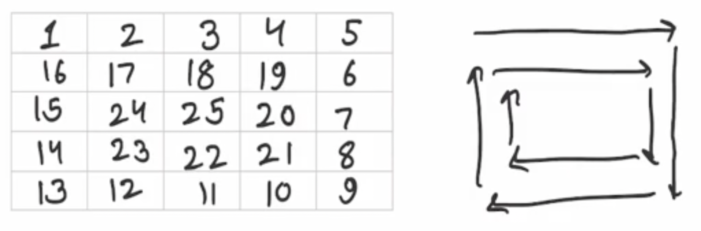
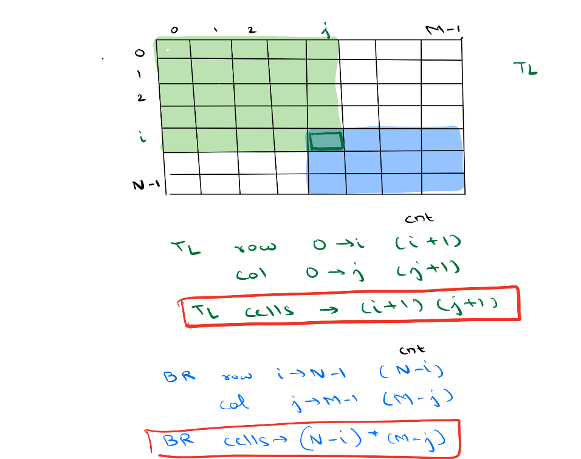

## Advance DSA Day 2 Arrays : 2 Dimensional

## Scope / Agenda
- [Search In Sorted Matrix](#search-in-sorted-matrix)
- [Number of 1's in a row](#number-of-1s-in-a-row)
- [Spiral Matrix](#spiral-matrix)
- [Sum of all Submatrix sum](#sum-of-all-submatrix-sum)
  

## Problems and solutions

1. [Assignments](../../../../problems/src/main/java/com/learning/scaler/advance/module1/array2d/assignment/)
2. [Additional Problems](../../../../problems/src/main/java/com/learning/scaler/advance/module1/array2d/additional/)
3. [Self Practise Problems](../../../../problems/src/main/java/com/learning/scaler/advance/module1/array2d/lecture/)

## Class Notes and Videos

1. [Class Notes](../../../class_Notes/Advance%20DSA%20Notes/2.%20Adv%20Arrays%202%20Dimensional(27-09-23).pdf)
2. [Class/Lecture Video](https://www.youtube.com/watch?v=nff9-dT7jxo&ab_channel=GrowTogether)


## Search In Sorted Matrix
    Problem Description
        Given a matrix of integers A of size N x M and an integer B.
        In the given matrix every row and column is sorted in non-decreasing order. Find and return the position of B in the matrix in the given form:
        If A[i][j] = B then return (i * 1009 + j)
        If B is not present return -1.

        Note 1: Rows are numbered from top to bottom and columns are numbered from left to right.
        Note 2: If there are multiple B in A then return the smallest value of i*1009 +j such that A[i][j]=B.
        Note 3: Expected time complexity is linear
        Note 4: Use 1-based indexing

    Problem Constraints
        1 <= N, M <= 1000
        -100000 <= A[i] <= 100000
        -100000 <= B <= 100000

    Input Format
        The first argument given is the integer matrix A.
        The second argument given is the integer B.

    Output Format
        Return the position of B and if it is not present in A return -1 instead.

    Example Input
        Input 1:-
            A = [[1, 2, 3]
                [4, 5, 6]
                [7, 8, 9]]
            B = 2
        Input 2:-
            A = [[1, 2]
                [3, 3]]
            B = 3

    Example Output
        Output 1:-
            1011
        Output 2:-
            2019

    Example Explanation
        Expanation 1:-
            A[1][2] = 2
            1 * 1009 + 2 = 1011
        Explanation 2:-
            A[2][1] = 3
            2 * 1009 + 1 = 2019
                A[2][2] = 3
            2 * 1009 + 2 = 2020
            The minimum value is 2019
### Solution approach
    Approach 1: Brute force
        We will find B in each and every cell and then calculate min value out of it.
        TC : O(m * n)
        SC : O(1)
    Approach 2: Will use properties of sorted matrix here
        If we look at input carefully, matrix is sorted in row wise and column wise, it means if we are looking for smaller value then current then move either left or top and if we are looking for greater value then move to either right or down
        1. We have confusion here as we have mutliple option for each way so we will try to figure out a point from which we will have only one options for smaller and greater element.
        2. Let's think about top right or bottom left corner of matrix and try to find it.
        3. Lets start from top right, if current element in bigger than required data move left or if current is smaller then required one then move down.
        4. calculate the value and assign to ans if minimum
### Solution
```java
    public int solve(int[][] A, int B) {
        int start = 0, end = A[0].length - 1, ans = Integer.MAX_VALUE;
        while (start < A.length && end >= 0) {
            int current = A[start][end];
            if (current >= B) {
                if (current == B) ans = Math.min(ans, (start + 1) * 1009 + (end + 1));
                end--;
            } else {
                start++;
            }
        }
        return ans == Integer.MAX_VALUE ? -1 : ans;
    }
```
## Number of 1's in a row
    Problem Description
        Given a binary sorted matrix A of N * N. Find row with max number of 1

### Solution approach
    Approach 1:
        Iterate for each row and find max no of 1 in a row and then get the max out of rows
        TC : O(n^2)
        SC : O(1)
    Approach 2:
        Will use sorted properties to count max no of 1's in a row 
        Steps:
            1. start with top right corner of matrix
            2. If current element is 1 then increment count and move left
            3. If current is 0 then move down and repeat this process untill we go beyond matrix limit

### Solution
```java
    public static int maxNoOf1s(int[][] A) {
        int count = 0, start = 0, end = A[0].length - 1;
        while (start < A.length && end >= 0) {
            int current = A[start][end];
            if (current == 1) {
                count++;
                end--;
            } else {
                start++;
            }
        }
        return count;
    }
```
## Spiral Matrix
    Problem Description
        Given an integer A, generate a square matrix filled with elements from 1 to A2 in spiral order and return the generated square matrix.

    Problem Constraints
        1 <= A <= 1000

    Input Format
        First and only argument is integer A

    Output Format
        Return a 2-D matrix which consists of the elements added in spiral order.

    Example Input
        Input 1:
            1
        Input 2:
            2
        Input 3:
            5

    Example Output
    Output 1:
        [ [1] ]
    Output 2:
        [ [1, 2],
        [4, 3] ]
    Output 2:
        [ [1,   2,  3,  4, 5],
        [16, 17, 18, 19, 6],
        [15, 24, 25, 20, 7],
        [14, 23, 22, 21, 8],
        [13, 12, 11, 10, 9] ]

    Example Explanation
        Explanation 1:
            Only 1 is to be arranged.
        Explanation 2:

            1 --> 2
                |
                |
            4<--- 3

### Solution approach
    If we look at above image carefully, we can figure it out that each line start from begining but end at second last index.
    Will use this observation to print boundar line first.
    Once boundry index is printed will start next from index to start, again look at image and we can find that next start index would be 
    current index + add 1 to i and j value.
    Along with this we need to shrink the length of boundry by 2.
### Solution
```java
    public int[][] generateMatrix(int A) {
        int[][] result = new int[A][A];
        int startVal = 1, i = 0, j = 0;
        while (A > 1) {
            // Left to Right
            for (int index = 1; index < A; index++) {
                result[i][j] = startVal++;
                j++;
            }

            // Top to Bottom
            for (int index = 1; index < A; index++) {
                result[i][j] = startVal++;
                i++;
            }

            // Right to Left
            for (int index = 1; index < A; index++) {
                result[i][j] = startVal++;
                j--;
            }

            // Bottom to Top
            for (int index = 1; index < A; index++) {
                result[i][j] = startVal++;
                i--;
            }
            A -= 2;
            i += 1;
            j += 1;
        }
        if (A == 1) result[i][j] = startVal;
        return result;
    }
```
## Sum of all Submatrix sum
    Problem Description:
        Given a matrix of N rows and M column. Determine sum of all possible sub matrix.
### Solution approach:
    Approach 1: Brute force
        We find each and every submatrix and find it total sum.
        TC : O(N^3M^3) --> O(N^2M^2) to set start index and end index of each submatrix and O(NM) to find its sum
        SC : O(1)
    Approach 2: Using contribution technique
        Will find not of time each cell contributed to the total sum i.e. we will count number of submatrix with the specific cell and add it together to get the result.
        TC : O(NM) --> Traverse through each cell
        SC : O(1)


    If we look at above screenshot we will see a formula which derived number of times a cell will contribute to the total sum.
        1. No of times it will contribute as TL(top left) cell
            row -> 0 to i
            col -> 0 to j
                total number of cell = (j-0 +1) * (i - 0 + 1)
                    (i + 1) * (j + 1)
        2. No of time s it will contribute as BR(bottom right) cell
            row -> n-1 to i
            col -> m -1 tp j
                total number of cell = (n-1-i+1) * (m-1-j+1)
                    (n-i) * (m - j)
### Solution code
```java
    public int sumOfAllSubmatrix(int[][] A) {
        int result = 0, N = A.length, M = A[0].length;
        for (int i = 0; i < N; i++) {
            for (int j = 0; j < M; j++) {
                // contribution of i,j cell is
                int topLeftCount = (i + 1) * (j + 1);
                int bottomRightCount = (N - i) * (M - j);
                int contribution = A[i][j] * topLeftCount * bottomRightCount;
                result += contribution;
            }
        }
        return result;
    }
```