## Advance DSA Day 13 Sorting : Merge Sort

## Scope / Agenda
- [Count Sort](#count-sort)
- [Stable and Inplace sorting](#stable-and-inplace-sorting)
- [Merge 2 Sorted Arrays](#merge-2-sorted-arrays)
- [Merge Sort](#merge-sort)
- [Inversion Count](#inversion-count)
- [No of Pairs](#no-of-pairs)
- [No of Open Doors](#no-of-open-doors)

## Problems and solutions

1. [Assignments]()
2. [Additional Problems]()
3. [Self Practise Problems]()

## Class Notes and Videos

1. [Class Notes](../../../class_Notes/Advance%20DSA%20Notes/13.%20Sorting%20Merge%20Sort.pdf)
2. [Follow Up Notes](../../../class_Notes/Advance%20DSA%20Notes/13.%20Sorting%20Merge%20Sort%20Follow%20Up.pdf)
3. [Class/Lecture Video](https://youtu.be/vMzX_cpGeN0)
4. [Follow Up Class/Lecture Video](https://youtu.be/YhIp0-mBorE)

## Count Sort
>**Counting Sort is a non-comparison-based sorting algorithm that works well when there is limited range of input values. It is particularly efficient when the range of input values is small compared to the number of elements to be sorted. The basic idea behind Counting Sort is to count the frequency of each distinct element in the input array and use that information to place the elements in their correct sorted positions.**
### Working of counting sort algorithm
- Declare an auxiliary array countArray[] of size max(inputArray[])+1 and initialize it with 0.
- Traverse array inputArray[] and map each element of inputArray[] as an index of countArray[] array, i.e., execute countArray[inputArray[i]]++ for 0 <= i < N.
- Calculate the prefix sum at every index of array inputArray[].
- Create an array outputArray[] of size N.
- Traverse array inputArray[] from end and update outputArray[ countArray[ inputArray[i] ] – 1] = inputArray[i]. Also, update countArray[ inputArray[i] ] = countArray[ inputArray[i] ]- 

### Steps to follow in counting sort
- Step 1:
    * Find out the maximum element from the given array.
        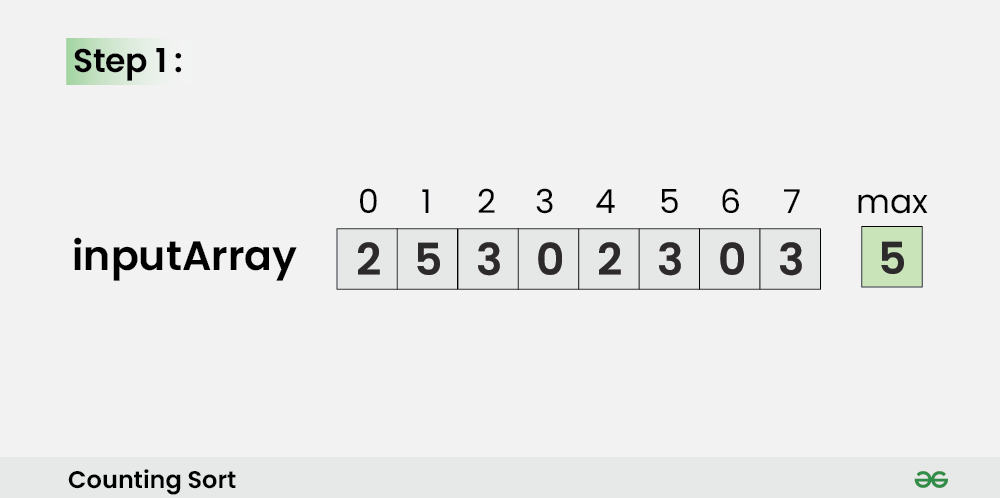
- Step 2 :
    * Initialize a countArray[] of length max+1 with all elements as 0. This array will be used for storing the occurrences of the elements of the input array.
        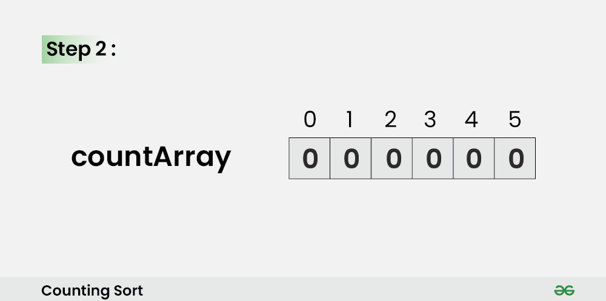
- Step 3 :
    * In the countArray[], store the count of each unique element of the input array at their respective indices.
    * For Example: The count of element 2 in the input array is 2. So, store 2 at index 2 in the countArray[]. Similarly, the count of element 5 in the input array is 1, hence store 1 at index 5 in the countArray[].
        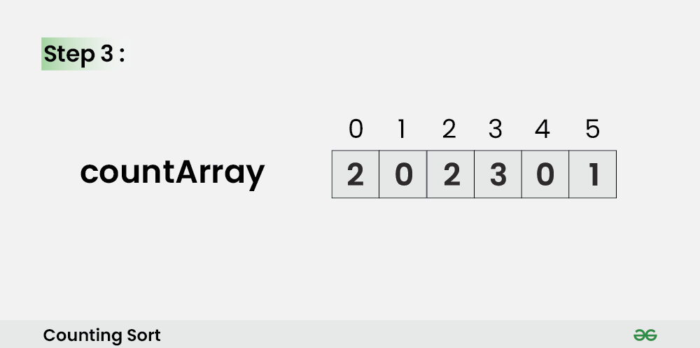
- Step 4 :
    * Store the cumulative sum or prefix sum of the elements of the countArray[] by doing countArray[i] = countArray[i – 1] + countArray[i]. This will help in placing the elements of the input array at the correct index in the output array.
        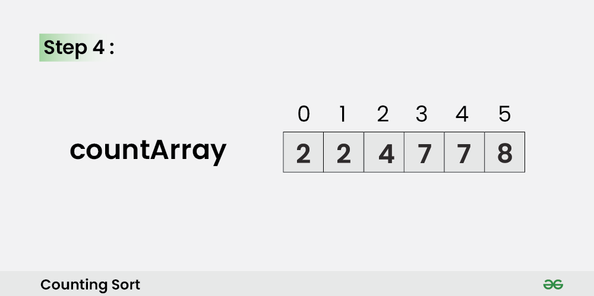
- Step 5 :
    * Iterate from end of the input array and because traversing input array from end preserves the order of equal elements, which eventually makes this sorting algorithm stable.
        - Update outputArray[ countArray[ inputArray[i] ] – 1] = inputArray[i].
        - Also, update countArray[ inputArray[i] ] = countArray[ inputArray[i] ]– -. 
        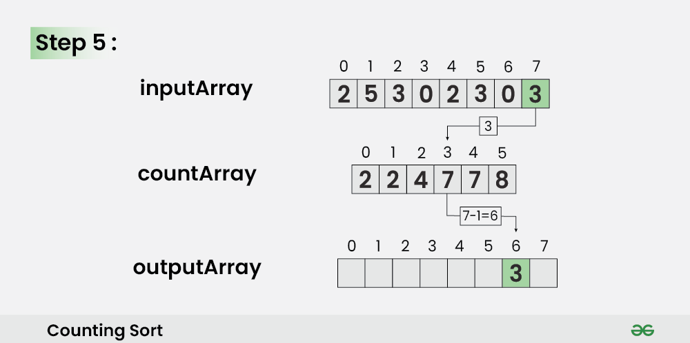
- Step 6 : For i = 6,
    * Update outputArray[ countArray[ inputArray[6] ] – 1] = inputArray[6]
Also, update countArray[ inputArray[6] ] = countArray[ inputArray[6] ]- –
        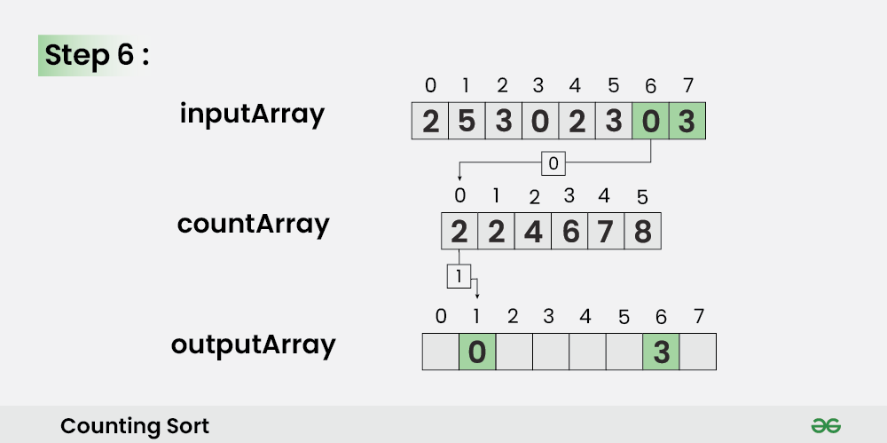
- Step 7 : for i = 5,
    * Update outputArray[ countArray[ inputArray[5] ] – 1] = inputArray[5]
Also, update countArray[ inputArray[5] ] = countArray[ inputArray[5] ]- –
        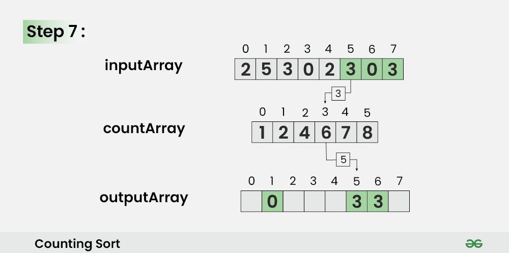
- Step 8 : for i = 8
    * Update outputArray[ countArray[ inputArray[4] ] – 1] = inputArray[4]
Also, update countArray[ inputArray[4] ] = countArray[ inputArray[4] ]- 
        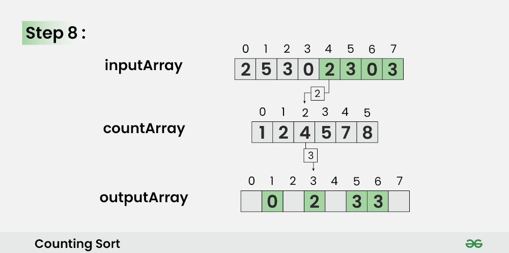
- Step 9 :
    *   Update outputArray[ countArray[ inputArray[3] ] – 1] = inputArray[3]
Also, update countArray[ inputArray[3] ] = countArray[ inputArray[3] ]
        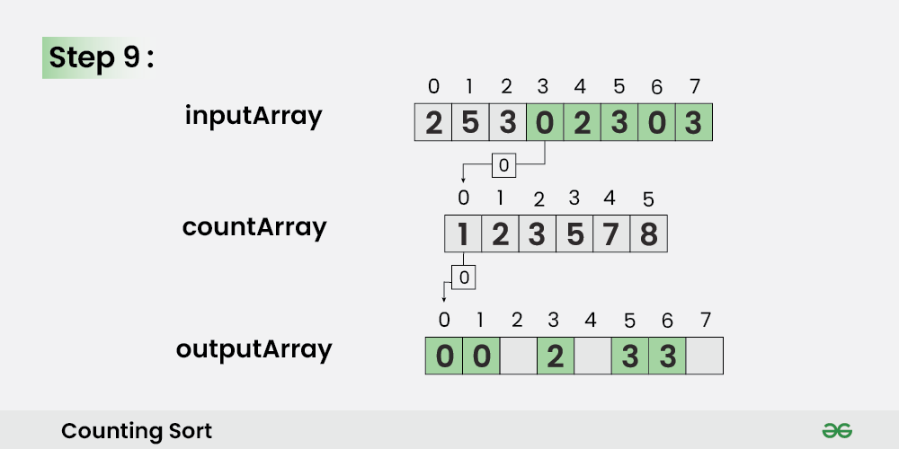
- Step 10 :
    *  Update outputArray[ countArray[ inputArray[2] ] – 1] = inputArray[2]
Also, update countArray[ inputArray[2] ] = countArray[ inputArray[2] ]
        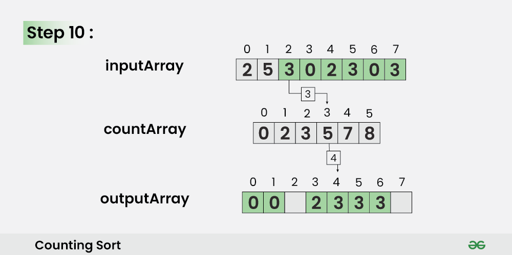
- Step 11 :
    * Update outputArray[ countArray[ inputArray[1] ] – 1] = inputArray[1]
Also, update countArray[ inputArray[1] ] = countArray[ inputArray[1] ]-
        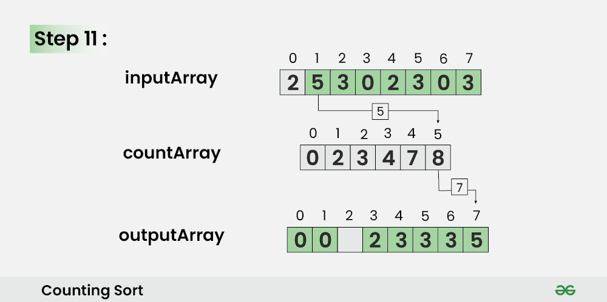
- Step 12 :
    *  Update outputArray[ countArray[ inputArray[0] ] – 1] = inputArray[0]
Also, update countArray[ inputArray[0] ] = countArray[ inputArray[0] ]  
        

### Time and space complexity of sorting algorithm
* Time Complexity: O(N+M), where N and M are the size of inputArray[] and countArray[] respectively.
    - Worst-case: O(N+M).
    - Average-case: O(N+M).
    - Best-case: O(N+M).
* Auxiliary Space: O(N+M), where N and M are the space taken by outputArray[] and countArray[] respectively.

### Advantage of Counting Sort:
* Counting sort generally performs faster than all comparison-based sorting algorithms, such as merge sort and quicksort, if the range of input is of the order of the number of input.
* Counting sort is easy to code
* Counting sort is a stable algorithm.
### Disadvantage of Counting Sort:
* Counting sort doesn’t work on decimal values.
* Counting sort is inefficient if the range of values to be sorted is very large.
* Counting sort is not an In-place sorting algorithm, It uses extra space for sorting the array elements.

### Problems
    Find smallest number that can be formed by rearranging digits given in an array.
    Input:
        arr : {6,3,4,2,7,2,1}
        arr2 : {4,2,7,3,9,0}
    Solution approach;
        Approach 1:
            Sort the array in descending order
            TC : O(nlogn)
            SC: Space taken by sorting algorithm
        Approach 2:
            As it is mentioned in array that it contains only digit so we will take a 10 size array to store frequency of each digit and then we will iterate it and add numbers as per their frequency.
            TC : O(n)
            SC : O(1) --> because we are taking 10 size array irrespective of the input size
### Solution
```java
    public List<Integer> rearrangeUsingCountSort(List<Integer> integers) {
        int[] countArray = new int[10];
        for (int i : integers) countArray[i]++;
        List<Integer> result = new ArrayList<>(integers.size());
        for (int i = 0; i < countArray.length; i++) {
            for (int index = 0; index < countArray[i]; index++) {
                result.add(i);
            }
        }
        return result;
    }
```
## Count sort example
```java
    public List<Integer> countSort(List<Integer> integers) {
        int min = Integer.MAX_VALUE, max = Integer.MIN_VALUE;
        for (int i : integers) {
            min = Math.min(i, min);
            max = Math.max(i, max);
        }
        int[] countArray = new int[max - min + 1];
        for (int i : integers) {
            countArray[i - min]++;
        }
        List<Integer> result = new ArrayList<>(integers.size());
        for (int i = 0; i < countArray.length; i++) {
            for (int index = 0; index < countArray[i]; index++) {
                result.add(i + min);
            }
        }
        return result;

    }
```
## Stable and Inplace sorting
### [Stable sort:](https://www.geeksforgeeks.org/stable-and-unstable-sorting-algorithms/)

> Stable Sorting : When two same data appear in the same order in sorted data without changing their position is called stable sort.

> Unstable Sorting : When two same data appear in the different order in sorted data it is called unstable sort.

### [In-place sorting:](https://www.geeksforgeeks.org/in-place-algorithm/)
> An in-place algorithm is an algorithm that does not need an extra space and produces an output in the same memory that contains the data by transforming the input ‘in-place’. However, a small constant extra space used for variables is allowed.

**Note :** In-place means that the algorithm does not use extra space for manipulating the input but may require a small though non-constant extra space for its operation. Usually, this space is O(log n), though sometimes anything in O(n) (Smaller than linear) is allowed.
## Merge 2 Sorted Arrays
    You are given two integer arrays nums1 and nums2, sorted in non-decreasing order, and two integers m and n, representing the number of elements in nums1 and nums2 respectively.

    Merge nums1 and nums2 into a single array sorted in non-decreasing order.

    The final sorted array should not be returned by the function, but instead be stored inside the array nums1. To accommodate this, nums1 has a length of m + n, where the first m elements denote the elements that should be merged, and the last n elements are set to 0 and should be ignored. nums2 has a length of n.
    Example 1:
        Input: nums1 = [1,2,3,0,0,0], m = 3, nums2 = [2,5,6], n = 3
        Output: [1,2,2,3,5,6]
        Explanation: The arrays we are merging are [1,2,3] and [2,5,6].
        The result of the merge is [1,2,2,3,5,6] with the underlined elements coming from nums1.
    Example 2:
        Input: nums1 = [1], m = 1, nums2 = [], n = 0
        Output: [1]
        Explanation: The arrays we are merging are [1] and [].
        The result of the merge is [1].
    Example 3:
        Input: nums1 = [0], m = 0, nums2 = [1], n = 1
        Output: [1]
        Explanation: The arrays we are merging are [] and [1].
        The result of the merge is [1].
        Note that because m = 0, there are no elements in nums1. The 0 is only there to ensure the merge result can fit in nums1.
### Soluion approach
    Idea 1:
        Create a temp array of size m +n and sort it
        TC : O((m+n)log(m+n))
        SC : O(m+n)
    Idea 2:
        As given, both the array is sorted and we will use this properties to reduce the time complexity.

        1. Create a temp array of size m + n to hold final result
        2. Start iterating from 0 till min(m,n)
        3. Pull one element from both the arrat and add the smaller one to the resultant array.
        4. Once loop finishes check the remaining element of larger array.
### Solution
```java
public int[] merge(int[] nums1, int[] nums2) {
    int m = nums1.length, n = nums2.length;
    int[] result = new int[m + n];
    int index1 = 0, index2 = 0, currentIndex = 0;
    while (index1 < m && index2 < n) {
        int first = nums1[index1];
        int second = nums2[index2];
        if (first <= second) {
            result[currentIndex++] = first;
            index1++;
            if (first == second) {
                result[currentIndex++] = second;
                index2++;
            }
        } else {
            result[currentIndex++] = second;
            index2++;
        }
    }

    // check for a remaining element of a larger array
    if (index1 < m) {
        while (index1 < m) {
            result[currentIndex++] = nums1[index1];
            index1++;
        }
    }
    if (index2 < n) {
        while (index2 < n) {
            result[currentIndex++] = nums2[index2];
            index2++;
        }
    }
    return result;
}
```
## Merge Probles
    Given an array of size N and 3 indices l,y and r. In the array, subarray from l to y and y +1 to r is sorted. Sort subarray from l to r.
### Solution approach:
    We will be using same approach as prev one but the only difference would be starting and ending index will change
### Solution
```java
public int[] merge(int[] arr, int l, int y, int r) {
    int[] result = new int[r - l + 1];
    int currentIndex = 0, index2 = y + 1, index1 = l;
    while (index1 <= y && index2 < r) {
        int first = arr[index1];
        int second = arr[index2];
        if (first <= second) {
            result[currentIndex++] = first;
            index1++;
            if (first == second) {
                result[currentIndex++] = second;
                index2++;
            }
        } else {
            result[currentIndex++] = second;
            index2++;
        }
    }

    // check for a remaining element of a larger array
    if (index1 <= y) {
        while (index1 <= y) {
            result[currentIndex++] = arr[index1];
            index1++;
        }
    }
    if (index2 <= r) {
        while (index2 <= r) {
            result[currentIndex++] = arr[index2];
            index2++;
        }
    }
    return result;
}
```
## Merge Sort	
> Merge sort is defined as a sorting algorithm that works by dividing an array into smaller subarrays, sorting each subarray, and then merging the sorted subarrays back together to form the final sorted array.

**Note :** In simple terms, we can say that the process of merge sort is to divide the array into two halves, sort each half, and then merge the sorted halves back together. This process is repeated until the entire array is sorted.

### How does Merge Sort work?
> Merge sort is a recursive algorithm that continuously splits the array in half until it cannot be further divided i.e., the array has only one element left (an array with one element is always sorted). Then the sorted subarrays are merged into one sorted array.


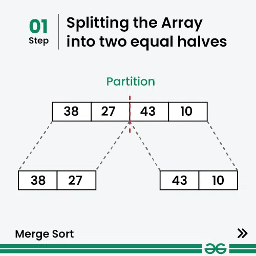
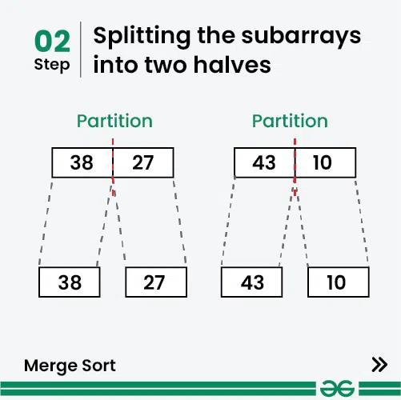
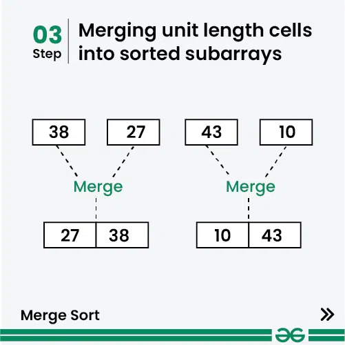
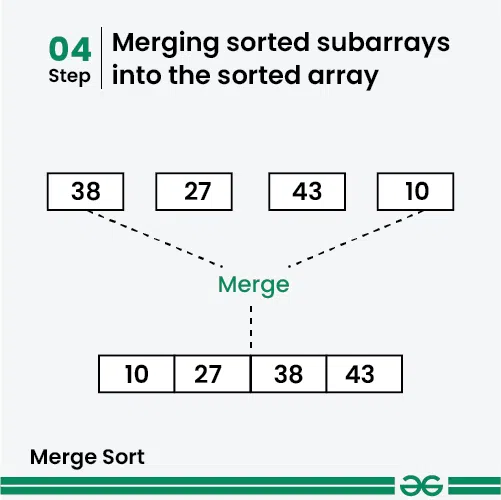


### Solution Approach
    We will keep dividing array in two part untill single element left, single element will always be sorted and then we will start merging it together to convert it into sorted array
    TC : O(nlogn)
    SC : O(logn + N)  --> logn for call stack and N for merge function
### Solution
```java
public int[] sortArray(int[] A) {
    if (A == null || A.length == 1) return A;
    mergeSort(A, 0, A.length - 1);
    return A;
}

private void mergeSort(int[] A, int start, int end) {
    if (start == end) return;
    int mid = (end + start) / 2;
    mergeSort(A, start, mid);
    mergeSort(A, mid + 1, end);
    merge(A, start, mid, end);
}

private void merge(int[] arr, int l, int y, int r) {
    int[] result = new int[r - l + 1];
    int currentIndex = 0, index2 = y + 1, index1 = l;
    while (index1 <= y && index2 <= r) {
        int first = arr[index1];
        int second = arr[index2];
        if (first <= second) {
            result[currentIndex++] = first;
            index1++;
            if (first == second) {
                result[currentIndex++] = second;
                index2++;
            }
        } else {
            result[currentIndex++] = second;
            index2++;
        }
    }

    // check for a remaining element of a larger array
    if (index1 <= y) {
        while (index1 <= y) {
            result[currentIndex++] = arr[index1];
            index1++;
        }
    }
    if (index2 <= r) {
        while (index2 <= r) {
            result[currentIndex++] = arr[index2];
            index2++;
        }
    }
    // copy a result array to the main array
    int start = 0, i = l;
    while (i <= r) {
        arr[i++] = result[start++];
    }
}
```
## Inversion Count
## No of Pairs
## No of Open Doors