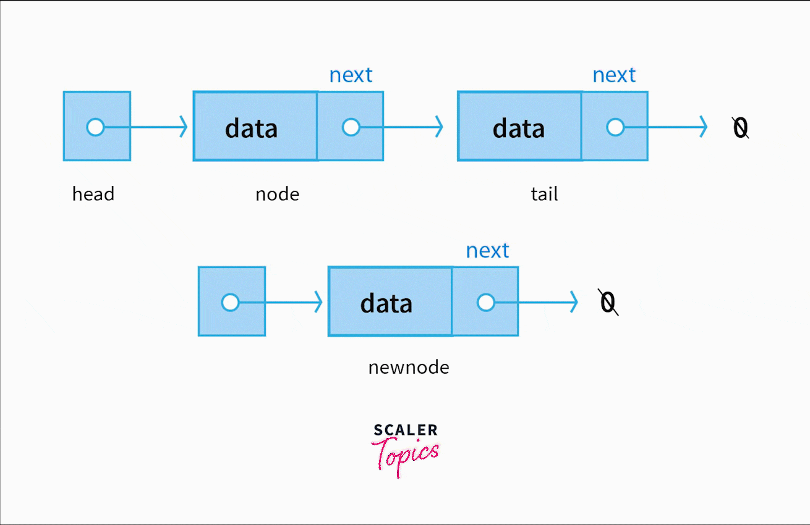

## Advanced DSA Day 24 LinkedList 1 Introduction

## Scope / Agenda
- [Linked List Introduction](#linked-list-introduction)
- [Operations on LinkedList](#operations-on-linkedlist)


## Problems and solutions

1. [Assignments](../../../../problems/src/main/java/com/learning/scaler/advance/module3/linkedlist1/assignment/)
2. [Additional Problems](../../../../problems/src/main/java/com/learning/scaler/advance/module3/linkedlist1/assignment/)

## Class Notes and Videos

1. [Class Notes](../../../class_Notes/Advance%20DSA%20Notes/24.%20Linked%20List%20Introduction.pdf)
2. [Class/Lecture Video](https://youtu.be/dZEfO5zacVM)

## Linked List Introduction
* Please refer [here](https://www.geeksforgeeks.org/what-is-linked-list/) to know more about linked list
   
   
## Operations on LinkedList
### Insert operation
   >**Insertion: The insertion operation can be performed in three ways. They are as follows…**
   * Inserting At the Beginning of the list
   * Inserting At End of the list
   * Inserting At Specific location in the list
### Search operation
   >**Search: It is a process of determining and retrieving a specific node either from the front, the end or anywhere in the list.**
### Delete operation
   >**Deletion: The deletion operation can be performed in three ways. They are as follows…**
   * Deleting from the Beginning of the list
   * Deleting from the End of the list
   * Deleting a Specific Node


### psuedo code
### Insertion Operation
**How to Insert a Node at the Front/Beginning of Linked List**
>To insert a node at the start/beginning/front of a Linked List, we need to:


* Make the first node of Linked List linked to the new node
* Remove the head from the original first node of Linked List
* Make the new node as the Head of the Linked List.

> TC : O(1)\
> SC : O(1)


```java
   /* This function is in LinkedList class. Inserts a
   new Node at front of the list. This method is
   defined inside LinkedList class shown above */
   public void push(int new_data) {
      /* 1 & 2: Allocate the Node &
            Put in the data*/
      Node new_node = new Node(new_data);

      /* 3. Make next of new Node as head */
      new_node.next = head;

      /* 4. Move the head to point to new Node */
      head = new_node;
   }
```


**How to Insert a Node after a Given Node in Linked List**
##### To insert a node after a given node in a Linked List, we need to:


* Check if the given node exists or not. 
   * If it do not exists, \
      * terminate the process.
   * If the given node exists,
      * Make the element to be inserted as a new node
      * Change the next pointer of given node to the new node
      * Now shift the original next pointer of given node to the next pointer of new node

> TC : O(1)\
> SC : O(1)

```java
   public void insertAfter(Node prev_node, int new_data) {
    /* 1. Check if the given Node is null */
    if (prev_node == null) {
        System.out.println(
            "The given previous node cannot be null");
        return;
    }
 
    /* 2. Allocate the Node &
    3. Put in the data*/
    Node new_node = new Node(new_data);
 
    /* 4. Make next of new Node as next of prev_node */
    new_node.next = prev_node.next;
 
    /* 5. make next of prev_node as new_node */
    prev_node.next = new_node;
}
```

**How to Insert a Node at the End of Linked List**
##### To insert a node at the end of a Linked List, we need to:

* Go to the last node of the Linked List
* Change the next pointer of last node from NULL to the new node
* Make the next pointer of new node as NULL to show the end of Linked List

```java
   public void append(int new_data) {
    /* 1. Allocate the Node &
    2. Put in the data
    3. Set next as null */
    Node new_node = new Node(new_data);
 
    /* 4. If the Linked List is empty, then make the
        new node as head */
    if (head == null) {
        head = new Node(new_data);
        return;
    }
 
    /* 4. This new node is going to be the last node, so
        make next of it as null */
    new_node.next = null;
 
    /* 5. Else traverse till the last node */
    Node last = head;
    while (last.next != null)
        last = last.next;
 
    /* 6. Change the next of last node */
    last.next = new_node;
    return;
}
```
> TC : O(N), where N is the number of nodes in the linked list.\
SC: O(1)

>Note :  Please refere [here](https://www.geeksforgeeks.org/introduction-to-linked-list-data-structure-and-algorithm-tutorial/) to get more details on Linked List operations.
