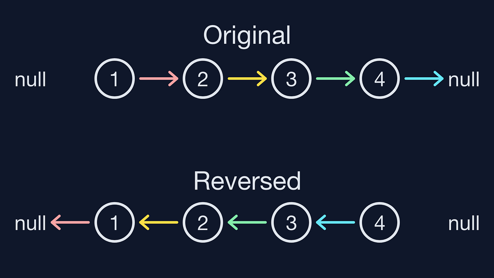

## Advanced DSA Day 25 LinkedList 2 Sorting and Detecting Loop

## Scope / Agenda
- [Reverse a Linked List](#reverse-a-linked-list)
- [Check whether LL is palindrome or not](#check-whether-ll-is-palindrome-or-not)
- [Find middle element of LL](#find-middle-element-of-ll)
- [Merge 2 sorted LL](#merge-2-sorted-ll)
- [Sort a LinkedList](#sort-a-linkedlist)
- [Find cycle in Linked List](#find-cycle-in-linked-list)


## Problems and solutions

1. [Assignments](../../../../problems/src/main/java/com/learning/scaler/advance/module3/linkedlist2/assignment/)
2. [Additional Problems](../../../../problems/src/main/java/com/learning/scaler/advance/module3/linkedlist2/additional/)
3. [Self Practise Problems](../../../../problems/src/main/java/com/learning/scaler/advance/module3/linkedlist2/lecture/)

## Class Notes and Videos

1. [Class Notes](https://github.com/rajpiyush220/Algorithms/blob/master/Notes/class_Notes/Advance%20DSA%20Notes/25.%20Adv%20Linked%20List%20Sorting%20and%20Detecting%20Loop.pdf)
2. [Class/Lecture Video](https://www.youtube.com/watch?v=Vroikqg_oFA&list=PLWV5FkQMcDU7gC6Lh87kP5ECv2HlsYF_7&index=31&ab_channel=GrowTogether)


## Reverse a Linked List

    Problem Description
        You are given a singly linked list having head node A. You have to reverse the linked list and return the head node of that reversed list.
        NOTE: You have to do it in-place and in one-pass.

    Problem Constraints
        1 <= Length of linked list <= 10^5

        Value of each node is within the range of a 32-bit integer.

    Input Format
        First and only argument is a linked-list node A.

    Output Format
        Return a linked-list node denoting the head of the reversed linked list.

    Example Input
        Input 1:
        A = 1 -> 2 -> 3 -> 4 -> 5 -> NULL
        Input 2:
        A = 3 -> NULL

    Example Output
        Output 1:
        5 -> 4 -> 3 -> 2 -> 1 -> NULL
        Output 2:
        3 -> NULL


    Example Explanation
        Explanation 1:
        The linked list has 5 nodes. After reversing them, the list becomes : 5 -> 4 -> 3 -> 2 -> 1 -> NULL
        Expalantion 2:
        The linked list consists of only a single node. After reversing it, the list becomes : 3 -> NULL
### Solution approach
    define current as head and prev and next as null
    Iterate from head till last node and follow below steps
        1. preserve next i.e. next = current.next
        2. Set prev as next of current i.e. current.next= prev
        3. Move prev to current i.e. prev = current
        4. Move current to next i.e. current = next
        5. return prev once current becomes null
```next = current.next```<br>
```current.next = prev```<br>
```prev = current```<br>
```current = nect```<br>
``` return prev``` once current becomes null
### Solution
```java
    public static ListNode reverseList(ListNode A) {
        if (A == null || A.next == null) return A;
        ListNode current = A;
        ListNode next, prev = null;
        while (current != null) {
            next = current.next;
            current.next = prev;
            prev = current;
            current = next;
        }
        return prev;
    }
```
## Check whether LL is palindrome or not
    Problem Description:
        Given the head of a singly linked list, return true if it is a palindrome or false otherwise
### Solution Approach
    Approach 1:
        Reverse complete Linked list and then compare it with exisitng list and check if all node value matches with each other
        TC : O(n)
        SC: O(n)
    Approach 2:
        Find size of linked list and reversed second half of the list, then compare second half of the linked list with first half of the linked list
        TC : O(n)
        SC : O(n)
    Approach 3: 
        Define a separate dynmic list of the array of same size as linked list
        Iterate through linkedlist and add node in dynamic array or array
        Now compare first element of the array with last and keep doing it till the middle element, if any of the node value mismatched then return false.
        TC : O(n)
        SC : O(n)
### Solution
```java
    // code to reverse linked list
    private static ListNode reverseList(ListNode A) {
        if (A == null || A.next == null) return A;
        ListNode current = A;
        ListNode next, prev = null;
        while (current != null) {
            next = current.next;
            current.next = prev;
            prev = current;
            current = next;
        }
        return prev;
    }
    // code to deep clone linked list
    public static ListNode cloneListNode(ListNode A) {
        if (A == null) return null;
        ListNode head = new ListNode(A.val);
        ListNode copyHead = head;
        ListNode temp = A.next;
        while (temp != null) {
            head.next = new ListNode(temp.val);
            head = head.next;
            temp = temp.next;
        }
        return copyHead;
    }
```
``` Solution for Approach 1```
```java
    // Approach 1
    public static boolean isPalindrome(ListNode A) {
        if (A == null || A.next == null) return true;
        ListNode reversed = reverseList(cloneListNode(A));
        ListNode temp = A;
        while (temp != null) {
            if (temp.val != reversed.val) return false;
            temp = temp.next;
            reversed = reversed.next;
        }
        return true;
    }
```
``` Solution for Approach 2```
```java
   public boolean isPalindromeWithoutReverse(ListNode A) {
        if (A == null || A.next == null) return true;
        int size = 0;
        ListNode temp = A;
        while (temp != null) {
            size++;
            temp = temp.next;
        }

        int secondHalf = (size + 1) / 2;
        ListNode current = A;
        int jumpCount = secondHalf;
        while (jumpCount > 0) {
            current = current.next;
            jumpCount--;
        }
        ListNode secondHalfReversed = reverseList(cloneListNode(current));
        temp = A;
        while (secondHalfReversed != null) {
            if (temp.val != secondHalfReversed.val) return false;
            secondHalfReversed = secondHalfReversed.next;
            temp = temp.next;
        }
        return true;
    }
```
``` Solution for Approach 3```
```java
    public boolean isPalindromeSuperSolution(ListNode A) {
        if (A == null || A.next == null) return true;
        List<ListNode> tempList = new ArrayList<>();
        ListNode temp = A;
        while (temp != null) {
            tempList.add(temp);
            temp = temp.next;
        }
        int size = tempList.size();
        int start = 0, end = size - 1;
        while (start < end) {
            if (tempList.get(start).val != tempList.get(end).val) return false;
            start++;
            end--;
        }
        return true;
    }
```
## Find middle element of LL
    Problem Description
        Given a linked list of integers, find and return the middle element of the linked list.
        NOTE: If there are N nodes in the linked list and N is even then return the (N/2 + 1)th element.

    Problem Constraints
        1 <= length of the linked list <= 100000
        1 <= Node value <= 10^9

    Input Format
        The only argument given head pointer of linked list.

    Output Format
        Return the middle element of the linked list.

    Example Input
        Input 1:
            1 -> 2 -> 3 -> 4 -> 5
        Input 2:
            1 -> 5 -> 6 -> 2 -> 3 -> 4

    Example Output
        Output 1:
            3
        Output 2:
            2


    Example Explanation
        Explanation 1:
            The middle element is 3.
    Explanation 2:
            The middle element in even length linked list of length N is ((N/2) + 1)th element which is 2.
### Solution approach
    Approach 1:
        We will find the size of LinkedList and using that size we will trvaerse again till the mid of the element and find the mid element value.
        TC : O(n)
        SC : O(1)
    Approach 2: Using fast and slowpointer technique
        We will create two pointer called as slow and fast pointer, slow pointer will jump one node at a time whereas fast pointer will jump 2 node at a time. Once fast pointer will reach end of the list till that slow pointer will be at the middle of the linked list
        TC : O(n) --> Even though time complexity is same no of iteration will be half
### Solution
```java
    // Approach 2
    public int solve(ListNode A) {
        int size = 0, start = 1;
        ListNode temp = A;
        while (temp != null) {
            size++;
            temp = temp.next;
        }
        temp = A;
        while (start <= (size / 2)) {
            start++;
            temp = temp.next;
        }
        return temp.val;
    }
```

```java
    // Approach 2
    public int solve(ListNode A) {
        if (A.next == null)
            return A.val;
        // slow and fast pointer
        ListNode slow = A, fast = A;
        while (fast != null && fast.next != null) {
            slow = slow.next;  // Jumping one node
            fast = fast.next.next; // Jumping two node
        }
        return slow.val;
    }
```
## Merge 2 sorted LL
    Problem Description
        Merge two sorted linked lists, A and B, and return it as a new list.
        The new list should be made by splicing together the nodes of the first two lists and should also be
        sorted.

    Problem Constraints
        0 <= |A|, |B| <= 10^5

    Input Format
        The first argument of input contains a pointer to the head of linked list A.
        The second argument of input contains a pointer to the head of linked list B.

    Output Format
        Return a pointer to the head of the merged linked list.

    Example Input
        Input 1:
            A = 5 -> 8 -> 20
            B = 4 -> 11 -> 15
        Input 2:
            A = 1 -> 2 -> 3
            B = Null
    Example Output
        Output 1:
            4 -> 5 -> 8 -> 11 -> 15 -> 20
        Output 2:
            1 -> 2 -> 3

    Example Explanation
        Explanation 1:
            Merging A and B will result in 4 -> 5 -> 8 -> 11 -> 15 -> 20
        Explanation 2:
            We don't need to merge as B is empty.
## Sort a LinkedList
    Problem Description
        Sort a linked list, A in O(n log n) time.

    Problem Constraints
        0 <= |A| = 10^5

    Input Format
        The first and the only argument of input contains a pointer to the head of the linked list, A.

    Output Format
        Return a pointer to the head of the sorted linked list.

    Example Input
        Input 1:
            A = [3, 4, 2, 8]
        Input 2:
            A = [1]

    Example Output
        Output 1:
            [2, 3, 4, 8]
        Output 2:
            [1]

    Example Explanation
        Explanation 1:
            The sorted form of [3, 4, 2, 8] is [2, 3, 4, 8].
        Explanation 2:
            The sorted form of [1] is [1].
## Find cycle in Linked List
    Problem Description
        Given a linked list of N nodes. The task is to check if the linked list has a loop. Linked list can contain self loop.
### Solution approach
    Approach 1: Using HashSet
        We will maintain a visited set which contains all the visited node information and we will start iterating from head till last.
        If any of the node is already visited then we will return true otherwise false.
        TC : O(n)
        SC : O(n)
    Approach 2: Using slow and fast pointer
        We will maintain slow and fast pointer and if there is a loop then slow and fast pointer will land on same node after few iteration.
        TC : O(n)
        SC : O(1)
### Solution
```java
    // Approach 1
    public boolean hasCycleWithSpace(ListNode head) {
        HashSet<ListNode> visitedSet = new HashSet<>();
        ListNode temp = head;
        while (temp != null) {
            if (visitedSet.contains(temp)) return true;
            visitedSet.add(temp);
            temp = temp.next;
        }
        return false;
    }
```

```java
    // Approach 2
    public boolean hasCycleConstantSpace(ListNode head) {
        if (head == null) return false;
        ListNode slow = head, fast = head;
        while (fast.next != null && fast.next.next != null) {
            slow = slow.next;
            fast = fast.next.next;
            if (slow == fast) return true;
        }
        return false;
    }
```