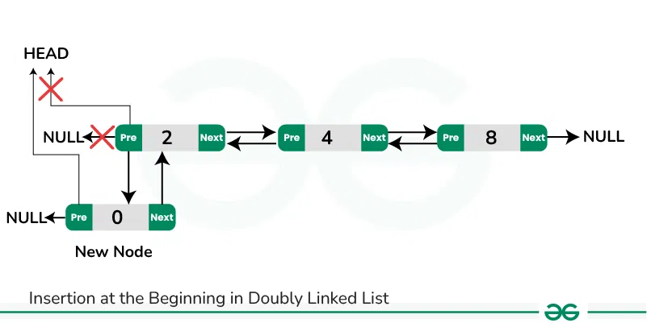
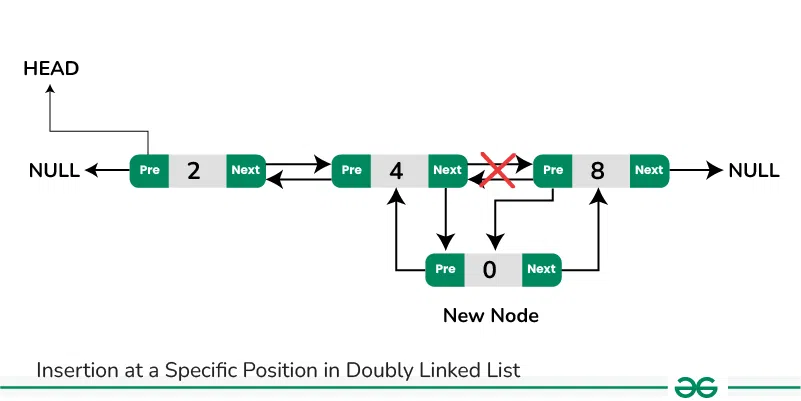
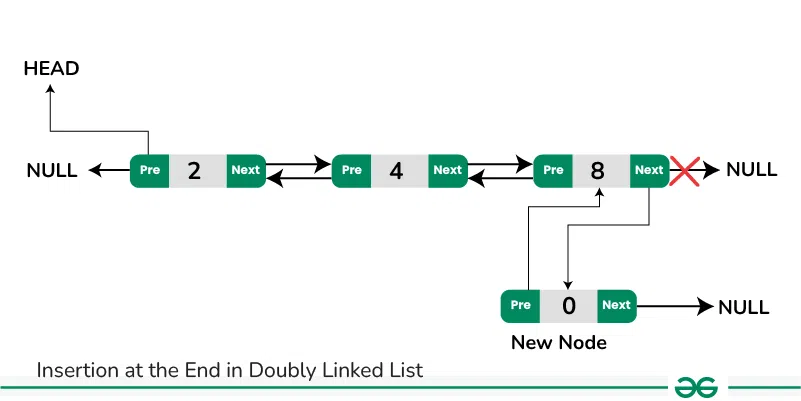

## Advance DSA Day 26 Linked List problems and Doubly LinkedList

##  Document is Under constructions

## Scope / Agenda
- [Check for cycle in Linked List](#check-for-cycle-in-linked-list)
- [Find starting point of loop](#find-starting-point-of-loop)
- [Introduction to Doubly LinkedList](#introduction-to-doubly-linkedlist)
- [Insertion/Deletion in Doubly LinkedList]
- [LRU(Least recent Used) Cache](#lruleast-recent-used-cache)
- [Clone a LL ]() 

## Problems and solutions

1. [Assignments](../../../../problems/src/main/java/com/learning/scaler/advance/module3/linkedlist3/assignment/)
2. [Additional Problems](../../../../problems/src/main/java/com/learning/scaler/advance/module3/linkedlist3/additional/)
3. [Self Practise Problems](../../../../problems/src/main/java/com/learning/scaler/advance/module3/linkedlist3/lecture/)

## Class Notes and Videos

1. [Class Notes](https://github.com/rajpiyush220/Algorithms/blob/master/Notes/class_Notes/Advance%20DSA%20Notes/26.%20LinkedList%20Problems%20and%20Doubly%20LinkedList.pdf)
2. [Class/Lecture Video](https://youtu.be/EBDPOWORteI)

## Check for cycle in Linked List
    Problem Description
        Given head, the head of a linked list, determine if the linked list has a cycle in it.
        There is a cycle in a linked list if there is some node in the list that can be reached again by
        continuously following the next pointer. Internally, pos is used to denote the index of the node that
        tail's next pointer is connected to. Note that pos is not passed as a parameter.

        Return true if there is a cycle in the linked list. Otherwise, return false.

    Example 1:
        Input: head = [3,2,0,-4], pos = 1
        Output: true
        Explanation: There is a cycle in the linked list, where the tail connects to the 1st node (0-indexed).
    Example 2:

        Input: head = [1,2], pos = 0
        Output: true
        Explanation: There is a cycle in the linked list, where the tail connects to the 0th node.
    Example 3:
        Input: head = [1], pos = -1
        Output: false
        Explanation: There is no cycle in the linked list.


    Constraints:
        The number of the nodes in the list is in the range [0, 10^4].
        -10^5 <= Node.val <= 10^5
        pos is -1 or a valid index in the linked-list.


    Follow up: Can you solve it using O(1) (i.e. constant) memory?
### Solution approach:
    Approach 1 : Using Hashset
        We will start traversing from head and keep storing traversed node into HashSet, while traversal we 
        will check if respective node is already present in HashSet it mean List has cycle otherwise not.
        TC : O(n)
        SC : O(n)
    Approach 2:
        Using fast and slow pointer
            Will start slow and fast from head and jump slow pointer by 1 node and fast pointer by 2 node. 
            If both the pointer matches then list has cycle otherwise not.
        TC : O(n)
        SC : O(1)
### Solution
```java
// Approach 1
public boolean hasCycleApproach1(ListNode list) {
    if (list == null || list.next == null) return false;
    HashMap<ListNode, Boolean> visitedNodes = new HashMap<>();
    while (list != null) {
        if (!visitedNodes.getOrDefault(list, false)) {
            visitedNodes.put(list, true);
            list = list.next;
        } else return true;
    }
    return false;
}

// Approach 2
public boolean hasCycleApproach2(ListNode head) {
    if (head == null || head.next == null) return false;
    ListNode slow = head, fast = head;
    while (fast.next != null && fast.next.next != null) {
        slow = slow.next;
        fast = fast.next.next;
        if (fast == slow) return true;
    }

    return false;
}
```

## Find starting point of loop
    Problem Description
        Given the head of a linked list, return the node where the cycle begins. If there is no cycle, return null.

        There is a cycle in a linked list if there is some node in the list that can be reached again by 
        continuously following the next pointer. Internally, pos is used to denote the index of the node 
        that tail's next pointer is connected to (0-indexed). It is -1 if there is no cycle. Note that pos 
        is not passed as a parameter.

        Do not modify the linked list.
    Constraints:
        The number of the nodes in the list is in the range [0, 10^4].
        -10^5 <= Node.val <= 10^5
        pos is -1 or a valid index in the linked-list.
### Solution Approach:
    Approach 1: Using approach 1 of find cycle
        TC : O(n)
        SC : O(n)
    Approach 2:
        Using slow and fast pointer
        Step 1:
            Using slow and fast pointer to find cycle, if no cycle then return null.
        Step 2:
            If it has cycle, reset slow point to head and start moving slow and fast by 1 jump. There would be 
            a time where fast and slow will match with each other and that will be starting point of the loop.
        TC : O(n)
        SC : O(1)
### Solution
```java
// Approach 1
public ListNode hasCycleApproach1(ListNode head) {
    if (head == null) return head;
    HashMap<ListNode, Boolean> visitedNodes = new HashMap<>();
    while (head != null) {
        if (!visitedNodes.getOrDefault(head, false)) {
            visitedNodes.put(head, true);
            head = head.next;
        } else return head;
    }
    return null;
}
// Approach 2
public ListNode hasCycleApproach2(ListNode head) {
    if (head == null) return null;
    ListNode slow = head, fast = head;
    while (fast != null && fast.next != null) {
        slow = slow.next;
        fast = fast.next.next;
        if (slow == fast) {
            slow = head;
            while (slow != fast) {
                slow = slow.next;
                fast = fast.next;
            }
            return slow;
        }
    }
    return null;
}
```
## Introduction to Doubly LinkedList
> A doubly linked list (DLL) is a special type of linked list in which each node contains a pointer to the previous node as well as the next node of the linked list.


```java
class Node {
    int data;
    Node prev;
    Node next;
    // Create constructor
}
```
### Advantages of Doubly Linked List over the singly linked list:
* A DLL can be traversed in both forward and backward directions. 
* The delete operation in DLL is more efficient if a pointer to the node to be deleted is given. 
* We can quickly insert a new node before a given node. 
* In a singly linked list, to delete a node, a pointer to the previous node is needed. To get this previous node, sometimes the list is traversed. In DLL, we can get the previous node using the previous pointer. 
### Disadvantages of Doubly Linked List over the singly linked list:
* Every node of DLL Requires extra space for a previous pointer. It is possible to implement DLL with a single pointer though (See this and this). 
* All operations require an extra pointer previous to be maintained. For example, in insertion, we need to modify previous pointers together with the next pointers. For example in the following functions for insertions at different positions, we need 1 or 2 extra steps to set the previous pointer.
### Applications of Doubly Linked List:
* It is used by web browsers for backward and forward navigation of web pages 
* LRU (Least Recently Used)/MRU(Most Recently Used) Cache are constructed using Doubly Linked Lists. 
Used by various applications to maintain undo and redo functionalities. 
* In Operating Systems, a doubly linked list is maintained by thread scheduler to keep track of processes that are being executed at that time.
## Insertion/Deletion in Doubly LinkedList
## Insertion Operations
> Inserting a new node in a doubly linked list is very similar to inserting new node in linked list.
### Case to handle
* At the start of the list
* Somewhere in middle
* At the end of the list







### Problem Description
    A doubly linked list is given. A node is to be inserted with data x at the position k. 
    The range of k is between 0 to n. Where n is the length of the linked list
### Solution approach
    Jump till the desired location to insert the node
    Step 1: Create node with new value
    Step 2: Create/Break the current link to the next and next.prev

### Solution
```java
public DoublyLinkedList insertNode(DoublyLinkedList head, int k, int newVal) {
    DoublyLinkedList newNode = new DoublyLinkedList(newVal);
    if (head == null) return newNode;
    else if (k < 0) return head;
    if (k == 0) {
        newNode.next = head;
        head.prev = newNode;
        return newNode;
    } else {
        // jump till k-1 th place
        int jump = 0;
        DoublyLinkedList temp = head;
        while (jump <= k - 1) {
            temp = temp.next;
            jump++;
        }
        newNode.prev = temp;
        newNode.next = temp.next;
        if (temp.next != null) {
            temp.next.prev = newNode;
        }
        temp.next = newNode;
    }
    return head;
}
```
### Problem Description
    Given a doubly linked list of length N, we have to delete first occurance of data x from given list. 
    If x is not present, do nothing.
### Solution approach
    Step 1 : Find the desired value, if not present return as it is.
    Step 2 : If desired node is first node, then return the next element but dont forget to break prev link to the current node.
    Step 3 : If desired node is last node, break its link with prev node and return.
    Step 4: If desired node is middle node, break the prev and next link of current node and create new prev and next link.
### Solution
```java
public DoublyLinkedList deleteNode(DoublyLinkedList head, int x) {
    if (head == null) return null;
    // find x node;
    if (x == head.val) {
        if (head.next != null) {
            head.next.prev = null;
        }
        return head.next;
    }
    DoublyLinkedList temp = head;
    while (temp != null && temp.val != x) {
        temp = temp.next;
    }
    if (temp == null) return head;
    else {
        // temp is last node
        if (temp.next == null) {
            temp.prev.next = null;
        } else {
            // temp is in the middle
            temp.prev.next = temp.next;
            temp.next.prev = temp.prev;
        }
    }
    return head;
}
```
## LRU(Least recent Used) Cache

## Clone a LL (Separate Recording will be available) 
    Problem Description
        You are given a linked list A
        Each node in the linked list contains two pointers: a next pointer and a random pointer
        The next pointer points to the next node in the list
        The random pointer can point to any node in the list, or it can be NULL
        Your task is to create a deep copy of the linked list A
        The copied list should be a completely separate linked list from the original list, but with the 
        same node values and random pointer connections as the original list
        You should create a new linked list B, where each node in B has the same value as the corresponding 
        node in A
        The next and random pointers of each node in B should point to the corresponding nodes in B (rather than A)

    Problem Constraints
    0 <= |A| <= 10^6

    Input Format
        The first argument of input contains a pointer to the head of linked list A.

    Output Format
        Return a pointer to the head of the required linked list.

    Example Input
        Given list
        1 -> 2 -> 3
        with random pointers going from
        1 -> 3
        2 -> 1
        3 -> 1
    

    Example Output
        1 -> 2 -> 3
        with random pointers going from
        1 -> 3
        2 -> 1
        3 -> 1

    Example Explanation
        You should return a deep copy of the list. The returned answer should not contain the same node 
        as the original list, but a copy of them. The pointers in the returned list should not link to 
        any node in the original input list.     