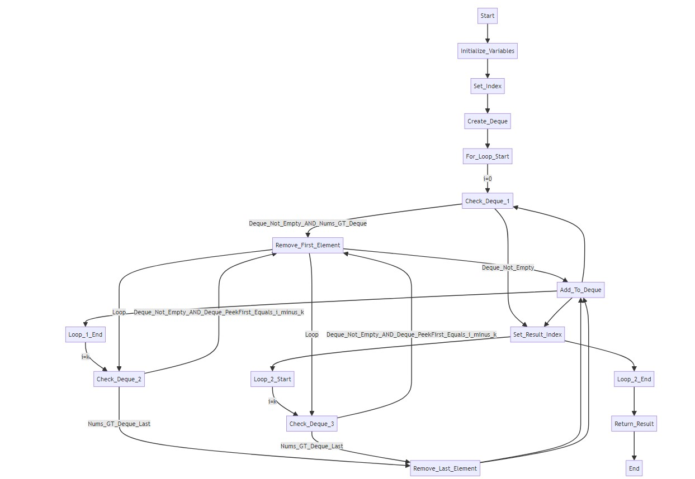

## Advanced DSA Day 29 Queue Implementation and Problems

## Scope / Agenda
- [Queue](#queue)
- [Implementation of queue using array](#implementation-of-queue-using-array)
- [Implementation of queue using stack](#implementation-of-queue-using-stack)
- [N integers containing only 1, 2 & 3](#n-integers-containing-only-1-2--3)
- [Queues Perfect No](#queues-perfect-no)
- [Doubly Ended Queue](#doubly-ended-queue)
- [Sliding Window Maximum](#sliding-window-maximum)
- [Sum of min and max of each window](#sum-of-min-and-max)


## Problems and solutions

1. [Assignments](https://github.com/rajpiyush220/Algorithms/tree/master/problems/src/main/java/com/learning/scaler/advance/module3/queue/assignment)
2. [Additional Problems](https://github.com/rajpiyush220/Algorithms/tree/master/problems/src/main/java/com/learning/scaler/advance/module3/queue/additional)
3. [Self Practise Problems](https://github.com/rajpiyush220/Algorithms/tree/master/problems/src/main/java/com/learning/scaler/advance/module3/queue/lecture)

## Class Notes and Videos

1. [Class Notes](https://github.com/rajpiyush220/Algorithms/blob/master/Notes/class_Notes/Advance%20DSA%20Notes/29%20Queues%20Implementation%20and%20Problems.pdf)
2. [Class/Lecture Video](https://www.youtube.com/watch?v=5merIcBvI0Q)
3. [New Batch Notes](../../../new_batch_notes/Queue.pdf)
4. [New Batch Video](https://youtu.be/8YuCnJ8fgsk)

## Queue
> A Queue Data Structure is a fundamental concept in computer science used for storing and managing data in a specific order. It follows the principle of “First in, First out” (FIFO), where the first element added to the queue is the first one to be removed.


### Functions of Queue
* **Enqueue (Insert):** Adds an element to the rear of the queue.
* **Dequeue (Delete):** Removes and returns the element from the front of the queue.
* **Peek:** Returns the element at the front of the queue without removing it.
* **isEmpty:** Checks if the queue is empty.
* **isFull:** Checks if the queue is full.
## Implementation of queue using array


## Implementation of queue using stack
    Problem Description
        Implement a First In First Out (FIFO) queue using stacks only.
        The implemented queue should support all the functions of a normal queue (push, peek, pop, and empty).
        Implement the UserQueue class:
        void push(int X) : Pushes element X to the back of the queue.
        int pop() : Removes the element from the front of the queue and returns it.
        int peek() : Returns the element at the front of the queue.
        boolean empty() : Returns true if the queue is empty, false otherwise.
    NOTES:
        You must use only standard operations of a stack, which means only push to top, peek/pop from top, size, 
        and is empty operations are valid.
        Depending on your language, the stack may not be supported natively. You may simulate a stack using a 
        list or deque (double-ended queue) as long as you use only a stack's standard operations.

    Problem Constraints
        1 <= X <= 10^9
        At most 1000 calls will be made to push, pop, peek, and empty function.
        All the calls to pop and peek are valid. i.e. pop and peek are called only when the queue is non-empty.

    Example
        Input 1:
            1) UserQueue()
            2) push(20)
            3) empty()
            4) peek()
            5) pop()
            6) empty()
            7) push(30)
            8) peek()
            9) push(40)
            10) peek()
        Input 2:
            1) UserQueue()
            2) push(10)
            3) push(20)
            4) push(30)
            5) pop()
            6) pop()

    Example Output
        Output 1:
            false
            20
            20
            true
            30
            30
        Output 2:
            10
            20

    Example
        Explanation 1:
            Queue => 20
            Queue => -
            Queue => 30
            Queue => 30, 40
        Explanation 2:
            Queue => 10
            Queue => 10, 20
            Queue => 10, 20, 30
            Queue => 20, 30
            Queue => 30

### Solution Approach
    We need to develop double ended entry using stack and that is not at all possible with stack as stack has single entry.
    Lets think about using 2 stack one to keep storing record and other we will use while popping element
    Step 1: Create two stack one to store element and other we will use while popping element
    Step 2: isEmpty() --> if both the stack is empty then empty else not empty
    Step 3: size() --> add size of both the stack
    Step 4: push(X) --> push value in first stack
    Step 5: pop/peek --> check if second stack is empty, if yes then pop all element from first stack and push it to second stack
    step 6: pop or peek top element from stack 2

### Solution
```java
    /**
     * Initialize your data structure here.
     */
    static Stack<Integer> container, auxSpace;

    QueueUsingStacks() {
        container = new Stack<>();
        auxSpace = new Stack<>();
    }

    /**
     * Push element X to the back of queue.
     */
    static void push(int X) {
        container.push(X);
    }

    /**
     * Removes the element from in front of queue and returns that element.
     */
    static int pop() {
        if (empty()) return -1;
        if (auxSpace.isEmpty()) {
            // push everything from container to aux space and return last item
            while (!container.isEmpty()) auxSpace.push(container.pop());
        }
        return auxSpace.pop();
    }

    /**
     * Get the front element of the queue.
     */
    static int peek() {
        if (empty()) return -1;
        if (auxSpace.isEmpty()) {
            // push everything from container to aux space and return last item
            while (!container.isEmpty()) auxSpace.push(container.pop());
        }
        return auxSpace.peek();
    }

    /**
     * Returns whether the queue is empty.
     */
    static boolean empty() {
        return container.isEmpty() && auxSpace.isEmpty();
    }
``` 

## N integers containing only 1, 2 & 3
    Problem Description
        Given an integer, A. Find and Return first positive A integers in ascending order containing only 
        digits 1, 2, and 3.
        NOTE: All the A integers will fit in 32-bit integers.

    Problem Constraints
        1 <= A <= 29500

    Input Format
        The only argument given is integer A.

    Output Format
        Return an integer array denoting the first positive A integers in ascending order containing only 
        digits 1, 2 and 3.

    Example
        Input 1:
            A = 3
        Input 2:
            A = 7

    Example
        Output 1:
            [1, 2, 3]
        Output 2:
            [1, 2, 3, 11, 12, 13, 21]

    Example
        Explanation 1:
            Output denotes the first 3 integers that contains only digits 1, 2 and 3.
        Explanation 2:
            Output denotes the first 7 integers that contains only digits 1, 2 and 3.

### Solution approach
    We need to generate all the numbers that can contains only 1, 2 and 3. 
    So lets take some example:
        1 2 3 11 12 13 21 22 23 
    lets start with 1 and the next number that can be formed using 1 and 1,2 and 3 is
        1 * 10 + 1
        1 * 10 + 2
        1 * 10 + 3
    in the same way we can create numbers till A
    TC : O(n)
    SC : O(n)

### Solution
```java
public static ArrayList<Integer> solve(int A) {
    int count = 0;
    ArrayList<Integer> result = new ArrayList<>();
    Queue<Integer> queue = new LinkedList<>();
    queue.add(1);
    queue.add(2);
    queue.add(3);
    while (count < A && !queue.isEmpty()) {
        Integer current = queue.poll();
        result.add(current);
        Integer first = current * 10 + 1;
        Integer second = current * 10 + 2;
        Integer third = current * 10 + 3;
        queue.add(first);
        queue.add(second);
        queue.add(third);
        count += 1;
    }
    return result;
}
```

## Queues Perfect No
    Problem Description
        Given an integer A, you have to find the Ath Perfect Number.
        A Perfect Number has the following properties:
        It comprises only 1 and 2.
        The number of digits in a Perfect number is even.
        It is a palindrome number.
        For example, 11, 22, 112211 are Perfect numbers, where 123, 121, 782, 1 are not.

    Problem Constraints
        1 <= A <= 100000

    Input Format
        The only argument given is an integer A.

    Output Format
        Return a string that denotes the Ath Perfect Number.

    Example
        Input 1:
            A = 2
        Input 2:
            A = 3

    Example
        Output 1:
            22
        Output 2:
            1111

    Example
        Explanation 1:
            First four perfect numbers are:
            1. 11
            2. 22
            3. 1111
            4. 1221
            Returns the 2nd Perfect number.
    Explanation 2:
        First four perfect numbers are:
        1. 11
        2. 22
        3. 1111
        4. 1221
        Returns the 3rd Perfect number.

### Solution Approach
    We will be using similar approach as previous problem with a small twist
    As we can see problem statement, we need to choose only number with even digit count and it should be palindrome.
    So we will be generating half part of the number and then we will append it with reverse of first part.

    lets take below example
    Generate first 4 number
    1 2 11 12 and append its reverse to the same number
    11 22 1111 1221

    TC : O(n)
    SC : O(n)

### Solution
```java
public String solve(int A) {
    List<Long> result = new ArrayList<>();
    Queue<Long> queue = new LinkedList<>();
    queue.add(1L);
    queue.add(2L);
    int count = 0;
    while (!queue.isEmpty() && count < A) {
        long current = queue.poll();
        result.add(current);
        queue.add(current * 10 + 1);
        queue.add(current * 10 + 2);
        count++;
    }
    String finalNumber = String.valueOf(result.get(result.size() - 1));
    StringBuilder str = new StringBuilder(finalNumber);
    return finalNumber + str.reverse();
}
```

## Doubly Ended Queue
> Deque or Double Ended Queue is a generalized version of Queue data structure that allows insert and delete at both ends.

* [GFG](https://www.geeksforgeeks.org/deque-set-1-introduction-applications/)
* [InterviewBit]()

| Operation   | Description                          | Time Complexity |
|-------------|--------------------------------------|-----------------|
| push_front()| Inserts the element at the beginning| O(1)            |
| push_back() | Adds element at the end              | O(1)            |
| pop_front() | Removes the first element from the deque | O(1)         |
| pop_back()  | Removes the last element from the deque  | O(1)         |
| front()     | Gets the front element from the deque   | O(1)         |
| back()      | Gets the last element from the deque    | O(1)         |
| empty()     | Checks whether the deque is empty or not | O(1)        |
| size()      | Determines the number of elements in the deque | O(1)     |


## Sliding Window Maximum
    You are given an array of integers nums, there is a sliding window of size k which is moving 
    from the very left of the array to the very right. You can only see the k numbers in the window. 
    Each time the sliding window moves right by one position.

    Return the max sliding window.

    Example 1:

    Input: nums = [1,3,-1,-3,5,3,6,7], k = 3
    Output: [3,3,5,5,6,7]
    Explanation: 
    Window position                Max
    ---------------               -----
    [1  3  -1] -3  5  3  6  7       3
    1 [3  -1  -3] 5  3  6  7       3
    1  3 [-1  -3  5] 3  6  7       5
    1  3  -1 [-3  5  3] 6  7       5
    1  3  -1  -3 [5  3  6] 7       6
    1  3  -1  -3  5 [3  6  7]      7
    Example 2:

    Input: nums = [1], k = 1
    Output: [1]

### Solution Approach
    Approach 1: Brute Force
        Go to each window of size k and find max out of it.
        TC : O(n * K)
        SC : O(k) --> to find max out of a window
    Approach 2: Using Double ended queue

    lets take example of 
    nums = [1,3,-1,-3,5,3,6,7], k = 3.in this case following would be the output
    [3,3,5,5,6,7]

> Please take a look at below flow chart to understand the steps to follow.




### Solution
```java
public int[] maxSlidingWindow(int[] nums, int k) {
    int[] result = new int[nums.length - k + 1];
    int index = 0;
    Deque<Integer> deque = new LinkedList<>();
    for (int i = 0; i < k; i++) {
        while (!deque.isEmpty() && nums[i] > nums[deque.peekFirst()]) deque.removeFirst();
        deque.addLast(i);
    }
    if (!deque.isEmpty())
        result[index++] = nums[deque.peekFirst()];

    for (int i = k; i < nums.length; i++) {
        if (!deque.isEmpty() && deque.peekFirst() == i - k) deque.removeFirst();

        while (!deque.isEmpty() && nums[i] > nums[deque.peekLast()])
            deque.removeLast();
        deque.addLast(i);

        if (!deque.isEmpty())
            result[index++] = nums[deque.peekFirst()];
    }
    return result;
}
```

## Sum of min and max
    Problem Description
        Given an array A of both positive and negative integers.
        Your task is to compute the sum of minimum and maximum elements of all sub-array of size B.
        NOTE: Since the answer can be very large, you are required to return the sum modulo 10^9 + 7.

    Problem Constraints
        1 <= size of array A <= 10^5
        -10^9 <= A[i] <= 10^9
        1 <= B <= size of array

    Input Format
        The first argument denotes the integer array A.
        The second argument denotes the value B

    Output Format
        Return an integer that denotes the required value.

    Example
        Input 1:
            A = [2, 5, -1, 7, -3, -1, -2]
            B = 4
        Input 2:
            A = [2, -1, 3]
            B = 2

    Example
        Output 1:
            18
        Output 2:
            3

    Example
        Explanation 1:
            Subarrays of size 4 are :
                [2, 5, -1, 7],   min + max = -1 + 7 = 6
                [5, -1, 7, -3],  min + max = -3 + 7 = 4
                [-1, 7, -3, -1], min + max = -3 + 7 = 4
                [7, -3, -1, -2], min + max = -3 + 7 = 4
                Sum of all min & max = 6 + 4 + 4 + 4 = 18
        Explanation 2:
            Subarrays of size 2 are :
                [2, -1],   min + max = -1 + 2 = 1
                [-1, 3],   min + max = -1 + 3 = 2
                Sum of all min & max = 1 + 2 = 3

### Solution
> Using above approach will find min and max of each window and then calculate the final result

```java
public int solve(int[] A, int B) {
    int[][] maxAndMinOfEachWindow = minAndMaxSlidingWindow(A, B);
    int total = 0;
    for (int[] arr : maxAndMinOfEachWindow) {
        total += (arr[0] + arr[1]);
    }
    return total;
}
public int[][] minAndMaxSlidingWindow(int[] nums, int k) {
    int[][] result = new int[nums.length - k + 1][2];

    Deque<Integer> maxDeque = new LinkedList<>();
    Deque<Integer> minDeque = new LinkedList<>();

    int index = 0;
    for (int i = 0; i < nums.length; i++) {
        // Remove elements outside of the window
        while (!maxDeque.isEmpty() && maxDeque.peekFirst() < i - k + 1) {
            maxDeque.removeFirst();
        }
        while (!minDeque.isEmpty() && minDeque.peekFirst() < i - k + 1) {
            minDeque.removeFirst();
        }

        // Remove elements from the deque that are smaller than current element for maxDeque
        while (!maxDeque.isEmpty() && nums[i] >= nums[maxDeque.peekLast()]) {
            maxDeque.removeLast();
        }
        // Remove elements from the deque that are greater than current element for minDeque
        while (!minDeque.isEmpty() && nums[i] <= nums[minDeque.peekLast()]) {
            minDeque.removeLast();
        }

        maxDeque.addLast(i);
        minDeque.addLast(i);

        if (i >= k - 1) {
            // First element in the window is the maximum, last element is the minimum
            if (!maxDeque.isEmpty())
                result[index][0] = nums[maxDeque.peekFirst()];
            if (!minDeque.isEmpty())
                result[index][1] = nums[minDeque.peekFirst()];
            index++;
        }
    }

    return result;
}
```