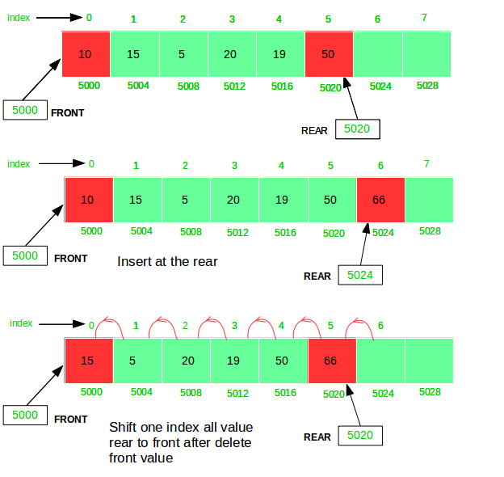

## Advanced DSA Day 29 Queue Implementation and Problems

## Scope / Agenda
- [Queue](#queue)
- [Implementation of queue using array](#implementation-of-queue-using-array)
- [Implementation of queue using stack](#implementation-of-queue-using-stack)
- [Queues Perfect No](#queues-perfect-no)
- [Doubly Ended Queue](#doubly-ended-queue)
- [Sliding Window Maximum](#sliding-window-maximum)


## Problems and solutions

1. [Assignments](https://github.com/rajpiyush220/Algorithms/tree/master/problems/src/main/java/com/learning/scaler/advance/module3/queue/assignment)
2. [Additional Problems](https://github.com/rajpiyush220/Algorithms/tree/master/problems/src/main/java/com/learning/scaler/advance/module3/queue/additional)
3. [Self Practise Problems](https://github.com/rajpiyush220/Algorithms/tree/master/problems/src/main/java/com/learning/scaler/advance/module3/queue/lecture)

## Class Notes and Videos

1. [Class Notes](https://github.com/rajpiyush220/Algorithms/blob/master/Notes/class_Notes/Advance%20DSA%20Notes/29%20Queues%20Implementation%20and%20Problems.pdf)
2. [Class/Lecture Video](https://www.youtube.com/watch?v=5merIcBvI0Q)
3. [New Batch Notes](../../../new_batch_notes/Queue.pdf)
4. [New Batch Video](https://youtu.be/8YuCnJ8fgsk)

## Queue
> A Queue Data Structure is a fundamental concept in computer science used for storing and managing data in a specific order. It follows the principle of “First in, First out” (FIFO), where the first element added to the queue is the first one to be removed.

### Functions of Queue
* **Enqueue (Insert):** Adds an element to the rear of the queue.
* **Dequeue (Delete):** Removes and returns the element from the front of the queue.
* **Peek:** Returns the element at the front of the queue without removing it.
* **isEmpty:** Checks if the queue is empty.
* **isFull:** Checks if the queue is full.
## Implementation of queue using array

## Implementation of queue using stack
    Problem Description
        Implement a First In First Out (FIFO) queue using stacks only.
        The implemented queue should support all the functions of a normal queue (push, peek, pop, and empty).
        Implement the UserQueue class:
        void push(int X) : Pushes element X to the back of the queue.
        int pop() : Removes the element from the front of the queue and returns it.
        int peek() : Returns the element at the front of the queue.
        boolean empty() : Returns true if the queue is empty, false otherwise.
    NOTES:
        You must use only standard operations of a stack, which means only push to top, peek/pop from top, size, and is empty operations are valid.
        Depending on your language, the stack may not be supported natively. You may simulate a stack using a list or deque (double-ended queue) as long as you use only a stack's standard operations.

    Problem Constraints
        1 <= X <= 10^9
        At most 1000 calls will be made to push, pop, peek, and empty function.
        All the calls to pop and peek are valid. i.e. pop and peek are called only when the queue is non-empty.

    Example
        Input 1:
            1) UserQueue()
            2) push(20)
            3) empty()
            4) peek()
            5) pop()
            6) empty()
            7) push(30)
            8) peek()
            9) push(40)
            10) peek()
        Input 2:
            1) UserQueue()
            2) push(10)
            3) push(20)
            4) push(30)
            5) pop()
            6) pop()

    Example Output
        Output 1:
            false
            20
            20
            true
            30
            30
        Output 2:
            10
            20

    Example
        Explanation 1:
            Queue => 20
            Queue => -
            Queue => 30
            Queue => 30, 40
        Explanation 2:
            Queue => 10
            Queue => 10, 20
            Queue => 10, 20, 30
            Queue => 20, 30
            Queue => 30

### Solution Approach
    We need to develop double ended entry using stack and that is not at all possible with stack as stack has single entry.
    Lets think about using 2 stack one to keep storing record and other we will use while popping element
    Step 1: Create two stack one to store element and other we will use while popping element
    Step 2: isEmpty() --> if both the stack is empty then empty else not empty
    Step 3: size() --> add size of both the stack
    Step 4: push(X) --> push value in first stack
    Step 5: pop/peek --> check if second stack is empty, if yes then pop all element from first stack and push it to second stack
    step 6: pop or peek top element from stack 2

### Solution
```java
    /**
     * Initialize your data structure here.
     */
    static Stack<Integer> container, auxSpace;

    QueueUsingStacks() {
        container = new Stack<>();
        auxSpace = new Stack<>();
    }

    /**
     * Push element X to the back of queue.
     */
    static void push(int X) {
        container.push(X);
    }

    /**
     * Removes the element from in front of queue and returns that element.
     */
    static int pop() {
        if (empty()) return -1;
        if (auxSpace.isEmpty()) {
            // push everything from container to aux space and return last item
            while (!container.isEmpty()) auxSpace.push(container.pop());
        }
        return auxSpace.pop();
    }

    /**
     * Get the front element of the queue.
     */
    static int peek() {
        if (empty()) return -1;
        if (auxSpace.isEmpty()) {
            // push everything from container to aux space and return last item
            while (!container.isEmpty()) auxSpace.push(container.pop());
        }
        return auxSpace.peek();
    }

    /**
     * Returns whether the queue is empty.
     */
    static boolean empty() {
        return container.isEmpty() && auxSpace.isEmpty();
    }
``` 
## Queues Perfect No
    
## Doubly Ended Queue
> Deque or Double Ended Queue is a generalized version of Queue data structure that allows insert and delete at both ends.


| Operation   | Description                          | Time Complexity |
|-------------|--------------------------------------|-----------------|
| push_front()| Inserts the element at the beginning| O(1)            |
| push_back() | Adds element at the end              | O(1)            |
| pop_front() | Removes the first element from the deque | O(1)         |
| pop_back()  | Removes the last element from the deque  | O(1)         |
| front()     | Gets the front element from the deque   | O(1)         |
| back()      | Gets the last element from the deque    | O(1)         |
| empty()     | Checks whether the deque is empty or not | O(1)        |
| size()      | Determines the number of elements in the deque | O(1)     |


## Sliding Window Maximum
