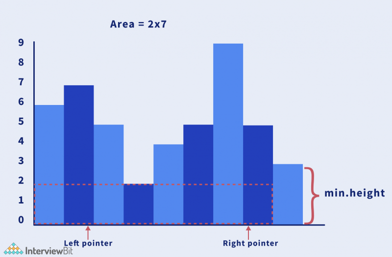
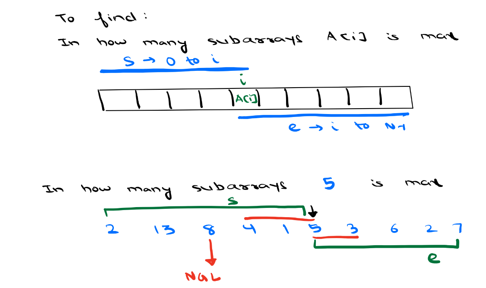

## Advanced DSA Day 28 Stack 2 Nearest smaller/greater element


## Scope / Agenda
- [Nearest Smaller element](#nearest-smaller-element)
- [Largest rectangle in histogram](#largest-rectangle-in-histogram)
- [Max/Min in subarray](#maxmin-in-subarray)


## Problems and solutions

1. [Assignments](https://github.com/rajpiyush220/Algorithms/tree/master/problems/src/main/java/com/learning/scaler/advance/module3/stack2/assignment)
2. [Additional Problems](https://github.com/rajpiyush220/Algorithms/tree/master/problems/src/main/java/com/learning/scaler/advance/module3/stack2/additional)
3. [Self Practise Problems](https://github.com/rajpiyush220/Algorithms/tree/master/problems/src/main/java/com/learning/scaler/advance/module3/stack2/lecture)

## Class Notes and Videos

1. [Class Notes](https://github.com/rajpiyush220/Algorithms/blob/master/Notes/class_Notes/Advance%20DSA%20Notes/28%20Stack%202%20Nearest%20Smaller%20or%20Greater%20Element.pdf)
2. [Class/Lecture Video](https://youtu.be/lQVNt_2AgMk)

## Nearest Smaller element
    Problem Description
        Given an array A, find the nearest smaller element G[i] for every element A[i] in the array such
        that the element has an index smaller than i.
        More formally,
        G[i] for an element A[i] = an element A[j] such that
        j is maximum possible AND
        j < i AND
        A[j] < A[i]
        Elements for which no smaller element exist, consider the next smaller element as -1.

    Problem Constraints
        1 <= |A| <= 100000
        -10^9 <= A[i] <= 10^9

    Input Format
        The only argument given is integer array A.

    Output Format
        Return the integar array G such that G[i] contains the nearest smaller number than A[i]. If no such element occurs G[i] should be -1.

    Example
        Input 1:
            A = [4, 5, 2, 10, 8]
        Input 2:
            A = [3, 2, 1]

    Example
        Output 1:
            [-1, 4, -1, 2, 2]
        Output 2:
            [-1, -1, -1]

    Example
        Explanation 1:
            index 1: No element less than 4 in left of 4, G[1] = -1
            index 2: A[1] is only element less than A[2], G[2] = A[1]
            index 3: No element less than 2 in left of 2, G[3] = -1
            index 4: A[3] is nearest element which is less than A[4], G[4] = A[3]
            index 4: A[3] is nearest element which is less than A[5], G[5] = A[3]
        Explanation 2:
            index 1: No element less than 3 in left of 3, G[1] = -1
            index 2: No element less than 2 in left of 2, G[2] = -1
            index 3: No element less than 1 in left of 1, G[3] = -1
### Solution approach
    Approach 1: Brute Force
        Try to find nearest smaller on left of the current index, search from i-1 till 0.
        TC : O(n^2)
        SC : O(1)
    Approach 2: Using stack
        1. Assign first index result as -1 and push current index element to stack.
        2. if top of stack is smaller then current index val then set stack top as answer for the current index
        and push current index val to the stack.
        3. Keep popping stack until stack is empty or we get the smaller element in stack. 
        If stack becomes empty assign -1 as result or the smaller element we find. Push current index
        val to the stack.
        4. Keep repeating step 2 and step 3 and untill we have element in array
        TC : O(n)
        SC : O(n)
### Solution
```java
public int[] prevSmaller(int[] A) {
    if (A == null || A.length == 0) return A;
    int[] result = new int[A.length];
    Stack<Integer> smallerStack = new Stack<>();
    for (int i = 0; i < A.length; i++) {
        // pop all greater or equal element from stack
        while (!smallerStack.isEmpty() && smallerStack.peek() >= A[i]) smallerStack.pop();
        result[i] = smallerStack.isEmpty() ? -1 : smallerStack.peek();
        smallerStack.push(A[i]);
    }
    return result;
}
```
## Largest rectangle in histogram
    Problem Description
        Given an array of integers A.
        A represents a histogram i.e A[i] denotes the height of the ith histogram's bar. Width of each bar is 1.
        Find the area of the largest rectangle formed by the histogram.

    Problem Constraints
    1 <= |A| <= 100000
    1 <= A[i] <= 10000

    Input Format
        The only argument given is the integer array A.

    Output Format
        Return the area of the largest rectangle in the histogram.

    Example
        Input 1:
            A = [2, 1, 5, 6, 2, 3]
        Input 2:
            A = [2]

    Example
        Output 1:
            10
        Output 2:
            2

    Example
        Explanation 1:
            The largest rectangle has area = 10 unit. Formed by A[3] to A[4].
        Explanation 2:
            Largest rectangle has area 2.

### Solution approach
    Approach 1L Brute force
        1. Fix any one building as left boundary and keep finiding at least same height building to the right.
        2. Calculate area and return max out of it
        TC : O(n^2)
        SC : O(n)
    Approach 2: Using stack
        If we look at problem carefully, we need to find left and right boundary for each index. Left and right boundary would be all the bar height which is equal or bigger than the current height.
        1. Find nearset smaller in left and nearest smaller in right for each index.
        2. Calculate area of the selected rectangeas A[i] * (right boundary index - left boundary index + 1)
        TC : O(n)
        SC : O(n)
### Solution
```java
public int largestRectangleArea(ArrayList<Integer> A) {
    if (A == null || A.isEmpty()) return 0;
    int[] leftSmaller = new int[A.size()];
    int[] rightSmaller = new int[A.size()];
    Stack<Integer> stack = new Stack<>();
    for (int i = 0; i < A.size(); i++) {
        while (!stack.isEmpty() && A.get(stack.peek()) >= A.get(i)) stack.pop();
        leftSmaller[i] = stack.isEmpty() ? -1 : stack.peek();
        stack.push(i);
    }
    stack = new Stack<>();
    for (int i = A.size() - 1; i >= 0; i--) {
        while (!stack.isEmpty() && A.get(stack.peek()) >= A.get(i)) stack.pop();
        rightSmaller[i] = stack.isEmpty() ? A.size() : stack.peek();
        stack.push(i);
    }
    // if left stack is -1 it means current index is left boundary
    // if right stack is -1 it means current index is right boundary
    int maxArea = 0;
    for (int i = 0; i < A.size(); i++) {
        // find the current area
        maxArea = Math.max(maxArea, ((rightSmaller[i] - leftSmaller[i] - 1) * A.get(i)));
    }
    return maxArea;
}
```
## Max/Min in subarray
    Problem Description
        Given an array of integers A.
        The value of an array is computed as the difference between the maximum element in the array and
        the minimum element in the array A.
        Calculate and return the sum of values of all possible subarrays of A modulo 10^9+7.

    Problem Constraints
        1 <= |A| <= 100000
        1 <= A[i] <= 1000000

    Input Format
        The first and only argument given is the integer array A.

    Output Format
        Returns the sum of values of all possible subarrays of A modulo 109+7.

    Example
        Input 1:
            A = [1]
        Input 2:
            A = [4, 7, 3, 8]

    Example
        Output 1:
            0
        Output 2:
            26

    Example
        Explanation 1:
            Only 1 subarray exists. Its value is 0.
        Explanation 2:
            value ( [4] ) = 4 - 4 = 0
            value ( [7] ) = 7 - 7 = 0
            value ( [3] ) = 3 - 3 = 0
            value ( [8] ) = 8 - 8 = 0
            value ( [4, 7] ) = 7 - 4 = 3
            value ( [7, 3] ) = 7 - 3 = 4
            value ( [3, 8] ) = 8 - 3 = 5
            value ( [4, 7, 3] ) = 7 - 3 = 4
            value ( [7, 3, 8] ) = 8 - 3 = 5
            value ( [4, 7, 3, 8] ) = 8 - 3 = 5
            sum of values % 10^9+7 = 26
### Solution Approach
    Approach 1: Brute force
        Traverse through all possible subarray and find min and max of it. 
        TC : O(n^3)
        SC : O(1)
    Approach 2: Carry forward
        As we can see in example, subarray with 1 size will always contribute zero to the total sum so we can ignore it.
        Start i = 0 till n-1
            Start j = i + 1 till n-1
            Find min and max in current subarray using carry forward and calculate sum
        TC : O(n^2)
        SC : O(1)
    Approach 3: Contribution technique
        For index i, try to find all the subarray where A[i] is max and all the subarray where A[i] would be minimum.
        Total contribution of A[i] would be A[i] * (maxCount - minCoun)
        TC : O(n)
        SC : O(n)

### Psuedo code
```java
    // find next greater Left and Next greater right to find max count
    // find next smaller left and next smaller right to find min count
    for(int i = 0; i < n; i++){
        noOfMax = (i - NGL[i] ) * (NGR[i] - i);
        noOfMin = (i - NSL[i]) * (NSR[i] - i);
        sum += A[i] * (noOfMax - noOfMin);
    }
```
### Solution
```java

```
