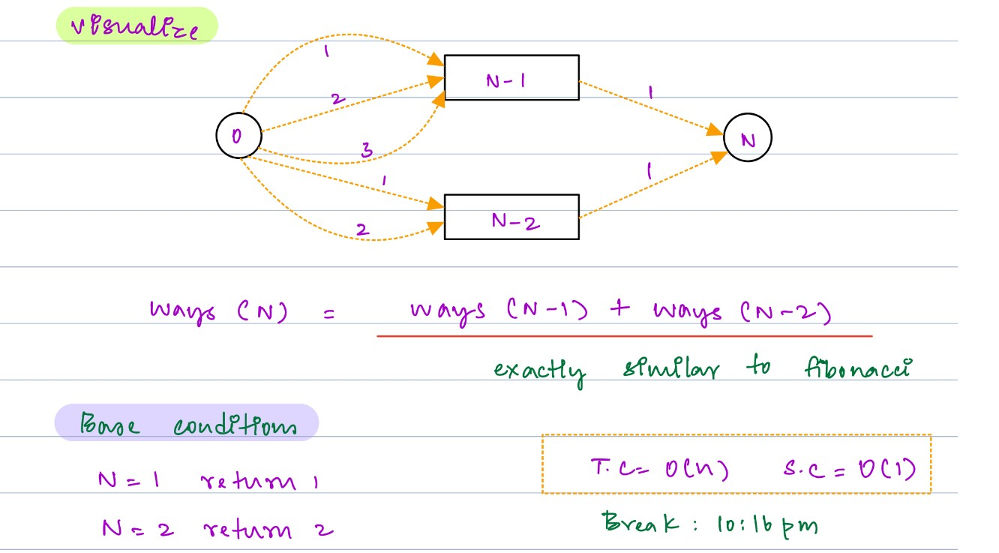
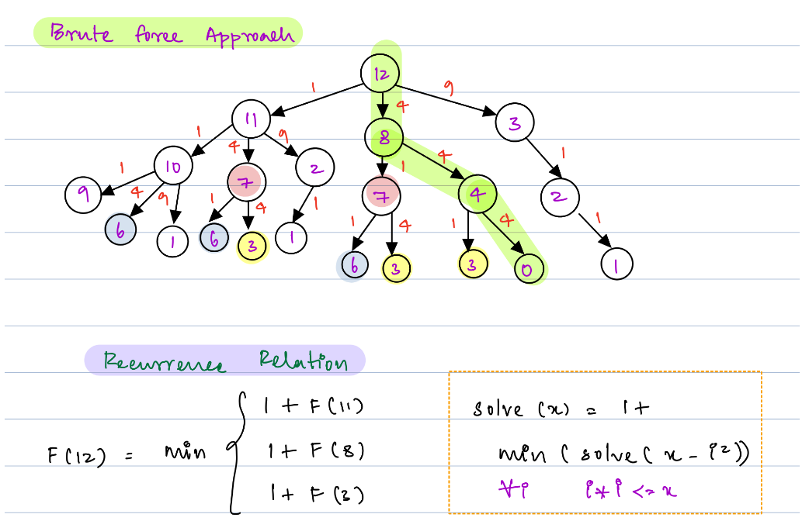

## Advance DSA Day 40 DP 1 Dimensional


## Scope / Agenda
- [What is Dynamic Programming](#what-is-dynamic-programming)
- [Conditions to use DP](#conditions-to-use-dp)
- [Why DP? Fibonacci series](#why-dp-fibonacci-series)
- [Types of DP](#types-of-dp)
- [No of stairs](#no-of-stairs)
- [Minimum Number of Squares](#minimum-number-of-squares)


## Problems and solutions

1. [Assignments](https://github.com/rajpiyush220/Algorithms/tree/master/problems/src/main/java/com/learning/scaler/advance/module4/dp1/assignment)
2. [Additional Problems](https://github.com/rajpiyush220/Algorithms/tree/master/problems/src/main/java/com/learning/scaler/advance/module4/dp1/additional)
3. [Self Practise Problems](https://github.com/rajpiyush220/Algorithms/tree/master/problems/src/main/java/com/learning/scaler/advance/module4/dp1/lecture)

## Class Notes and Videos

1. [Class Notes](https://github.com/rajpiyush220/Algorithms/blob/master/Notes/class_Notes/Advance%20DSA%20Notes/40.%20DP%201%20Dimensional.pdf)
2. [Class/Lecture Video](https://www.youtube.com/watch?v=QUpIV6IncXY)
3. [New Batch Notes](../../../new_batch_notes/Dp%201.pdf)
4. [New Batch video](https://youtu.be/khYRq5-4ugc)

## What is Dynamic Programming
    Dynamic Programming is mainly an optimization over plain recursion.
    Wherever we see a recursive solution that has repeated calls for same inputs, 
    we can optimize it using Dynamic Programming. The idea is to simply store the results of subproblems, 
    so that we do not have to re-compute them when needed later. 
    This simple optimization reduces time complexities from exponential to polynomial.


### Please follow below link for more details
* [GFG](https://www.geeksforgeeks.org/dynamic-programming/#basics)
* [InterviewBit](https://www.interviewbit.com/courses/programming/dynamic-programming/)
## Conditions to use DP
* Optimal Substructure: If we can break a bigger problem into similar smaller subproblems
* Overlapping subproblems: If same subproblems is getting repeated or it is getting called multiple time for the same input.
> Note : For the above scenario we can use DP to solve the problems
## Why DP? Fibonacci series
    If we look at DP, it is avoiding the repeatative call for the same input basically it is storing the result of respective 
    input on the very first call and same in being used in further call. Suppose if same function is getting 
    called n times, in that case and each execution take n time then
        * without dp the total execution time would be n ^ 2
        * With dp same execution can be done in n times
    By looking at above comparision we can see DP is saving lot of time if problems has repeated calls.
### Fibonacci series example
#### Recursive Approach without DP
```java
    private int fibonacciRecursiveNoDp(int input) {
        if (input == 0 || input == 1) return input;
        return fibonacciRecursiveNoDp(input - 1) + fibonacciRecursiveNoDp(input - 2);
    }
```
    TC : O(2^N)
    SC : O(h) --> recursive call stack memory
#### Recursive Approach with DP
```java
    int[] fibonacciTerms;
    private int fibonacciRecursive(int input) {
        if (fibonacciTerms == null) {
            fibonacciTerms = new int[input + 1];
            Arrays.fill(fibonacciTerms, 0, input + 1, -1);
        }
        if (input == 0 || input == 1) return input;
        if (fibonacciTerms[input] != -1) return fibonacciTerms[input];
        int currentTerm = fibonacciRecursive(input - 1) + fibonacciRecursive(input - 2);
        fibonacciTerms[input] = currentTerm;
        return fibonacciTerms[input];
    }
```
    TC : O(logN) --> number of method call will be height of recursion and that would be logn
    SC : O(n+logn)  --> n would be dp array space and logn would be recirsive call stack memory
#### Iterative Approach
```java
    private int fibonacciIterative(int input) {
        int term1 = 0, term2 = 1;
        for (int i = 1; i < input; i++) {
            int nextTerm = term1 + term2;
            term1 = term2;
            term2 = nextTerm;
        }
        return term2;
    }
```
    TC : O(N)
    SC : O(1)

## Types of DP
* **Recursive or Top Down approach or Memoization** : We will start from bigger to smaller problem and keep storing result of smaller problem for future use. We store result so we call it memoization.
* **Iterative or Bottom Up or tabulation approach** : we will start from smaller to bigger problem and store only specific result which would help to calculate next resutls.
## No of stairs
    Problem Description
        You are climbing a staircase, and it takes A steps to reach the top.
        Each time you can either climb 1 or 2 steps. In how many distinct ways can you climb to the top?
        Return the number of distinct ways modulo 1000000007


    Problem Constraints
        1 <= A <= 10^5

    Input Format
        The first and the only argument contains an integer A, the number of steps.

    Output Format
        Return an integer, representing the number of ways to reach the top.

    Example Input
        Input 1:
            A = 2
        Input 2:
            A = 3
    Example Output
        Output 1:
            2
        Output 2:
            3

    Example Explanation
        Explanation 1:
            Distinct ways to reach top: [1, 1], [2].
        Explanation 2:
            Distinct ways to reach top: [1 1 1], [1 2], [2 1].
### Solution approach
    As per the problem description either we can take 1 step or 2, so based on that if we start 
    thinking about breaking into subproblems, it would be like below 
        ways to climb n stair = ways to climb n-1 stair + ways to climb n-2 stair
> Note : Ways to reach step 0 will always be 1


### Solution Approach



    Approach 1 : Using recursion
        As we can see in the problem we are allowed to take either one step or two step.
        We will try to find number of ways we can reach to the last step and suppose last step in n
        then number of ways to reach last step would be
            stepCount(n) = stepCount(n-1) + stepCount(n-2)
            base case for recursion would be
            if(A < 0) return 0;
            if(A <= 1) return 1;
        TC : O(2^n) --> recursion TC
        SC : O(n) --> Recursion stack space
    Approach 2: Using dynamic programming top down approach
        We will just remove the duplicate calculation from prev approach using dynamic programming
        TC : O(n)
        SC : O(n) --> dp array space
    Approach 3: Using dynamic programming bottom up approach
        In place of stating from last step we will start from first step and keep counting till last step
        and that would be the result.
        TC : O(n)
        SC : O(1)
### Solution
```java
public int climbStairsApproach2(int A) {
    if (climbWayCount == null) {
        climbWayCount = new int[A + 1];
        Arrays.fill(climbWayCount, 0, A + 1, -1);
    }
    if (A < 0) return 0;
    if (A == 0 || A == 1) return 1;
    if (climbWayCount[A] != -1) return climbWayCount[A];
    int count = climbStairsRecursive(A - 1) + climbStairsRecursive(A - 2);
    count = count % 1000000007;
    climbWayCount[A] = count;
    return count;
}

public int climbStairsApproach3(int A) {
    int[] waysCount = new int[A + 1];
    waysCount[0] = waysCount[1] = 1;
    for (int i = 2; i < waysCount.length; i++) {
        waysCount[i] = (waysCount[i - 1] + waysCount[i - 2]) % 1000000007;
    }
    return waysCount[A] % 1000000007;
}
```
## Minimum Number of Squares
    Problem Description
        Given an integer A. Return minimum count of numbers, sum of whose squares is equal to A.

    Problem Constraints
        1 <= A <= 10^5

    Input Format
        First and only argument is an integer A.

    Output Format
        Return an integer denoting the minimum count.

    Example Input
        Input 1:
            A = 6
        Input 2:
            A = 5

    Example Output
        Output 1:
            3
        Output 2:
            2

    Example Explanation
    Explanation 1:
        Possible combinations are : (12 + 12 + 12 + 12 + 12 + 12) and (12 + 12 + 22).
        Minimum count of numbers, sum of whose squares is 6 is 3.
    Explanation 2:
        We can represent 5 using only 2 numbers i.e. 12 + 22 = 5
### Solution approach



    Approach 1: Using Recursion
        As per the problem statement largest number that can be used to calculate no of perfect square would be
        sqrt(n), and we will use same propeties to find the number of perfect square whose sum would be as same as n.

        Find all the number from 1 to sqrt(n) and subtract it to find the number of perfect square that can be
        used to calculate the total sum and whichever gives minimun count that would be the result.

        TC : O(2^n)
        SC : O(n) --> Stack space
    Approach 2: Using dynamic programming Top down approach
        We will just remove duplicate calculation from prev approach and will calculate once and reuse it multiple times.
        TC : O(n*sqrt(n))
        SC : O(n)
### Solution
```java
public int countMinSquaresApproach2(int A) {
    if (squareCount == null) {
        squareCount = new int[A + 1];
        Arrays.fill(squareCount, -1);
    }
    if (A == 0) return 0;
    if (squareCount[A] != -1) return squareCount[A];
    int min = Integer.MAX_VALUE;
    for (int i = 1; i * i <= A; i++) {
        min = Math.min(min, countMinSquares(A - i * i));
    }
    squareCount[A] = min + 1;
    return squareCount[A];
}
```
