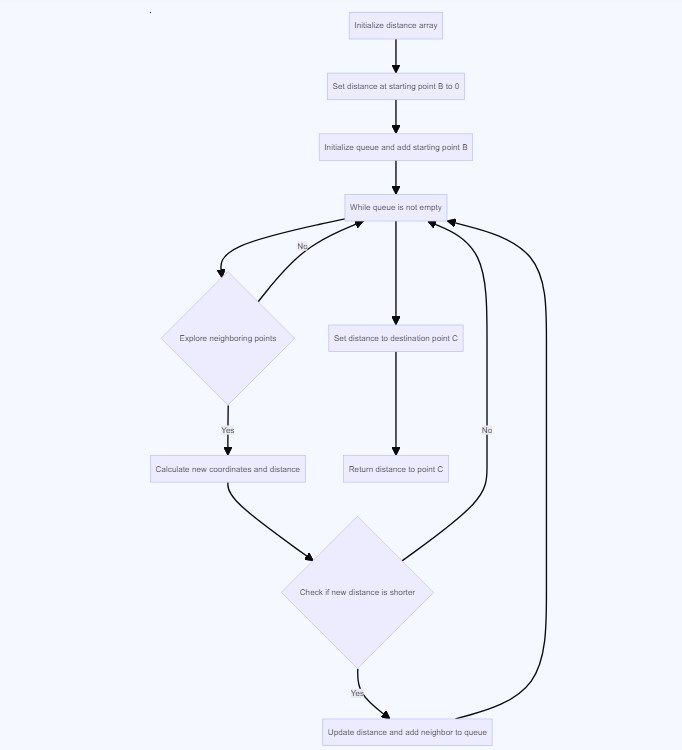

## Advance DSA Day 41 DP 2 Two Dimentional

## Scope / Agenda
- [Max Subsequence Sum](#max-subsequence-sum)
- [Unique path in a grid I](#unique-path-in-a-grid-i)
- [Unique path in a grid II](#unique-path-in-a-grid-ii)
- [Dungeons and princess](#dungeons-and-princess)
- [N Digit Number](#n-digit-number)
- [Unique Binary Search Trees II](#unique-binary-search-trees-ii)
- [Shortest Distance in a Maze](#shortest-distance-in-a-maze)


## Problems and solutions

1. [Assignments](https://github.com/rajpiyush220/Algorithms/tree/master/problems/src/main/java/com/learning/scaler/advance/module4/dp2/assignment)
2. [Additional Problems](https://github.com/rajpiyush220/Algorithms/tree/master/problems/src/main/java/com/learning/scaler/advance/module4/dp2/additional)
3. [Lecture Problems]()

## Class Notes and Videos

1. [Class Notes](https://github.com/rajpiyush220/Algorithms/blob/master/Notes/class_Notes/Advance%20DSA%20Notes/41.%20DP%202%20Two%20Dimensional.pdf)
2. [Class/Lecture Video](https://youtu.be/Bb-K2N2GA3A)
3. [New Batch Video](https://youtu.be/nSmzx29wM9I)
4. [New Batch Notes](/Notes/new_batch_notes/Dp%202.pdf)

## Max Subsequence Sum
    Problem statement:
    Given an array arr[] of positive numbers, The task is to find the maximum sum of a subsequence such that no 2 numbers 
    in the sequence should be adjacent in the array.
    Examples :
        Input: arr[] = {5, 5, 10, 100, 10, 5}
        Output: 110
        Explanation: Pick the subsequence {5, 100, 5}.
        The sum is 110 and no two elements are adjacent. This is the highest possible sum.

        Input: arr[] = {3, 2, 7, 10}
        Output: 13
        Explanation: The subsequence is {3, 10}. This gives sum = 13.
        This is the highest possible sum of a subsequence following the given criteria

        Input: arr[] = {3, 2, 5, 10, 7}
        Output: 15
        Explanation: Pick the subsequence {3, 5, 7}. The sum is 15.
### Solution Approach
    Approach 1: Brute Fore
        Try all possible options
        TC : O(2^n)
        SC : O(n)
    Approach 2: Using dynamic programming
        Take below array as example
            arr = [2,-1,-4,5,6,-1,4,7]
        As pe the problem statement, we can choose consecutive element, selected element should be at least 1 distance apart.
        Lets think of choosing element at index 0
            in this case we can choose any other element from index (2-n-1)
        Lets think of not choosing element at index 0
            in this case we can choose any other element from index (1-n-1)

        so basically max sum would be
            max[i] = max( (A[i] + maxSum(2,n-1)), maxSum(1,n-1))
        Please take a look at below image for better understanding

        TC : O(n)
        SC : O(n)/O(1) --> O(n) for top down approach and O(1) for bottom up approach


### Solution
```java
// Brute Force
public int adjacentBF(int[] A) {
    return adjacentBFRec(A, A.length - 1);
}
public int adjacentBFRec(int[] A, int i) {
    if (i < 0) return 0;
    return Math.max((A[i] + adjacentBFRec(A, i - 2)), adjacentBFRec(A, i - 1));
}

// Using Top down approach
int[] maxSumArray;
public int adjacentDp1(int[] A) {
    maxSumArray = new int[A.length + 1];
    Arrays.fill(maxSumArray, -1);
    return adjacentTopDown(A, A.length - 1);
}

public int adjacentTopDown(int[] A, int i) {
    if (i < 0) return 0;
    if (maxSumArray[i] != -1) return maxSumArray[i];
    maxSumArray[i] = Math.max((A[i] + adjacentBFRec(A, i - 2)), adjacentBFRec(A, i - 1));
    return maxSumArray[i];
}
// using bottom up approach
public int adjacentDp2(int[] A) {
    int first = Math.max(A[0], 0), second = Math.max(A[1], first);
    for (int i = 2; i < A.length; i++) {
        int current = Math.max((A[i] + first), second);
        first = second;
        second = current;
    }
    return second;
}
```

## Unique path in a grid I
> [Question Link](https://leetcode.com/problems/unique-paths/description/)

    There is a robot on an m x n grid. The robot is initially located at the top-left corner 
    (i.e., grid[0][0]). The robot tries to move to the bottom-right corner 
    (i.e., grid[m - 1][n - 1]). The robot can only move either down or right at any point in time.

    Given the two integers m and n, return the number of possible unique paths that the robot can take to reach the 
    bottom-right corner.

    The test cases are generated so that the answer will be less than or equal to 2 * 10^9.


### Solution approach


    Approach 1: Brute force 
        We will follow the above mentioned approach and we will use it to calculate
        the total number of ways
         waysToReach(m,n) = waysToReach(m-1,n)  + waysToReach(m,n-1);
        TC : O(2^n)
        SC : O(n)
    Approach 2: Using dynamic programming
        We will just remove duplicate calculation from previous approach using top down approach of dynamic programming
        TC : O(n)
        SC : O(n)
    Approach 3 : Using dynamic programming bottom up approach
        Its approach would be similar as top down approach, the only difference would be we will calculate border 
        value in advance.
        TC : O(n)
        SC : O(n)
### Solution
```java
// Brute force
public int uniquePathsBF(int[][] A) {
    if (A.length == 0 || A[0].length == 0) return 0;
    return uniquePathsBFRec(A.length - 1, A[0].length - 1);
}

private int uniquePathsBFRec(int start, int end) {
    if (start == 0 || end == 0) return 1;
    return uniquePathsBFRec(start - 1, end) + uniquePathsBFRec(start, end - 1);
}

// Top down approach
int[][] pathMatrix;
public int uniquePathsDP1(int[][] A) {
    if (pathMatrix == null) {
        pathMatrix = new int[A.length][A[0].length];
        for (int[] arr : pathMatrix) Arrays.fill(arr, -1);
    }
    return uniquePathsDP1Rec(A.length - 1, A[0].length - 1);
}

private int uniquePathsDP1Rec(int start, int end) {
    if (start == 0 || end == 0) return 1;
    if (pathMatrix[start][end] != -1) return pathMatrix[start][end];
    pathMatrix[start][end] = uniquePathsBFRec(start - 1, end) + uniquePathsBFRec(start, end - 1);
    return pathMatrix[start][end];
}

// bottom up
public int uniquePathsDP2(int[][] A) {
    if (pathMatrix == null) {
        pathMatrix = new int[A.length][A[0].length];
        for (int i = 0; i < pathMatrix.length; i++) {
            if (i == 0) Arrays.fill(pathMatrix[i], 1);
            else {
                Arrays.fill(pathMatrix[i], -1);
                pathMatrix[i][0] = 1;
            }
        }
    }
    return uniquePathsDP2Rec(A.length - 1, A[0].length - 1);
}

private int uniquePathsDP2Rec(int start, int end) {
    if (pathMatrix[start][end] != -1) return pathMatrix[start][end];
    pathMatrix[start][end] = uniquePathsDP2Rec(start - 1, end) + uniquePathsDP2Rec(start, end - 1);
    return pathMatrix[start][end];
}

```

## Unique path in a grid II
> [Leet code Question Link](https://leetcode.com/problems/unique-paths-ii/description/)\
> [Scaler question link](https://www.scaler.com/academy/mentee-dashboard/class/160983/assignment/problems/8?navref=cl_tt_lst_nm)
### Problem Description
    Given a grid of size n * m, lets assume you are starting at (1,1) and your goal is to reach (n, m). 
    At any instance, if you are on (x, y), you can either go to (x, y + 1) or (x + 1, y).

    Now consider if some obstacles are added to the grids. 
    Return the total number unique paths from (1, 1) to (n, m).

    Note: 
    1. An obstacle is marked as 1 and empty space is marked 0 respectively in the grid.
    2. Given Source Point and Destination points are 1-based index.

    Problem Constraints
    1 <= n, m <= 100
    A[i][j] = 0 or 1

    Input Format
    Firts and only argument A is a 2D array of size n * m.

    Output Format
    Return an integer denoting the number of unique paths from (1, 1) to (n, m).

    Example Input
    Input 1:
        A = [
                [0, 0, 0]
                [0, 1, 0]
                [0, 0, 0]
            ]
    Input 2:
        A = [
                [0, 0, 0]
                [1, 1, 1]
                [0, 0, 0]
            ]

    Example Output
    Output 1:
       2
    Output 2:
        0

    Example Explanation
    Explanation 1:

        Possible paths to reach (n, m): {(1, 1), (1, 2), (1, 3), (2, 3), (3, 3)} and {(1 ,1), (2, 1), (3, 1), (3, 2), (3, 3)}  
        So, the total number of unique paths is 2. 
    Explanation 2:
        It is not possible to reach (n, m) from (1, 1). So, ans is 0.

### Solution Approach


> Note : We have to keep in mind that if any cell has obstacle then it would return 0 because there is obstacle and we can not use that path.

    Approach 1: Brute force 
        We will follow the above mentioned approach and we will use it to calculate
        the total number of ways
         waysToReach(m,n) = waysToReach(m-1,n)  + waysToReach(m,n-1);
        TC : O(2^n)
        SC : O(n)
    Approach 2: Using dynamic programming
        We will just remove duplicate calculation from previous approach using top down approach of dynamic programming
        TC : O(n)
        SC : O(n)
    Approach 3 : Using dynamic programming bottom up approach
        Its approach would be similar as top down approach, the only difference would be we will calculate 
        border value in advance.
        TC : O(n)
        SC : O(n)
### Soluton
```java
// Top down approach
int[][] pathMatrix;
public int uniquePathsWithObstacles(int[][] A) {
    if (pathMatrix == null) {
        pathMatrix = new int[A.length][A[0].length];
        for (int[] arr : pathMatrix) Arrays.fill(arr, -1);
    }
    return uniquePathsWithObstaclesDp1Rec(A, A.length - 1, A[0].length - 1);
}

public int uniquePathsWithObstaclesDp1Rec(int[][] A, int start, int end) {
    if (start < 0 || end < 0) return 0;
    else if (start == 0 && end == 0) return (A[start][end] == 1) ? 0 : 1;
    else if (pathMatrix[start][end] != -1) return pathMatrix[start][end];
    else if (A[start][end] == 1) {
        pathMatrix[start][end] = 0;
    } else {
        pathMatrix[start][end] = uniquePathsWithObstaclesTDRec(A, start - 1, end) +
                uniquePathsWithObstaclesTDRec(A, start, end - 1);
    }
    return pathMatrix[start][end];
}
// bottom up is yet to be solved 

```

## Dungeons and princess
    Problem Description
        The demons had captured the princess and imprisoned her in the bottom-right corner of a dungeon. The dungeon consists of 
        M x N rooms laid out in a 2D grid. Our valiant knight was initially positioned in the top-left room and must fight his 
        way through the dungeon to rescue the princess.

        The knight has an initial health point represented by a positive integer. If at any point his health point drops to 
        0 or below, he dies immediately.

        Some of the rooms are guarded by demons, so the knight loses health (negative integers) upon entering these rooms; 
        other rooms are either empty (0's) or contain magic orbs that increase the knight's health (positive integers).

        In order to reach the princess as quickly as possible, the knight decides to move only rightward or downward in each step.

        Given a 2D array of integers A of size M x N. Find and return the knight's minimum initial health so that he is 
        able to rescue the princess.

    Problem Constraints
        1 <= M, N <= 500
        -100 <= A[i] <= 100

    Input Format
        First and only argument is a 2D integer array A denoting the grid of size M x N.

    Output Format
        Return an integer denoting the knight's minimum initial health so that he is able to rescue the princess.

    Example Input
        Input 1:
            A = [ 
                [-2, -3, 3],
                [-5, -10, 1],
                [10, 30, -5]
                ]
        Input 2:
            A = [ 
                [1, -1, 0],
                [-1, 1, -1],
                [1, 0, -1]
                ]

    Example Output
        Output 1:
            7
        Output 2:
            1

    Example Explanation
        Explanation 1:
            Initially knight is at A[0][0].
            If he takes the path RIGHT -> RIGHT -> DOWN -> DOWN, the minimum health required will be 7.
            At (0,0) he looses 2 health, so health becomes 5.
            At (0,1) he looses 3 health, so health becomes 2.
            At (0,2) he gains 3 health, so health becomes 5.
            At (1,2) he gains 1 health, so health becomes 6.
            At (2,2) he looses 5 health, so health becomes 1.
            At any point, the health point doesn't drop to 0 or below. So he can rescue the princess with minimum health 7.
        
        Explanation 2:
            Take the path DOWN -> DOWN ->RIGHT -> RIGHT, the minimum health required will be 1.
### Solution approach:
    Idea 1:
        Identify all possible way and calculate min health point to start with
    Idea 2:
        Start from right bottom cell and calculate min healpoint required to reach here so once we cross the cell, 
        post execution health point should be at least 1
    Use below formula to calculate min energy required
        min_ene = 1 - current cell value
        there is a chance min_ene value could be negative in that case we will take max of 1 and min_ene and 
        that will be the min energy we need in order to successfully cross that cell.

### Psuedo code
```java
    // define 2D array of same size as given grid
    int[] healthPoints = new int[A.size()][A.get(0).size()];
    for(int i = n-1;i>=0;i--){
        for(int j = m -1; j>=0j--){
            // if last cell then 
            healthPoints[i][j] = Math.max(1, 1 - A.get(i).get(j));
            /// if last row then 
            healthPoints[i][j] = Math.max(1, healthPoints[i][j + 1] - A.get(i).get(j));
            // if last column then
            healthPoints[i][j] = Math.max(1, healthPoints[i + 1][j] - A.get(i).get(j));
            // else
            healthPoints[i][j] = Math.max(1, Math.min(healthPoints[i][j + 1], healthPoints[i + 1][j])
                            - A.get(i).get(j));
        }
    }
    return healthPoints[0][0]
``` 

### Solution
```java
    int[][] healthPoints;
    public int calculateMinimumHP(ArrayList<ArrayList<Integer>> A) {
        int n = A.size(), m = A.get(0).size();
        healthPoints = new int[A.size()][A.get(0).size()];
        for (int i = n - 1; i >= 0; i--) {
            for (int j = m - 1; j >= 0; j--) {
                if (i == n - 1 && j == m - 1) {
                    healthPoints[i][j] = Math.max(1, 1 - A.get(i).get(j));
                } else if (i == n - 1) {
                    healthPoints[i][j] = Math.max(1, healthPoints[i][j + 1] - A.get(i).get(j));
                } else if (j == m - 1) {
                    healthPoints[i][j] = Math.max(1, healthPoints[i + 1][j] - A.get(i).get(j));
                } else {
                    healthPoints[i][j] = Math.max(1, Math.min(healthPoints[i][j + 1], healthPoints[i + 1][j])
                            - A.get(i).get(j));
                }
            }
        }
        return healthPoints[0][0];
    }
```

## N Digit Number
    Problem Description
        Find out the number of A digit positive numbers, whose digits on being added equals to a given number B.
        Note that a valid number starts from digits 1-9 except the number 0 itself. i.e. leading zeroes are not allowed.
        Since the answer can be large, output answer modulo 1000000007

    Problem Constraints
        1 <= A <= 1000
        1 <= B <= 10000

    Input Format
        First argument is the integer A
        Second argument is the integer B

    Output Format
        Return a single integer, the answer to the problem

    Example Input
        Input 1:
            A = 2
            B = 4
        Input 2:
            A = 1
            B = 3


    Example Output
        Output 1:
            4
        Output 2:
            1

    Example Explanation
        Explanation 1:
            Valid numbers are {22, 31, 13, 40}
            Hence output 4.
        Explanation 2:
            Only valid number is 3

### Solution Approach
    Approach 1: Brute Force
        Lets take an example of 2 digit number with sum k and we cant take 0 as first digit.
            Options for digit 0 : 1 to 9 where digit <= k
            options for digit 1 : 0 to 9 where digit <= (k - first digit)

        Generalized one
            count(digit_count,sum) = ∑ count(digit_count-1,sum-x) where 0 <= x <= 9 && sum-x >= 0
            ∑ --> Sum of all available options
        TC : O(10 * 2^n)
        SC : O(n)
    Approach 2: Using DP
        Avoid recalculation in previous approach and good to go
        TC : O(10 * n)
        SC : O(10 * n)
### Solution
```java
    static final int MOD = 1000000007;
    public int solveRecursive(int A, int B) {
        long[][] dp = new long[A + 1][B + 1];
        for (int j = 1; j < Math.min(10, B + 1); j++) {
            dp[1][j] = 1;
        }

        // Build up the solution
        for (int i = 2; i <= A; i++) {
            for (int j = 1; j <= B; j++) {
                for (int k = 0; k < 10; k++) {
                    if (j - k >= 0) {
                        dp[i][j] = dp[i][j] + (dp[i - 1][j - k] % MOD);
                    }
                }
            }
        }

        return (int) (dp[A][B] % MOD);
    }
```

## Unique Binary Search Trees II
    Problem Description
        Given an integer A, how many structurally unique BST's (binary search trees) exist that can store values 1...A?

    Problem Constraints
        1 <= A <=18

    Input Format
        First and only argument is the integer A

    Output Format
        Return a single integer, the answer to the problem

    Example Input
        Input 1:
            1
        Input 2:
            2

    Example Output
        Output 1:
            1
        Output 2:
            2

    Example Explanation
        Explanation 1:
            Only single node tree is possible.
        Explanation 2:
            2 trees are possible, one rooted at 1 and the other rooted at 2.

### Solution approach
> Note : This example is as same catalane number

> Note : Even if there is no node we can construct empty BST

    Let take an example of n =3
        if n = 3, here we have option to choose 1 to 3 as root node

        Step 1: if 1 is root node, 2 and 3 would be nodes of right subtree and we can arrange then in 2 way
        step 2: if 2 is root node, 1 would be nodes of left subtree and 3 would be nodes of right subtree and
                we can construct only one distinct node
        step 3: if 3 is root node, 1 and 2 would be nodes of left subteee and we can arrange them in 2 different way

        so total number of arrangement is 2 + 1 + 2 = 5
        Generalized form
            count(n) = sum of count(1...n)
    Approach 1: BF
        Consider each element from 1 to n as root and use remaining as left and right subtree and find the 
        number of tree that can be constructed
        TC : O(2^n)
        SC : O(n) --> stack space in case of skew tree structure
    Approach2 : Using DP
        Remove duplicate operation from previous approach and we are good to go
        TC : O(n^2)  --> for each n, we are traversing from 1 to n
        SC : O(n)
### Solution
```java
// Approach 1
public int numTreesBf(int A) {
    if (A == 0 || A == 1) return 1;
    if (A < 0) return 0;
    int total = 0;
    for (int i = 1; i <= A; i++) {
        total += numTreesBf(i - 1) * numTreesBf(A - i);
    }
    bstCount[A] = total;
    return bstCount[A];
}
// Approach 2
int[] bstCount;
public int numTrees(int A) {
    if (bstCount == null) {
        bstCount = new int[A + 1];
        Arrays.fill(bstCount, -1);
        bstCount[0] = bstCount[1] = 1;
    }
    if (bstCount[A] != -1) return bstCount[A];
    int total = 0;
    for (int i = 1; i <= A; i++) {
        total += numTrees(i - 1) * numTrees(A - i);
    }
    bstCount[A] = total;
    return bstCount[A];
}
```

## Shortest Distance in a Maze
    Problem Description
        Given a matrix of integers A of size N x M describing a maze. The maze consists of empty locations and walls.
        1 represents a wall in a matrix and 0 represents an empty location in a wall.
        There is a ball trapped in a maze. The ball can go through empty spaces by rolling up, down, left or right, but it won't stop rolling until hitting a wall (maze boundary is also considered as a wall). When the ball stops, it could choose the next direction.
        Given two array of integers of size B and C of size 2 denoting the starting and destination position of the ball.
        Find the shortest distance for the ball to stop at the destination. The distance is defined by the number of empty spaces traveled by the ball from the starting position (excluded) to the destination (included). If the ball cannot stop at the destination, return -1.

    Problem Constraints
        2 <= N, M <= 100
        0 <= A[i] <= 1
        0 <= B[i][0], C[i][0] < N
        0 <= B[i][1], C[i][1] < M

    Input Format
        The first argument given is the integer matrix A.
        The second argument given is an array of integer B.
        The third argument if an array of integer C.

    Output Format
        Return a single integer, the minimum distance required to reach destination

    Example Input
        Input 1:
            A = [ [0, 0],
                [0, 0] ]
            B = [0, 0]
            C = [0, 1]
        Input 2:
            A = [ [0, 1],
                [1, 0] ]
            B = [0, 0]
            C = [1, 1]

    Example Output
        Output 1:
            1
        Output 2:
            -1

    Example Explanation
        Explanation 1:
            Go directly from start to destination in distance 1.
        Explanation 2:
            It is impossible to reach the destination from (0, 0) to (1, 1) as there are walls at (1, 0) and (0, 1)
### Solution approach
    There is bit trick in this question, here ball will keep rolling until we find wall or boundary.
    Another trick is, if we are able to reach destination is x steps that doesnt mean x would be answer. X wont be answer
    until ball stopped there.

    Lets take example of below input to understand it bit



    We will be using modified BFS to find the shortest path
    step 1: Initiliaze distance array of same size of input and intialize each cell as INT_MAX
    step 2: Create a queue which will hold start and end index of cell
    step 3: Add source to the queue and start traversing untill queue is not empty
    step 4: Start rolloing in one direction and keep rolling until we reach till wall or boundary and maintain rolling count
    step 5: now calcuate distance from source till last valid index while rolling
    step 6: Check if current distance from source till last valid index is less than last valid index then update it
    step 7: Add last valid index and keep traversing
    step 8: Check if destination cell value in INT_MAX(in case we cant reach dest) then return -1 else return distance

### Solution
```java
private static final int[][] DIRECTIONS = {{-1, 0}, {1, 0}, {0, -1}, {0, 1}};
public int solve(int[][] A, int[] B, int[] C) {
    int n = A.length;
    int m = A[0].length;
    int[][] distance = new int[n][m];
    for (int[] row : distance)
        Arrays.fill(row, Integer.MAX_VALUE);
    distance[B[0]][B[1]] = 0;

    Queue<Cell> queue = new LinkedList<>();
    queue.offer(new Cell(B[0], B[1]));
    while (!queue.isEmpty()) {
        Cell current = queue.poll();
        for (int[] dir : DIRECTIONS) {
            int x = current.xAxis + dir[0];
            int y = current.yAxis + dir[1];
            int rollCount = 0;
            while (isValidIndex(x, y, n, m) && A[x][y] == 0) {
                x += dir[0];
                y += dir[1];
                rollCount++;
            }
            int distanceFromCurrent = distance[current.xAxis][current.yAxis] + rollCount;
            int lastValidIndexDistance = distance[x - dir[0]][y - dir[1]];
            if (distanceFromCurrent < lastValidIndexDistance) {
                distance[x - dir[0]][y - dir[1]] = distanceFromCurrent;
                queue.offer(new Cell(x - dir[0], y - dir[1]));
            }
        }
    }
    distance[C[0]][C[1]] = (distance[C[0]][C[1]] == Integer.MAX_VALUE ? -1 : distance[C[0]][C[1]]);
    return distance[C[0]][C[1]];
}

private boolean isValidIndex(int x, int y, int n, int m) {
    return x >= 0 && x < n && y >= 0 && y < m;
}

class Cell {
    public Integer xAxis;
    public Integer yAxis;

    public Cell(Integer xAxis, Integer yAxis) {
        this.xAxis = xAxis;
        this.yAxis = yAxis;
    }
}
```