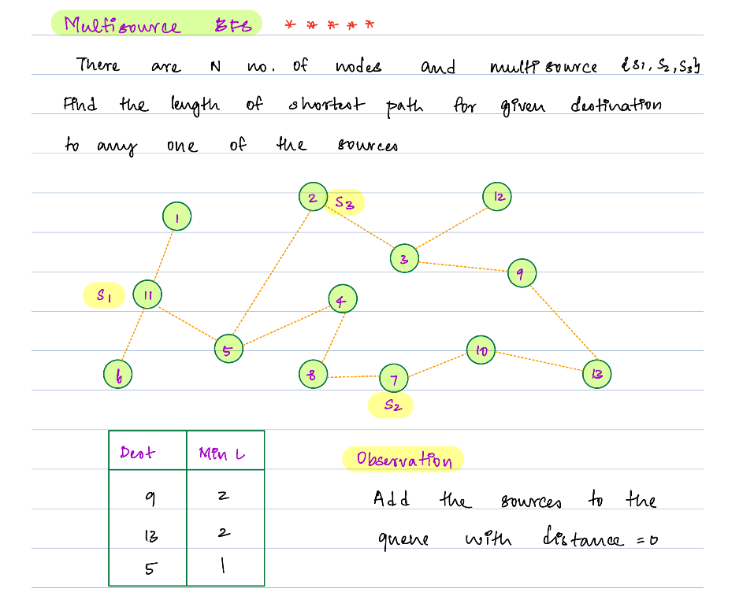
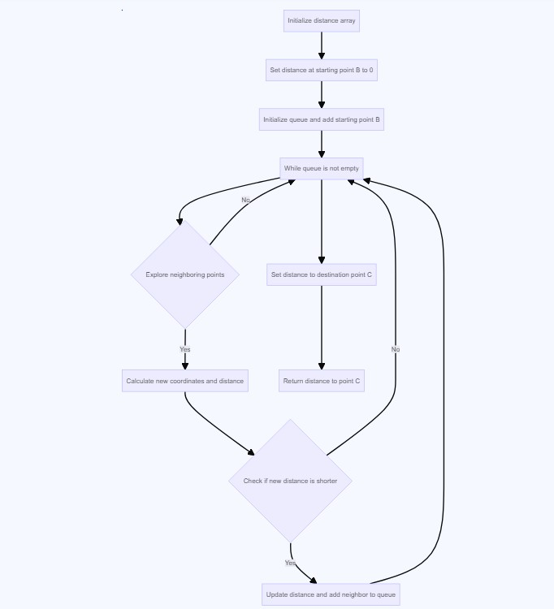

## Advance DSA Day 46 Graphs 2: BFS, Matrix Questions & Topological Sort

## Scope / Agenda
- [BFS](#bfs)
- [Multi Source BFS](#multi-source-bfs)
- [Rotten Oranges](#rotten-oranges)
- [Possibility of finishing course](#possibility-of-finishing-course)
- [Topological sort](#topological-sort)
- [Reverse Topological sort]()
- [Knight On Chess Board](#knight-on-chess-board)
- [Shortest Distance in a Maze](#shortest-distance-in-a-maze)


## Problems and solutions

1. [Assignments](https://github.com/rajpiyush220/Algorithms/tree/master/problems/src/main/java/com/learning/scaler/advance/module4/graph2/assignment)
2. [Additional Problems](https://github.com/rajpiyush220/Algorithms/tree/master/problems/src/main/java/com/learning/scaler/advance/module4/graph2/additional)
3. [Self Practise Problems](https://github.com/rajpiyush220/Algorithms/tree/master/problems/src/main/java/com/learning/scaler/advance/module4/graph2/lecture)

## Class Notes and Videos

1. [Class Notes](https://github.com/rajpiyush220/Algorithms/blob/master/Notes/class_Notes/Advance%20DSA%20Notes/46.%20graph%202.pdf)
2. [Class/Lecture Video](https://youtu.be/yYlVP_1vkss)
3. [New Batch Notes](../../../new_batch_notes/Graph2.pdf)
4. [New Batch Video](https://youtu.be/RpCnBlqCw20)


## BFS
    The Breadth First Search (BFS) algorithm is used to search a graph data structure for a
    node that meets a set of criteria. It starts at the root of the graph and visits all 
    nodes at the current depth level before moving on to the nodes at the next depth level.

    Basically it is level order traversal, first we will trvaerse all the direct neighbour and then 
    we will traverse to next level neighbours.

    TC : O(V+E)
    SC : O(V+E)  --> O(V*E) in case of adjacency matrix


### Solution approach
    We will start visiting from root node and one level at a time
    TC : O(V + E) --> No of vertices + max no of edges that can be 2* edged count
    SC : O(V + V)     --> Space taken by visited node array + space take by queue
 
### Solution
```java
public List<Integer> bfsSearch(List<List<Integer>> graphs, int root) {
    List<Integer> result = new ArrayList<>();
    boolean[] visitedNodes = new boolean[graphs.size()];
    Queue<Integer> paths = new LinkedList<>();
    paths.add(root);
    visitedNodes[root] = true;
    while (!paths.isEmpty()) {
        int current = paths.poll();
        result.add(current);
        List<Integer> nbrs = graphs.get(current);
        for (Integer nbr : nbrs) {
            if (!visitedNodes[nbr]) {
                paths.add(nbr);
                visitedNodes[nbr] = true;
            }
        }
    }
    return result;
}
```

## Multi Source BFS
    Multi source BFS is all about starting BFS from multiple nodes(in place of single source like legacy BFS) 
    choosen based on some condition and trversing level by level



### Solution approach
    If we look at problem statment, we need to find minimum distance from any source till the target

    step 1: Intialize a queue which will hold Pair(node val and distance from its source) class
    Step 2: Add all sources in queue
    Step 3: Traverse until queue is empty while calculating distance

    TC : O(V+E) --> time complexity to calculate adj list
    SC : O(V+E)
### Solution
```java
public Map<Integer, Integer> findNearestSource(List<Integer> sources, List<Integer> targets,
                                                          int A, List<List<Integer>> edges) {
    Map<Integer, Integer> result = new HashMap<>(sources.size());
    List<List<Integer>> adjList = ConstructGraphs.constructAdjList(edges, A);
    Queue<NodeDistance> queue = new LinkedList<>();
    boolean[] visited = new boolean[A + 1];
    for (int source : sources) {
        queue.add(new NodeDistance(0, source));
        visited[source] = true;
    }
    while (!queue.isEmpty()) {
        NodeDistance current = queue.poll();
        visited[current.node] = true;
        if (targets.contains(current.node)) {
            if (result.containsKey(current.node)) {
                if (result.get(current.node) > current.distance)
                    result.replace(current.node, current.distance);
            } else result.put(current.node, current.distance);
        } else {
            // add all neighbour
            for (int nbr : adjList.get(current.node)) {
                if (!visited[nbr]) {
                    visited[nbr] = true;
                    queue.add(new NodeDistance(current.distance + 1, nbr));
                }
            }
        }
    }

    return result;
}

class NodeDistance {
    int distance;
    int node;

    public NodeDistance(int distance, int node) {
        this.distance = distance;
        this.node = node;
    }
}
```

## Possibility of finishing course
    Problem Description
        There are a total of A courses you have to take, labeled from 1 to A.
        Some courses may have prerequisites, for example to take course 2 you have to first take course 1, which 
        is expressed as a pair: [1,2].
        So you are given two integer array B and C of same size where for each i (B[i], C[i]) denotes a pair.
        Given the total number of courses and a list of prerequisite pairs, is it possible for you to finish all courses?
        Return 1 if it is possible to finish all the courses, or 0 if it is not possible to finish all the courses.

    Problem Constraints
        1 <= A <= 6*10^4
        1 <= length(B) = length(C) <= 10^5
        1 <= B[i], C[i] <= A

    Input Format
        The first argument of input contains an integer A, representing the number of courses.
        The second argument of input contains an integer array, B.
        The third argument of input contains an integer array, C.

    Output Format
        Return 1 if it is possible to finish all the courses, or 0 if it is not possible to finish all the courses.

    Example Input
        Input 1:
            A = 3
            B = [1, 2]
            C = [2, 3]
        Input 2:
            A = 2
            B = [1, 2]
            C = [2, 1]

    Example Output
        Output 1:
            1
        Output 2:
            0

    Example Explanation
        Explanation 1:
            It is possible to complete the courses in the following order:
                1 -> 2 -> 3
        Explanation 2:
            It is not possible to complete all the courses.

### Solution Approach
    As per the problem statement course may or may not depend on other course so we need to start with course
    which has no dependency.

    Step 1: Calculate adjacency list along with indegree of each node
    Step 2: Create a queue and add all nodes with 0 indegree
    Step 3: Iterate until queue has data
    Step 4: Poll from front and reduce its dependency by 1
    Step 4: Iterate through all of its neighbour and reduce its dependency by 1
    Step 5: If any of the neighbour has 0 indegree then add it to queue.
    Step 6: Once queue becomes empty check if any of the node has more than 0 indegree
    Step 7: If present return 0 or return 1 at last

### Solution
```java
public int solve(int A, ArrayList<Integer> B, ArrayList<Integer> C) {
    if (B.isEmpty() || C.isEmpty()) return 1;
    int[] indegree = new int[A + 1];
    List<List<Integer>> adjList = constructAdjList(B, C, A, indegree);
    Queue<Integer> paths = new LinkedList<>();
    for (int i = 1; i <= A; i++) {
        if (indegree[i] == 0) paths.add(i);
    }
    while (!paths.isEmpty()) {
        int current = paths.poll();
        indegree[current]--;
        for (int nbr : adjList.get(current)) {
            indegree[nbr]--;
            if (indegree[nbr] == 0) paths.add(nbr);
        }
    }
    for (int i = 1; i <= A; i++) {
        if (indegree[i] > 0) return 0;
    }
    return 1;
}

private List<List<Integer>> constructAdjList(List<Integer> startNodes, List<Integer> endNodes, int nodeCount, int[] nodes) {
    if (startNodes.isEmpty() || endNodes.isEmpty()) return new ArrayList<>();
    int edgeCount = startNodes.size();
    List<List<Integer>> adjList = new ArrayList<>();
    for (int i = 0; i <= nodeCount; i++) {
        adjList.add(new ArrayList<>());
    }
    for (int i = 1; i <= edgeCount; i++) {
        int src = startNodes.get(i - 1);
        int dest = endNodes.get(i - 1);
        nodes[dest]++;
        adjList.get(src).add(dest);
    }
    return adjList;
}
```

## Rotten Oranges
    Problem Description
        Given a matrix of integers A of size N x M consisting of 0, 1 or 2.
        Each cell can have three values:
        The value 0 representing an empty cell.
        The value 1 representing a fresh orange.
        The value 2 representing a rotten orange.
        Every minute, any fresh orange that is adjacent (Left, Right, Top, or Bottom) to a rotten orange becomes 
        rotten. Return the minimum number of minutes that must elapse until no cell has a fresh orange. If this 
        is impossible, return -1 instead.
        Note: Your solution will run on multiple test cases. If you are using global variables, make sure to clear them.

    Problem Constraints
        1 <= N, M <= 1000
        0 <= A[i][j] <= 2

    Input Format
        The first argument given is the integer matrix A.

    Output Format
        Return the minimum number of minutes that must elapse until no cell has a fresh orange.
        If this is impossible, return -1 instead.

    Example Input
        Input 1:
            A = [   [2, 1, 1]
                    [1, 1, 0]
                    [0, 1, 1]   ]
        Input 2:
            A = [   [2, 1, 1]
                    [0, 1, 1]
                    [1, 0, 1]   ]

    Example Output
        Output 1:
            4
        Output 2:
            -1

    Example Explanation
        Explanation 1:
            Minute 0: [ [2, 1, 1]
                        [1, 1, 0]
                        [0, 1, 1] ]
            Minute 1: [ [2, 2, 1]
                        [2, 1, 0]
                        [0, 1, 1] ]
            Minute 2: [ [2, 2, 2]
                        [2, 2, 0]
                        [0, 1, 1] ]
            Minute 3: [ [2, 2, 2]
                        [2, 2, 0]
                        [0, 2, 1] ]
            Minute 4: [ [2, 2, 2]
                        [2, 2, 0]
                        [0, 2, 2] ]
            At Minute 4, all the oranges are rotten.
        Explanation 2:
            The fresh orange at 2nd row and 0th column cannot be rotten, So return -1.
### Solution Approach
    As per the problem statement only rotten orange can trigger fresh orange to rotten, if fresh orange in the range of
    rotten orange, so we will start travering from each rotten orange and will keep calculating time and whichever time
    is max that would be the result.

    Step 1: Creata a queue of Triplet object which hold current index and time taken to reach here
    Step 2: Add all rotten orange to the queue with time zero
    Step 3: Extract Triplet from queue and assign max of totoal time and current time to total time
    Step 4: Traverse to left, right , bottom and top if it has fresh orange and that index to queue with +1 in current time
    Step 5: Keep iterating until queue is empty and keep calculating time
    Strp 6: At last check if any fresh orange is available if yes return 0 or return total time

### Solution
```java
public static int solve(ArrayList<ArrayList<Integer>> A) {
    int N = A.size(), M = A.get(0).size(), totalTime = 0;
    int[] row = {-1, 0, 1, 0};
    int[] col = {0, 1, 0, -1};
    Queue<Triplet> rottenQueue = new LinkedList<>();
    for (int i = 0; i < N; i++) {
        for (int j = 0; j < M; j++) {
            if (A.get(i).get(j) == 2)
                rottenQueue.add(new Triplet(i, j, 0));
        }
    }

    while (!rottenQueue.isEmpty()) {
        Triplet triplet = rottenQueue.poll();
        int i = triplet.i, j = triplet.j, time = triplet.time;
        totalTime = Math.max(totalTime, time);
        for (int nbr = 0; nbr < 4; nbr++) {
            int nbrI = i + row[nbr];
            int nbrJ = j + col[nbr];
            if (isValidIndex(nbrI, nbrJ, N, M) && A.get(nbrI).get(nbrJ) == 1) {
                rottenQueue.add(new Triplet(nbrI, nbrJ, time + 1));
                A.get(nbrI).set(nbrJ, 2);
            }
        }
    }
    for (List<Integer> rows : A) {
        for (Integer val : rows) {
            if (val == 1) return -1;
        }
    }
    return totalTime;
}

private static boolean isValidIndex(int i, int j, int N, int M) {
    return i >= 0 && j >= 0 && i < N && j < M;
}

class Triplet {
    public int i;
    public int j;
    public int time;

    public Triplet(int i, int j, int time) {
        this.i = i;
        this.j = j;
        this.time = time;
    }
}
```

## Topological sort
    Problem Description
        Given an directed acyclic graph having A nodes. A matrix B of size M x 2 is given which represents the M edges such 
        that there is a edge directed from node B[i][0] to node B[i][1]. Topological 
        sorting for Directed Acyclic Graph (DAG) is a linear ordering of vertices such 
        that for every directed edge uv, vertex u comes before v in the ordering. 
        Topological Sorting for a graph is not possible if the graph is not a DAG.
        Return the topological ordering of the graph and if it doesn't exist 
        then return an empty array.
        If there is a solution return the correct ordering. If there are 
        multiple solutions print the lexographically smallest one.
        Ordering (a, b, c) is said to be lexographically smaller than 
        ordering (e, f, g) if a < e or if(a==e) then b < f and so on.
        NOTE:
            There are no self-loops in the graph.
            The graph may or may not be connected.
            Nodes are numbered from 1 to A.
            Your solution will run on multiple test cases. If you are 
            using global variables make sure to clear them.

    Problem Constraints
        2 <= A <= 10^4
        1 <= M <= min(100000,A*(A-1))
        1 <= B[i][0], B[i][1] <= A

    Input Format
        The first argument given is an integer A representing the number of nodes 
        in the graph.
        The second argument given a matrix B of size M x 2 which represents 
        the M edges such that there is a edge directed from node B[i][0] 
        to node B[i][1].

    Output Format
        Return a one-dimensional array denoting the topological ordering of the graph and it 
        it doesn't exist then return empty array.

    Example Input
        Input 1:
            A = 6
            B = [  [6, 3]
                    [6, 1]
                    [5, 1]
                    [5, 2]
                    [3, 4]
                    [4, 2] ]
        Input 2:
            A = 3
            B = [  [1, 2]
                    [2, 3]
                    [3, 1] ]

    Example Output
        Output 1:
            [5, 6, 1, 3, 4, 2]
        Output 2:
            []

    Example Explanation
        Explanation 1:
            The given graph contain no cycle so topological ordering exists which is [5, 6, 1, 3, 4, 2]
        Explanation 2:
            The given graph contain cycle so topological ordering not possible we will return empty array.

### Solution approach
    Follow the same approach as Possibility of finishing with a small twist.
    In prev problem we used queue as ordering was not a condition but here ordering matters so we will be using 
    min heap in place of queue. Remaining steps would be same

### Solution
```java
public ArrayList<Integer> solve(int A, ArrayList<ArrayList<Integer>> B) {
    List<List<Integer>> adjList = new ArrayList<>();
    for (int i = 0; i <= A; i++) {
        adjList.add(new ArrayList<>());
    }
    int[] indegree = new int[A + 1];
    for (ArrayList<Integer> row : B) {
        int start = row.get(0);
        int end = row.get(1);
        indegree[end]++;
        adjList.get(start).add(end);
    }
    PriorityQueue<Integer> minHeap = new PriorityQueue<>();
    for (int i = 1; i < indegree.length; i++) {
        if (indegree[i] == 0) minHeap.add(i);
    }

    ArrayList<Integer> result = new ArrayList<>();
    while (!minHeap.isEmpty()) {
        int current = minHeap.poll();
        result.add(current);
        for (int nbr : adjList.get(current)) {
            indegree[nbr]--;
            if (indegree[nbr] == 0) minHeap.add(nbr);
        }
    }
    return result;
}
```

## Knight On Chess Board
    Problem Description
        Given any source point, (C, D) and destination point, (E, F) on a chess board of size A x B, 
        we need to find whether Knight can move to the destination or not.


        The above figure details the movements for a knight ( 8 possibilities ).
        If yes, then what would be the minimum number of steps for the knight to move to the said point. 
        If knight can not move from the source point to the destination point, then return -1.
            NOTE: A knight cannot go out of the board.

    Problem Constraints
        1 <= A, B <= 500

    Input Format
        The first argument of input contains an integer A.
        The second argument of input contains an integer B.
        The third argument of input contains an integer C.
        The fourth argument of input contains an integer D.
        The fifth argument of input contains an integer E.
        The sixth argument of input contains an integer F.

    Output Format
        If it is possible to reach the destination point, return the minimum number of moves.
        Else return -1.

    Example Input
        Input 1:
            A = 8
            B = 8
            C = 1
            D = 1
            E = 8
            F = 8
        Input 2:
            A = 2
            B = 4
            C = 2
            D = 1
            E = 4
            F = 4

    Example Output
        Output 1:
            6
        Output 2:
            -1

    Example Explanation
        Explanation 1:
            The size of the chessboard is 8x8, the knight is initially at (1, 1) and the knight wants to reach position (8, 8).
            The minimum number of moves required for this is 6.
        Explanation 2:
            It is not possible to move knight to position (4, 4) from (2, 1)

### Solution Approach
    We can solve this using DP and graph combination, in place of creating adj list in advance. We will create it
    on the go and use dijkastra flow to calculate min steps to reach target.

    Step 1: Define a 2D visited array of size [A+1][B+1]
    Step 2: Define a Queue of Triple to hold current cell cordinate and steps to reach till that cell
    Step 3: Add source to the queue with stepCount as 0 and start trversing till queue is empty
    step 4: Exract element from queue and check if it already visited then continue or mark it visited
    Step 5: Check if current cordinate is destination cordinate, if yes then assign min of totalStepCount and 
            current step count to min step count
    Step 6: Check all 8 direction if that is valid index and not already visited
    Step 7: If not visited then add it to queue with new index and step count as current step count + 1
    Step 8: Check min step count at last if unchange then reurn -1 or return minStepCount

### Solution
```java
public int knight(int A, int B, int C, int D, int E, int F) {
    boolean[][] visited = new boolean[A + 1][B + 1];
    Queue<Triplet> queue = new LinkedList<>();
    queue.add(new Triplet(C, D, 0));
    int minStepCount = Integer.MAX_VALUE;
    int[] start = {-2, -2, 2, 2, -1, 1, -1, 1};
    int[] end = {1, -1, 1, -1, 2, 2, -2, -2};
    while (!queue.isEmpty()) {
        Triplet current = queue.poll();
        if (visited[current.i][current.j]) continue;
        if (current.i == E && current.j == F) {
            minStepCount = Math.min(minStepCount, current.steps);
        }
        visited[current.i][current.j] = true;
        // check all options and add it to queue if valid
        for (int i = 0; i < 8; i++) {
            int X = current.i + start[i], Y = current.j + end[i];
            if (isValidIndex(X, Y, A, B) && !visited[X][Y])
                queue.add(new Triplet(X, Y, current.steps + 1));
        }
    }
    return minStepCount == Integer.MAX_VALUE ? -1 : minStepCount;
}

boolean isValidIndex(int i, int j, int N, int M) {
    return i > 0 && j > 0 && i <= N && j <= M;
}

class Triplet {
    public int i;
    public int j;
    public int steps;

    public Triplet(int i, int j, int steps) {
        this.i = i;
        this.j = j;
        this.steps = steps;
    }
}
```

## Shortest Distance in a Maze
    Problem Description
        Given a matrix of integers A of size N x M describing a maze. The maze consists of empty locations and walls.
        1 represents a wall in a matrix and 0 represents an empty location in a wall.
        There is a ball trapped in a maze. The ball can go through empty spaces by rolling up, down, left or right, 
        but it won't stop rolling until hitting a wall (maze boundary is also considered as a wall). When the ball 
        stops, it could choose the next direction.
        Given two array of integers of size B and C of size 2 denoting the starting and destination position of the ball.
        Find the shortest distance for the ball to stop at the destination. The distance is defined by the number of 
        empty spaces traveled by the ball from the starting position (excluded) to the destination (included). 
        If the ball cannot stop at the destination, return -1.

    Problem Constraints
        2 <= N, M <= 100
        0 <= A[i] <= 1
        0 <= B[i][0], C[i][0] < N
        0 <= B[i][1], C[i][1] < M

    Input Format
        The first argument given is the integer matrix A.
        The second argument given is an array of integer B.
        The third argument if an array of integer C.

    Output Format
        Return a single integer, the minimum distance required to reach destination

    Example Input
        Input 1:
            A = [ [0, 0],
                [0, 0] ]
            B = [0, 0]
            C = [0, 1]
        Input 2:
            A = [ [0, 1],
                [1, 0] ]
            B = [0, 0]
            C = [1, 1]

    Example Output
        Output 1:
            1
        Output 2:
            -1

    Example Explanation
        Explanation 1:
            Go directly from start to destination in distance 1.
        Explanation 2:
            It is impossible to reach the destination from (0, 0) to (1, 1) as there are walls at (1, 0) and (0, 1)
### Solution approach
    There is bit trick in this question, here ball will keep rolling until we find wall or boundary.
    Another trick is, if we are able to reach destination is x steps that doesnt mean x would be answer. X wont be answer
    until ball stopped there.

    Lets take example of below input to understand it bit
    int[][] A = {{1, 1, 0, 1}, {0, 0, 0, 1}, {1, 0, 0, 1}, {0, 0, 1, 0}};
    int[] B = {1, 1};
    int[] C = {2, 1};



    We will be using modified BFS to find the shortest path
    step 1: Initiliaze distance array of same size of input and intialize each cell as INT_MAX
    step 2: Create a queue which will hold start and end index of cell
    step 3: Add source to the queue and start traversing untill queue is not empty
    step 4: Start rolloing in one direction and keep rolling until we reach till wall or boundary and maintain rolling count
    step 5: now calcuate distance from source till last valid index while rolling
    step 6: Check if current distance from source till last valid index is less than last valid index then update it
    step 7: Add last valid index and keep traversing
    step 8: Check if destination cell value in INT_MAX(in case we cant reach dest) then return -1 else return distance

### Solution
```java
private static final int[][] DIRECTIONS = {{-1, 0}, {1, 0}, {0, -1}, {0, 1}};
public int solve(int[][] A, int[] B, int[] C) {
    int n = A.length;
    int m = A[0].length;
    int[][] distance = new int[n][m];
    for (int[] row : distance)
        Arrays.fill(row, Integer.MAX_VALUE);
    distance[B[0]][B[1]] = 0;

    Queue<Cell> queue = new LinkedList<>();
    queue.offer(new Cell(B[0], B[1]));
    while (!queue.isEmpty()) {
        Cell current = queue.poll();
        for (int[] dir : DIRECTIONS) {
            int x = current.xAxis + dir[0];
            int y = current.yAxis + dir[1];
            int rollCount = 0;
            while (isValidIndex(x, y, n, m) && A[x][y] == 0) {
                x += dir[0];
                y += dir[1];
                rollCount++;
            }
            int distanceFromCurrent = distance[current.xAxis][current.yAxis] + rollCount;
            int lastValidIndexDistance = distance[x - dir[0]][y - dir[1]];
            if (distanceFromCurrent < lastValidIndexDistance) {
                distance[x - dir[0]][y - dir[1]] = distanceFromCurrent;
                queue.offer(new Cell(x - dir[0], y - dir[1]));
            }
        }
    }
    distance[C[0]][C[1]] = (distance[C[0]][C[1]] == Integer.MAX_VALUE ? -1 : distance[C[0]][C[1]]);
    return distance[C[0]][C[1]];
}

private boolean isValidIndex(int x, int y, int n, int m) {
    return x >= 0 && x < n && y >= 0 && y < m;
}

class Cell {
    public Integer xAxis;
    public Integer yAxis;

    public Cell(Integer xAxis, Integer yAxis) {
        this.xAxis = xAxis;
        this.yAxis = yAxis;
    }
}
```
