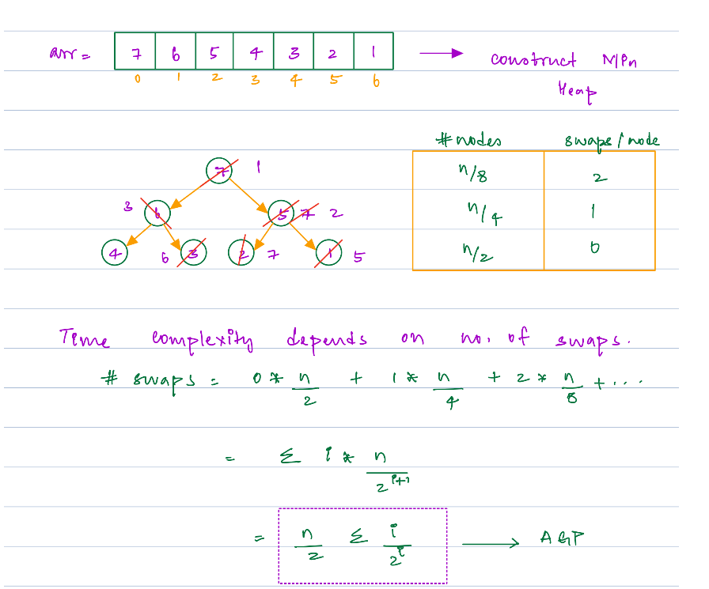
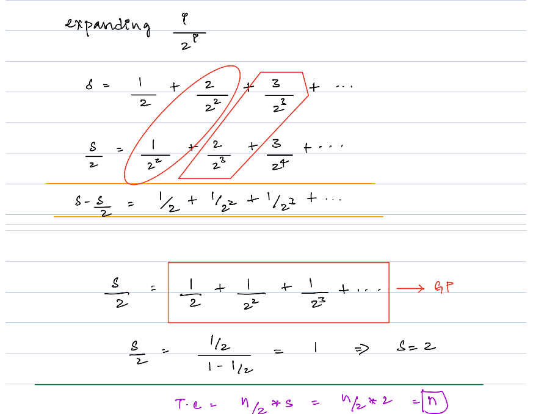

## Advance DSA Day 37 Heaps 1: Introduction

## Scope / Agenda
- [Connecting the Ropes](#connecting-the-ropes)
- [Heap Introduction](#heap-introduction)
- [Insertion](#insertion)
- [Heapify](#heapify)
- [Extract Min](#extract-min)
- [Build Heap](#build-min-heap)


## Problems and solutions

1. [Assignments](https://github.com/rajpiyush220/Algorithms/tree/master/problems/src/main/java/com/learning/scaler/advance/module4/heap1/additional)
2. [Additional Problems](https://github.com/rajpiyush220/Algorithms/tree/master/problems/src/main/java/com/learning/scaler/advance/module4/heap1/assignment)

## Class Notes and Videos

1. [Class Notes](https://github.com/rajpiyush220/Algorithms/blob/master/Notes/class_Notes/Advance%20DSA%20Notes/37.%20Heaps%20Introduction.pdf)
2. [Class/Lecture Video](https://youtu.be/-bqK0plm4xI)
3. [New Batch Video](https://youtu.be/TE_hkeZD6ks)
4. [New Batch Notes](../../../new_batch_notes/Heaps%201.pdf)

## Connecting the Ropes
    Problem Description
        You are given an array A of integers that represent the lengths of ropes.
        You need to connect these ropes into one rope. The cost of joining two ropes equals the sum of
        their lengths.
        Find and return the minimum cost to connect these ropes into one rope.

    Problem Constraints
        1 <= length of the array <= 100000
        1 <= A[i] <= 1000

    Input Format
        The only argument given is the integer array A.

    Output Format
        Returns an integer denoting the minimum cost to connect these ropes into one rope.

    Example Input
        1:
            A = [1, 2, 3, 4, 5]
        2:
            A = [5, 17, 100, 11]

    Example Output
        1:
            33
        2:
            182

    Example Explanation
        1:
            Given array A = [1, 2, 3, 4, 5].
            Connect the ropes in the following manner:
            1 + 2 = 3
            3 + 3 = 6
            4 + 5 = 9
            6 + 9 = 15

            So, the total cost to connect the ropes into one is 3 + 6 + 9 + 15 = 33.
        2:
            Given array A = [5, 17, 100, 11].
            Connect the ropes in the following manner:
            5 + 11 = 16
            16 + 17 = 33
            33 + 100 = 133

            So, total cost  to connect the ropes into one is 16 + 33 + 133 = 182.
### Solution Approach:
    Our target is to reduce the total cost and in order to do that we have to connect larger ropes
    at the end to reduce its total value.
    We will be using min heap properties and will add first two smallest rope and push the result back to 
    min heap and we will keep adding untill we reach to one.
### Solution
```java
public int connectingRopes(List<Integer> A) {
    if (A.size() == 1) return A.get(0);
    PriorityQueue<Integer> minHeap = new PriorityQueue<>(A);
    int totalCost = 0;
    while (minHeap.size() != 1) {
        int firstMin = !minHeap.isEmpty() ? minHeap.poll() : 0;
        int secondMin = minHeap.isEmpty() ? 0 : minHeap.poll();
        totalCost += (firstMin + secondMin);
        minHeap.add(firstMin + secondMin);
    }
    return totalCost;
}
```

## Heap Introduction
    A Heap is a special Tree-based data structure in which the tree is a complete binary tree.

### Please follow below links to get more about heap data structure
- [Heap](https://www.geeksforgeeks.org/introduction-to-heap-data-structure-and-algorithm-tutorials/)
- [Problems](https://www.interviewbit.com/courses/programming/heaps-and-maps/)

## Insertion
    Given a Binary Heap and a new element to be added to this Heap. The task is to insert the new element to the Heap 
    maintaining the properties of Heap. 
    Process of Insertion: Elements can be inserted to the heap following a similar approach as discussed above for deletion. 
    
    The idea is to: 
    * First increase the heap size by 1, so that it can store the 
        new element.
    * Insert the new element at the end of the Heap.
    * This newly inserted element may distort the properties of Heap for its parents. So, in order to keep the 
    properties of Heap, heapify this newly inserted element following a bottom-up approach.

    TC : O(height of tree) i.e. logN
    SC : O(1)

   
### Psuedo code
```java
    void insert(int element, int[] heap) {  // x represents dynamic array
        // add element at last
        heap.addElementAtLast(element)
        i = heap.size() - 1
        while(i > 0){
            int parentIndex = (i-1)/2
            if(heap[i] < heap[parentIndex]){
                swap(heap[i], heap[parentIndex])
                i = parentIndex;
            }else{
                break;
            }
        }
    }
```

### Heap properites in array representation
#### Find child index if parent index is given
* Left Child index : ```2 * parent index + 1```
* Right child index : ```2 * parent index + 2```
#### Find parent index if child index is given
* ```(child index - 1) / 2```

## [Heapify](https://www.geeksforgeeks.org/building-heap-from-array/)
>Heapify is a proecss to place respective element at its proper place to follow either 
min heap properties or max heap properties.

>If We look at respective CBT structure of Heap, we can observe that all leaf node is already follwing heap properties as it does not have a child so we need to check all non leaf node whether it is present at proper place or not.

**TC : O(logN)**\
**SC : O(1)**

### Psuedo Code
```java
    void heapify(int[] heap, int index){
        int N = heap.size();
        // heapify for all non leaf node
        // last child node will 2 * index + 1 
        while(2 * index + 1 < N){
            // compare 
            int currentMin = min(heap[index], heap[2 * index + 1])
            // check if right child is in range
            if(2 * index + 2 < N){
                currnetMin = min(currentMin, heap[2 * index 2 1])
            }
            if(currentMin == min[index]){
                // do nothing as it is on correct position
                break;
            }else if(currentMin == heap[2 * index + 1]){
                swap(currentMin,heap[2 * index + 1])
                index = (2 * index + 1)
            }else{
               swap(currentMin,heap[2 * index + 2])
                index = (2 * index + 2) 
            }
        }
    }
```

## Extract Min
    We can follow below steps to extract min element from heap
    Steps :
        * Construct min heap from given array
        * Swap first element with last element so that we can ignore 
        * reduce size by 1 so that last element will be out of heap
        * Heapify with index 0 so that element creating issue in heap will get settled

    TC : O(logn)
    SC : O(1)
### Psuedo code
```java
   void extractMin(int[] heap){
        // swap 0 index element with last index
        int temp = heap[0]
        heap[0] = heap[heap.size - 1]
        heap[heap.size - 1] =  temp
        heapify(heap,0)
   }
```
## Build Min Heap
    Construct heap from given array
    arr = [5, 13, -2, 11, 27, 31, 0, 19]
### Solution approach
    Idea 1 : 
        Sort the array in ascending order and we will get the min heap
        TC : O(nlogn)
    Idea 2 : 
        Insert element one by one in heap
        TC : O(nlogn)
        SC : O(1)
    Idea 3 :
        heapify all non leaf node 
        Child node for any parent index p
            left child node  : 2 * parent index + 1
            right child node : 2 * parent index + 2
        Parent node to find any child node index c
            parent node index = (c - 2)/2
        TC : O(n)
        SC : O(1)
### Time Complexity explanation
> Here time complexity would depend on number of swap we will do.




### Psuedo code
```java
    void createHeap(int[] arr)
    // start with last non leaf node and heapify till root
        for(i = (n-2)/2; i >= 0; i--){
            heapify(arr,i);
        }
```
## Merge K Sorted Lists
### Problem Description
    Given a list containing head pointers of N sorted linked lists.
    Merge these given sorted linked lists and return them as one sorted list.

    Problem Constraints
        1 <= total number of elements in given linked lists <= 100000

    Input Format
        The first and only argument is a list containing N head pointers.

    Output Format
        Return a pointer to the head of the sorted linked list after merging all the given linked lists.

    Example Input
        Input 1:
            1 -> 10 -> 20
            4 -> 11 -> 13
            3 -> 8 -> 9
        Input 2:
            10 -> 12
            13
            5 -> 6

    Example Output
        Output 1:
            1 -> 3 -> 4 -> 8 -> 9 -> 10 -> 11 -> 13 -> 20
        Output 2:
            5 -> 6 -> 10 -> 12 ->13

    Example Explanation
        Explanation 1:
            The resulting sorted Linked List formed after merging is 1 -> 3 -> 4 -> 8 -> 9 -> 10 -> 11 -> 13 -> 20.
        Explanation 2:
            The resulting sorted Linked List formed after merging is 5 -> 6 -> 10 -> 12 ->13.

### Solution approach
    Idea 1: We can use two pointers technique like merge sort and create the sorted list

    Problem with this idea: As input size grow it will be difficult to maintian that many pointer and associated manipulation 
    will be very very difficult.

    Idea 2: Using mean heap
        Steps to follow:
            1. Create Min heap (with custom comparator that will work on node value) as same size as 
            input size and we will maintain same heap size throughout the solution
            2. Push root node of each input in min heap
            3. Pull the min node value from heap and push it into LinkedList
            4. Push back the next node of linked list to min heap to process next node.
        TC : nlogn (each operation in heap and we are processing n items)
        SC : O(size of input)

### Solution
```java
    public ListNode mergeKLists(ArrayList<ListNode> a) {
        int listSize = a.size();
        PriorityQueue<ListNode> minHeap = new PriorityQueue<>(listSize, Comparator.comparingInt(o -> o.val));
        for (int i = 0; i < listSize; i++) {
            minHeap.add(a.get(i));
        }
        ListNode root = null, current = null;
        while (!minHeap.isEmpty()) {
            ListNode min = minHeap.poll();
            if (min.next != null)
                minHeap.add(min.next);
            ListNode temp = new ListNode(min.val);
            if (root == null) {
                root = temp;
                current = root;
            } else {
                current.next = temp;
            }
            current = temp;
        }
        return root;
    }
```