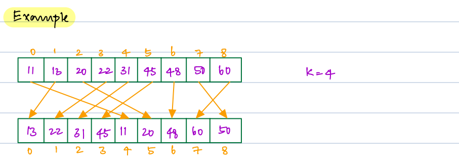
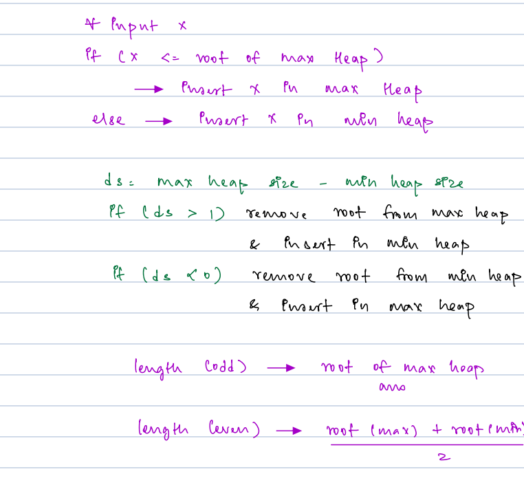

## Advance DSA Day 38 Heaps 2: Problems

## Scope / Agenda
- [Heap sort](#heap-sort)
- [kth Largest Element](#kth-largest-element)
- [Find kth largest in all the window of an array](#find-kth-largest-in-all-the-window-of-an-array-starting-from-index-0)
- [Sort Nearly Sorted Array](#sort-nearly-sorted-array)
- [Median of stream of Integers](#median-of-stream-of-integers)


## Problems and solutions
1. [Assignments](../../../../problems/src/main/java/com/learning/scaler/advance/module4/heap2/assignment)
2. [Additional Problems](../../../../problems/src/main/java/com/learning/scaler/advance/module4/heap2/additional)
3. [Lecture Problems](../../../../problems/src/main/java/com/learning/scaler/advance/module4/heap2/lecture)

## Class Notes and Videos
1. [Class Notes](https://github.com/rajpiyush220/Algorithms/blob/master/Notes/class_Notes/Advance%20DSA%20Notes/38.%20Heaps%202%20Problems.pdf)
2. [Class/Lecture Video](https://youtu.be/CuEtSz8lJtY)
3. [New Batch Notes](../../../new_batch_notes/Heaps%202.pdf)
4. [New Batch Lecture Video](https://youtu.be/Ug-2M6j7zPg)


## Heap sort 
    Problem Description:
        Sort the given array using heap
    arr = [3,1,9,4,6,2,10,5]
    Idea 1: 
        Use normal sort and return the result
        TC : O(nlogn)
        SC : Depends upon space taken by sorting algorithm
    Idea 2:
        1. Construct min heap using given array
        2. Extract min/root element and add into another array called ans array
        3. reconstruct min heap using remaining element of array
        4. And keep repeating it until remainig array has no element.
        TC : nlogn + nlogn  nlogn --> to construct min heap using library func and nlogn to extract min element from heap
        SC : O(n)  space taken by ans array
    Idea 3: with constant space
        1. Construct max heap using the element of given array 
        2. Extract max and swap it with the last element of array, basically we are trying to keep max element out of heap to 
            process remaining elements.
        3. repeat same process untill remaining size is zero.
        TC : nlogn + logn  nlogn --> to construct min heap using library func and logn to extract min element from heap
        SC : O(1)  Space optimized

>Note: Heap Sort is not stable sort.

### Psuedo code:
#### Idea 1 : Using min heap
```java
    // construct Priority queue
    PriorityQueue<Integer> minHeap = new PriorityQueue<>();
    minHeap.addAll(<array elements>)
    arr[] ans;
    while(!minHeap.isEmpty()){
        ans[index] = minHeap.poll();
    }
    return 
```
## Ath Largest Element
    Problem Description
        Given an integer array B of size N.
        You need to find the Ath largest element in the subarray [1 to i], where i varies from 1 to N. 
        In other words, find the Ath largest element in the sub-arrays [1 : 1], [1 : 2], [1 : 3], ...., [1 : N].
        NOTE: If any subarray [1 : i] has less than A elements, then the output should be -1 at the ith index.

    Problem Constraints
        1 <= N <= 100000
        1 <= A <= N
        1 <= B[i] <= INT_MAX

    Input Format
        The first argument is an integer A.
        The second argument is an integer array B of size N.

    Output Format
        Return an integer array C, where C[i] (1 <= i <= N) will have the Ath largest element in the subarray [1 : i].

    Example Input
        Input 1:
            A = 4
            B = [1 2 3 4 5 6]
        Input 2:
            A = 2
            B = [15, 20, 99, 1]

    Example Output
        Output 1:
            [-1, -1, -1, 1, 2, 3]
        Output 2:
            [-1, 15, 20, 20]

    Example Explanation
        Explanation 1:
        for i <= 3 output should be -1.
        for i = 4, Subarray [1:4] has 4 elements 1, 2, 3 and 4. So, 4th maximum element is 1.
        for i = 5, Subarray [1:5] has 5 elements 1, 2, 3, 4 and 5. So, 4th maximum element is 2.
        for i = 6, Subarray [1:6] has 6 elements 1, 2, 3, 4, 5 and 6. So, 4th maximum element is 3.
        So, output array is [-1, -1, -1, 1, 2, 3].
        Explanation 2:
        for i <= 1 output should be -1.
        for i = 2 , Subarray [1:2] has 2 elements 15 and 20. So, 2th maximum element is 15.
        for i = 3 , Subarray [1:3] has 3 elements 15, 20 and 99. So, 2th maximum element is 20.
        for i = 4 , Subarray [1:4] has 4 elements 15, 20, 99 and 1. So, 2th maximum element is 20.
        So, output array is [-1, 15, 20, 20].

### Solution approach
    Approach 1: 
        Find Ath largest in each subarray from 1 to i
        TC : O(n^3)
        SC : O(1)
    Approach 2: 
        Sort the array and find k-1 th element
        TC: O(nlogn)
        SC: Sorting algo space
    Approach 2: Using min heap
        We will start with creating min heap of and we will maintain A largest element
        In each iteration we will check current element with heap min element, if current element is bigger than 
        current min will replace current heap min with current element.
        At last we will current min heap element to the result.
        TC : (N-A)logA
        SC : O(A)
### Solution
```java
public ArrayList<Integer> solve(int A, ArrayList<Integer> B) {
    ArrayList<Integer> result = new ArrayList<>();
    PriorityQueue<Integer> minHeap = new PriorityQueue<>(A);
    for (int i = 0; i < A; i++) {
        minHeap.add(B.get(i));
        if (i < A - 1) result.add(-1);
    }
    result.add(minHeap.peek());
    for (int index = A; index < B.size() && !minHeap.isEmpty(); index++) {
        int currentMin = minHeap.peek();
        int currentVal = B.get(index);
        if (currentVal > currentMin) {
            minHeap.poll();
            minHeap.add(currentVal);
        }
        result.add(minHeap.peek());
    }
    return result;
}
```
## Find Kth Largest in all the window of an array starting from index 0
    Problem Description:
        Find the kth largest element for all the window of and array starting from index 0
### Solution Approach
    Approach 1:
        Find kth largest in each window
        TC : O(n^2)
    Approach 2: Use Min heap
        Step 1: Create a min heap of size k and add first k element to the heap
        Step 2: Extract min and that will be the answer for the first window
        Step 3: Now iterate from k till n 
        Step 4: If arr[i] > heap.peek() then extract min and add arr[i] to heap  
    Note: Basically we will consider only those element which can be kth largest element in future
### Solution
```java
public int[] kthLargestInAllWindows(int[] arr, int k) {
        int[] result = new int[arr.length - k + 1];
        int index = 0;
        PriorityQueue<Integer> minHeap = new PriorityQueue<>();
        for (int i = 0; i < k; i++) minHeap.offer(arr[i]);
        result[index++] = minHeap.peek();
        for (int i = k; i < arr.length; i++) {
            if (arr[i] > minHeap.peek()) {
                minHeap.poll();
                minHeap.offer(arr[i]);
            }
            result[index++] = minHeap.peek();
        }
        return result;
    } 
```
## Sort Nearly Sorted Array
    Problem Statement:
        Given a nearely sorted array, you need to sort it.
        Nearely Sorted Array : Every element is shifted away from its correct position by at most k steps.
    
### Example


### Solution approach
    Approach 1: Sort the array
        TC : O(nlogn)
        SC : Sorting algo space
    Approach 2: Using min heap
        This idea evilves around k, if each element is k steps away then 
        element at index i could be in range (i - k - 1) and (i+k+1).
        Step 1 : Create a min heap of size k and add first k element to the heap
        Step 2 : Iterate from k + 1 till n
        Step 3 : Poll the current root from min heap and add in result array
        Step 4 : Add arr[k+1..] to the heap
        Step 5: Iterate Until min heap has element and add it into result.
        TC : O(nlogk)
        SC : O(n) --> result array space
### Solution
```java
public ArrayList<Integer> solve(ArrayList<Integer> A, int B) {
    ArrayList<Integer> result = new ArrayList<>();
    PriorityQueue<Integer> minHeap = new PriorityQueue<>();
    for (int i = 0; i <= B; i++) {
        minHeap.add(A.get(i));
    }
    result.add(minHeap.poll());
    for (int i = B + 1; i < A.size(); i++) {
        minHeap.add(A.get(i));
        result.add(minHeap.poll());
    }
    while (!minHeap.isEmpty()) {
        result.add(minHeap.poll());
    }
    return result;
}
```
## Median of stream of Integers
    Problem Statement:
        Given an infinite stream of integer. Find the median of the current set of elements
### Solution Approach
    Idea 1: 
        Add new element at the end of the array and sort it and find median.
        TC : O(n^2logn)
        SC : O(1)
    Idea 2:
        Use insertion sort to place new element at the appropriate place and find median
        TC : O(n^2)
        SC : O(1)
    Idea 3:
        If we look at our requirement carefully we only care about middle element, 2 middle element
        if array is of even length and 1 middle element if array is of odd length.

        If this is the case why cant we think of diving stream into two part where each part will have half
        element and if there is extra element it will go to the left part.
        There is a reason of adding extra element in left part so that we can use it directly in case if odd length
        and we can use it with min element of right part in case of even length.

        Example:
            Consider 1 2 3 4 5 6
                We will divide it into two part, as array is of even length both part will have n/2 element and
                we will calculate median by using below formula
                    (max of left part + min of right part)/2
            Consider 1 2 3 4 5 6 7
                We will divide it in two part as it is odd length array left part will have one extra element
                as below
                    left part : 1 2 3 4
                    right part : 5 6 7
                We will calculate median using below formula
                    (max of left part)

        Based on the above example and logic we can use below formula to calcuate median
            if array is of even length
                (max of left part + min of right part)/2
            if array is og off length
                 (max of left part)
        
        Now the actual problem is, what type of data structure we can use that can continuously give use max in case 
        of left part and min in case of right part.

        Can we think of max heap and min heap??

        Actual approach:
            We will maintain two heap one is mean heap and other is max heap. max heap will be used to store left part
            data and min heap will be used to store right part of data.

            Problem that we may face while implementing it:-
                a. When to add data in min heap/max heap?
                b. How can we balance size of min heap and max heap so that max heap can have max of one extra element?
                c. How to decide when to move element from min heap to max heap and vice versa?

            Solution to the above problems?
                1. If array size is zero then we will add data in max heap and same element will be used to calculate
                   median as array is of off length
                2. If arr[i] <= root of max heap then we will add it in max heap otherwise in min heap
                3. If we observe our logic carefully, we can observe that the difference of size of max heap and min heap
                   could be either 0 or 1. i.e. max heap can have at most one extra element or as much as element as min
                   heap. We will use this condition to move element from min heap to max heap and vice versa.
                4. calculate diff
                    ds = size of max heap - size of min heap
                5. if ds is [0,1] then do nothing
                6. if ds is greater then one it means max heap has more data and we will move root of max heap to min heap
                7. if ds is less than 0 it mean min heap has more element and we will move root of min heap to max heap
        TC : O(nlogn) --> Considering worst case in which I need to perform heapify for each insertion
        SC : O(n) --> space taken by heap (n/2 + n/2)



> For details understating of **running median** please watch [this video]() from 1:57 hrs till 2:22 hrs

### Solution
```java
public int[] solve(int[] A) {
    int[] result = new int[A.length];
    PriorityQueue<Integer> maxHeap = new PriorityQueue<>(Comparator.reverseOrder());
    PriorityQueue<Integer> minHeap = new PriorityQueue<>();
    int size = 0, index = 0;
    for (int j : A) {
        int currentMax = maxHeap.isEmpty() ? Integer.MAX_VALUE : maxHeap.peek();
        if (j <= currentMax) maxHeap.offer(j);
        else minHeap.offer(j);
        size++;
        // check diff
        int difference = maxHeap.size() - minHeap.size();
        if (difference < 0 || difference > 1)
            if (difference > 1)
                minHeap.offer(maxHeap.poll());
            else
                maxHeap.offer(minHeap.poll());

        result[index++] =
                ((size % 2 == 0) ?
                        ((maxHeap.isEmpty() ? 0 : maxHeap.peek()) + (minHeap.isEmpty() ? 0 :
                                minHeap.peek())) / 2 : (maxHeap.isEmpty() ? 0 : maxHeap.peek()));
    }
    return result;
}
```
        
