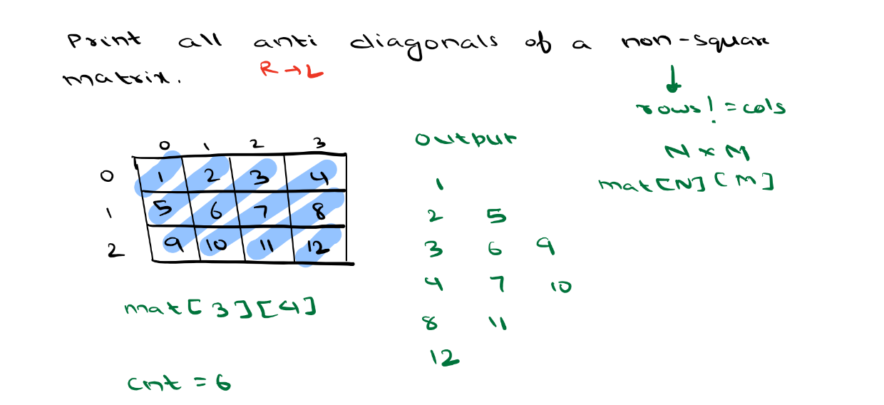

## Day 7 Arrays : 2D Matrix

## Scope / Agenda
- [Arrays 2D Matrix](#arrays-2d-matrix)
- [Print Row/column wise Sum](#print-rowcolumn-wise-sum)
- [Principle Diagonal](#principle-diagonal)
- [Print all anti diagonal of matrix](#print-all-anti-diagonal-of-matrix)
- [Matrix Transpose](#matrix-transpose)
- [Matrix Rotate](#matrix-rotate)

## Problems and solutions

1. [Assignments](https://github.com/rajpiyush220/Algorithms/tree/master/problems/src/main/java/com/learning/scaler/intermediate/twod/matrix/assignment)
2. [Additional Problems](https://github.com/rajpiyush220/Algorithms/tree/master/problems/src/main/java/com/learning/scaler/intermediate/twod/matrix/additional)
3. [Self Practise Problems](https://github.com/rajpiyush220/Algorithms/tree/master/problems/src/main/java/com/learning/scaler/intermediate/twod/matrix/lecture)

## Class Notes and Videos

1. [Class Notes](../../class_Notes/DSA%20Intermediate%20Notes/7%20Two%20Dimensional%20Matrices(6-09-23).pdf)
2. [Class/Lecture Video](https://www.youtube.com/watch?v=60tAbr6yVwQ)


## Arrays 2D Matrix
* [Refer Here for more details](https://www.geeksforgeeks.org/multidimensional-arrays-in-java/)
## Print Row/column wise Sum   
    Problem description
        Given a N*M matrix find sum of each row and column separetely.
### Solution
```java
    public List<List<Integer>> findRowWiseSum(List<List<Integer>> inputs) {
        List<List<Integer>> result = new ArrayList<>(inputs.size());
        for (List<Integer> input : inputs) {
            int currentRowSum = 0;
            for (Integer integer : input) {
                currentRowSum += integer;
            }
            result.add(new ArrayList<>(List.of(currentRowSum)));
        }
        return result;
    }

    public List<Integer> findColumnWiseSum(List<List<Integer>> inputs) {
        List<Integer> result = new ArrayList<>(inputs.get(0).size());
        for (int i = 0; i < inputs.get(0).size(); i++) {
            int currentRowSum = 0;
            for (List<Integer> input : inputs) {
                currentRowSum += input.get(i);
            }
            result.add(currentRowSum);
        }
        return result;
    }
```
## Principle Diagonal
> Principle diagonal of any 2D matrix start from left top corner and it goes till right bottom corner. i.e. choose each element with row = column


    The primary diagonal is formed by the elements A00, A11, A22, A33.
    i.e. row column condition would be row = column
### Solution
```java
    public List<Integer> printPrincipleDiagonal(List<List<Integer>> inputs) {
        List<Integer> result = new ArrayList<>(inputs.size());
        for (int i = 0; i < inputs.get(0).size(); i++) {
            for (int j = 0; j < inputs.get(i).size(); j++) {
                if (i == j) result.add(inputs.get(i).get(j));
            }
        }
        return result;
    }
```
### Print all anti diagonal of matrix


## Matrix Transpose
    Problem Description
        Given a 2D integer array A, return the transpose of A.

        The transpose of a matrix is the matrix flipped over its main diagonal, switching the matrix's row and column indices.

    Problem Constraints
        1 <= A.size() <= 1000
        1 <= A[i].size() <= 1000
        1 <= A[i][j] <= 1000

    Input Format
        First argument is a 2D matrix of integers.

    Output Format
        You have to return the Transpose of this 2D matrix.

    Example Input
        Input 1:
            A = [[1, 2, 3],[4, 5, 6],[7, 8, 9]]
        Input 2:
            A = [[1, 2],[1, 2],[1, 2]]

    Example Output
        Output 1:
            [[1, 4, 7], [2, 5, 8], [3, 6, 9]]
        Output 2:
            [[1, 1, 1], [2, 2, 2]]


    Example Explanation
        Explanation 1:
            Clearly after converting rows to column and columns to rows of [[1, 2, 3],[4, 5, 6],[7, 8, 9]]
            we will get [[1, 4, 7], [2, 5, 8], [3, 6, 9]].
        Explanation 2:
            After transposing the matrix, A becomes [[1, 1, 1], [2, 2, 2]]
### Solution approach
> Will replace rows with column and vice versa
### Solution
```java
    public int[][] solve(int[][] A) {
        int[][] result = new int[A[0].length][A.length];
        for (int i = 0; i < A[0].length; i++) {
            for (int j = 0; j < A.length; j++) {
                result[i][j] = A[j][i];
            }
        }
        return result;
    }
```
## Matrix Rotate
    Problem Description
        You are given a n x n 2D matrix A representing an image.
        Rotate the image by 90 degrees (clockwise).
        You need to do this in place.
        Note: If you end up using an additional array, you will only receive partial score.

    Problem Constraints
        1 <= n <= 1000

    Input Format
        First argument is a 2D matrix A of integers

    Output Format
        Return the 2D rotated matrix.

    Example Input
        Input 1:
            [
                [1, 2],
                [3, 4]
            ]
        Input 2:
            [
                [1, 2, 3],
                [4, 5, 6],
                [7, 8, 9]
            ]

    Example Output
        Output 1:
            [
                [3, 1],
                [4, 2]
            ]
        Output 2:
            [
                [7, 4, 1],
                [8, 5, 2],
                [9, 6, 3]
            ]

    Example Explanation
        Explanation 1:
            After rotating the matrix by 90 degree:
            1 goes to 2, 2 goes to 4
            4 goes to 3, 3 goes to 1
        Explanation 2:
            After rotating the matrix by 90 degree:
            1 goes to 3, 3 goes to 9
            2 goes to 6, 6 goes to 8
            9 goes to 7, 7 goes to 1
            8 goes to 4, 4 goes to 2
### Solution approach
> Will do matrix transpose and then reverse each row of the resultant matrix
### Solution
```java
    public void solveScaler(int[][] A) {
        int n = A.length;
        for (int i = 0; i < n; i++) {
            for (int j = 0; j < i; j++) {
                int temp = A[i][j];
                A[i][j] = A[j][i];
                A[j][i] = temp;
            }
        }
        for (int i = 0; i < n; i++) {
            for (int j = 0; j < n / 2; j++) {
                int temp = A[i][j];
                A[i][j] = A[i][n - j - 1];
                A[i][n - j - 1] = temp;
            }
        }
    }
```