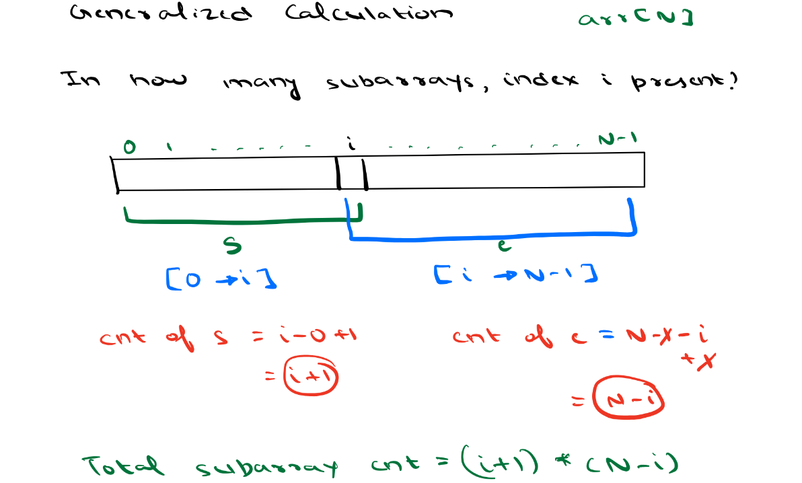

## Day 6 Arrays : Sliding Window and Contribution Technique

## Scope / Agenda
- [Questions](#questions)
  

## Problems and solutions

1. [Assignments](https://github.com/rajpiyush220/Algorithms/tree/master/problems/src/main/java/com/learning/scaler/intermediate/sliding/window/assignment)
2. [Additional Problems](https://github.com/rajpiyush220/Algorithms/tree/master/problems/src/main/java/com/learning/scaler/intermediate/sliding/window/additional)
3. [Self Practise Problems](https://github.com/rajpiyush220/Algorithms/tree/master/problems/src/main/java/com/learning/scaler/intermediate/sliding/window/assignment)

## Class Notes and Videos

1. [Class Notes](../../class_Notes/DSA%20Intermediate%20Notes/6%20Sliding%20Window%20and%20Contribution%20technique(4-09-23).pdf)
2. [Class/Lecture Video](https://www.youtube.com/watch?v=kGAzVlMW4xs)

## Questions
### Max Subarray sum
    Problem Description
        You are given an integer array C of size A. Now you need to find a subarray (contiguous elements) so that the sum of contiguous elements is maximum.
        But the sum must not exceed B.

    Problem Constraints
        1 <= A <= 10^3
        1 <= B <= 10^9
        1 <= C[i] <= 10^6

    Input Format
        The first argument is the integer A.
        The second argument is the integer B.
        The third argument is the integer array C.

    Output Format
        Return a single integer which denotes the maximum sum.

    Example Input
        Input 1:
            A = 5
            B = 12
            C = [2, 1, 3, 4, 5]
        Input 2:
            A = 3
            B = 1
            C = [2, 2, 2]

    Example Output
        Output 1:
            12
        Output 2:
            0

    Example Explanation
        Explanation 1:
            We can select {3,4,5} which sums up to 12 which is the maximum possible sum.
            Explanation 2:

            All elements are greater than B, which means we cannot select any subarray.
            Hence, the answer is 0.
### Solution approach
* Brute Force
    Find all possible subarray and get the subarray with maximum sum
    TC : O(n^3)  --> 2 loop to fix subarray and 1 loop to find sum
    SC : O(1)
* Using prefix sum
    Calculate prefix sum for the whole array
    Set starting and ending of each subarray and find its sum using prefixsum
    TC : O(n^2)
    SC : O(n)
* Optmized way
    We will use carry forward technique here, will fix start as 0 and it will go till size of the array.
    Will fix end as start and it will go till size of the array.
    TC : O(n^2)
    SC : O(1)
### Solution
```java
    public int maxSubarray(int A, int B, ArrayList<Integer> C) {
        int max = 0;
        for (int s = 0; s < A; s++) {
            int currentSum = 0;
            for (int e = s; e < A; e++) {
                currentSum += C.get(e);
                if (currentSum <= B) max = Math.max(max, currentSum);
            }
        }
        return max;
    }
```
### Sum of all Subarrays
    Problem Description
        You are given an integer array A of length N.
        You have to find the sum of all subarray sums of A.
        More formally, a subarray is defined as a contiguous part of an array which we can obtain by deleting zero or more elements from either end of the array.
        A subarray sum denotes the sum of all the elements of that subarray.

        Note : Be careful of integer overflow issues while calculations. Use appropriate datatypes.

    Problem Constraints
        1 <= N <= 10^5
        1 <= Ai <= 10^4

    Input Format
        The first argument is the integer array A.

    Output Format
        Return a single integer denoting the sum of all subarray sums of the given array.

    Example Input
        Input 1:
            A = [1, 2, 3]
        Input 2:
            A = [2, 1, 3]

    Example Output
        Output 1:
            20
        Output 2:
            19

    Example Explanation
        Explanation 1:
            The different subarrays for the given array are: [1], [2], [3], [1, 2], [2, 3], [1, 2, 3].
            Their sums are: 1 + 2 + 3 + 3 + 5 + 6 = 20
        Explanation 2:
            The different subarrays for the given array are: [2], [1], [3], [2, 1], [1, 3], [2, 1, 3].
            Their sums are: 2 + 1 + 3 + 3 + 4 + 6 = 19
### Solution approach
* Brute Force
    Find all possible subarray and get the final sum
    TC : O(n^3)  --> 2 loop to fix subarray and 1 loop to find sum
    SC : O(1)
* Using prefix sum
    Calculate prefix sum for the whole array
    Set starting and ending of each subarray and find its sum using prefixsum
    TC : O(n^2)
    SC : O(n)
* Optmized way
    If we look at problem constraint, length of array is 10^5 so need to find solution with max TC as nlogn
    We will use contribution technique in this proble.
    * We will find how much would be the contribution for each element in total subarray sum
    * If we look at element residing at 0 index will contribute n * element val to the total subarray because it will be part on n subarray which start at 0
    * If we consider any index element its contribution should be like below
        contribution in all the subarray starting before current index +
        contribution in all the subarray which start at specific index

    If you look at the above formulation
        contribution of each element residing at index i would be
        A[i] * (i+1) * (n-i)
### Solution
```java
    public Long subarraySum(ArrayList<Integer> A) {
        long totalSum = 0L;
        for (int i = 0; i < A.size(); i++) {
            totalSum += ((long) A.get(i) * (i + 1) * (A.size() - i));
        }
        return totalSum;
    }
```
### Max subarray sum of length k
    Problem Description
        Given an array A of length N. Also given are integers B.
        Return 1 if there exists a subarray with length B and 0 otherwise

    Problem Constraints
        1 <= N <= 10^5
        1 <= A[i] <= 10^4
        1 <= B <= N

    Input Format
        First argument A is an array of integers.
        The remaining arguments B are integers

    Output Format
        Return 1 if such a subarray exist and 0 otherwise

    Example Input
        Input 1:
            A = [4, 3, 2, 6, 1]
            B = 3
        Input 2:
            A = [4, 2, 2, 5, 1]
            B = 4

    Example Output
        Output 1:
            1
        Output 2:
            0

    Example Explanation
        Explanation 1:
            The subarray [3, 2, 6] is of length 3.
        Explanation 2:
            There are no such subarray.
### Solution approach
* Brute Force
    Find all possible subarray of length k and get the final sum
    TC : O(n^3)  --> 2 loop to fix subarray and 1 loop to find sum
    SC : O(1)
* Using prefix sum
    Calculate prefix sum for the whole array
    Set starting and ending of each subarray and find its sum using prefixsum
    TC : O(n^2)
    SC : O(n)
* Optmized way
    * We can use sliding window technique here.
    * Will calculate sum of first k length subarray and will check it it same as target sum if yes return 1 else do the following
    * Now we have subarray with length k, now keep sliding this to the right and calculate sum by subtracting start index value and add end +1 value to the current sum and this process will keep going until we find target sum with k length or we reached till end of the array.
### Solution
```java
    public int solve(int[] A, int B, int C) {
        int ans = 0;
        for (int i = 0; i < B; i++) {
            ans += A[i];
        }
        if (ans == C) return 1;
        int startIndex = 1, endIndex = B;
        while (endIndex < A.length) {
            ans = ans - A[startIndex - 1] + A[endIndex];
            if (ans == C) return 1;
            startIndex++;
            endIndex++;
        }
        return 0;
    }
```