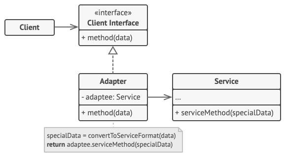
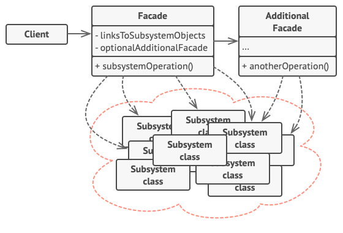

## Adapter and Facade Design Patterns

## Scope / Agenda

* Adapter Pattern
* Facade Pattern

---

## Class Notes and Videos

1. [Class Notes](/Notes/class_Notes/LLD/Design%20Patterns/Adapter%20and%20Facade%20Design%20Pattern.pdf)
2. [Class/Lecture Video](https://youtu.be/vl958YLFabg)

---

## Adapter Pattern

### 🎯 Intent

> **Adapter Pattern** is a structural design pattern that allows incompatible interfaces to work together by providing a wrapper that translates one interface into another.

---

### 🧩 Problem

You want to integrate an existing class into your system, but its interface does not match the one expected by your system. You don't want to change the existing class, but need a way to adapt it to work with your system.

---

### ✅ Solution

Create an **Adapter** class that translates between the incompatible interfaces. This adapter wraps the existing class and presents the required interface to the client code.

---

### 💡 Real-World Analogy

Consider a **plug adapter**. If you travel to a country with a different electrical outlet, you use a plug adapter to fit your device into their sockets. The adapter allows your device to work in different countries without changing the device itself.

---

### 📦 Structure



---

### 🧑‍💻 Java Example

#### 1. Target Interface

```java
public interface MediaPlayer {
    void play(String audioType, String fileName);
}
````

#### 2. Adaptee Class

```java
public class MediaAdapter implements MediaPlayer {
    private AdvancedMediaPlayer advancedMusicPlayer;

    public MediaAdapter(String audioType) {
        if(audioType.equalsIgnoreCase("vlc")) {
            advancedMusicPlayer = new VlcPlayer();
        } else if(audioType.equalsIgnoreCase("mp4")) {
            advancedMusicPlayer = new Mp4Player();
        }
    }

    @Override
    public void play(String audioType, String fileName) {
        if(audioType.equalsIgnoreCase("vlc")) {
            advancedMusicPlayer.playVlc(fileName);
        } else if(audioType.equalsIgnoreCase("mp4")) {
            advancedMusicPlayer.playMp4(fileName);
        }
    }
}
```

#### 3. Adaptee Classes (for advanced media players)

```java
public class VlcPlayer implements AdvancedMediaPlayer {
    @Override
    public void playVlc(String fileName) {
        System.out.println("Playing VLC file. Name: " + fileName);
    }

    @Override
    public void playMp4(String fileName) {
        // Do nothing
    }
}

public class Mp4Player implements AdvancedMediaPlayer {
    @Override
    public void playVlc(String fileName) {
        // Do nothing
    }

    @Override
    public void playMp4(String fileName) {
        System.out.println("Playing MP4 file. Name: " + fileName);
    }
}
```

#### 4. Client

```java
public class AdapterClient {
    public static void main(String[] args) {
        AudioPlayer audioPlayer = new AudioPlayer();

        audioPlayer.play("mp3", "beyond the horizon.mp3");
        audioPlayer.play("vlc", "far far away.vlc");
        audioPlayer.play("mp4", "alone.mp4");
    }
}
```

---

### ✅ Pros

* **Extends functionality**: Enables integration of classes with incompatible interfaces.
* **Reusability**: The existing class remains unchanged.
* **Decoupling**: The client code interacts with the Adapter, not the Adaptee, leading to reduced dependencies.

---

### ❌ Cons

* **Complexity**: Adding an adapter layer may add unnecessary complexity, especially when the number of adapters grows.
* **Performance**: Extra layer of indirection may slightly affect performance.

---

### 🧠 Key Points

* **Adapter Pattern** is used when you want to make two incompatible interfaces compatible.
* It is often used when integrating third-party libraries that don’t match your system's design.
* The **Adapter** acts as a middleman, converting requests from one interface to another.

---

## Facade Pattern

### 🎯 Intent

> **Facade Pattern** is a structural design pattern that provides a simplified interface to a complex subsystem, hiding the complexity from the client.

---

### 🧩 Problem

You have a subsystem with many interdependent classes, and you want to provide a simple interface for the client code to interact with it without needing to know all the internal details.

---

### ✅ Solution

Create a **Facade** class that wraps the complex subsystem and exposes only the necessary operations to the client code, reducing the number of calls and the complexity involved.

---

### 💡 Real-World Analogy

Imagine a **home theater system**. The system involves a TV, a DVD player, a sound system, etc., but the user doesn’t need to interact with each component separately. The **remote control (Facade)** provides a simple interface to control all components in the system.

---

### 📦 Structure




---

### 🧑‍💻 Java Example

#### 1. Subsystem Classes

```java
public class Lights {
    public void turnOn() {
        System.out.println("Lights are ON");
    }

    public void turnOff() {
        System.out.println("Lights are OFF");
    }
}

public class SoundSystem {
    public void turnOn() {
        System.out.println("Sound System is ON");
    }

    public void turnOff() {
        System.out.println("Sound System is OFF");
    }
}

public class DVDPlayer {
    public void turnOn() {
        System.out.println("DVD Player is ON");
    }

    public void turnOff() {
        System.out.println("DVD Player is OFF");
    }

    public void play(String movie) {
        System.out.println("Playing movie: " + movie);
    }
}
```

#### 2. Facade Class

```java
public class HomeTheaterFacade {
    private Lights lights;
    private SoundSystem soundSystem;
    private DVDPlayer dvdPlayer;

    public HomeTheaterFacade(Lights lights, SoundSystem soundSystem, DVDPlayer dvdPlayer) {
        this.lights = lights;
        this.soundSystem = soundSystem;
        this.dvdPlayer = dvdPlayer;
    }

    public void watchMovie(String movie) {
        lights.turnOff();
        soundSystem.turnOn();
        dvdPlayer.turnOn();
        dvdPlayer.play(movie);
    }

    public void endMovie() {
        lights.turnOn();
        soundSystem.turnOff();
        dvdPlayer.turnOff();
    }
}
```

#### 3. Client

```java
public class FacadeClient {
    public static void main(String[] args) {
        Lights lights = new Lights();
        SoundSystem soundSystem = new SoundSystem();
        DVDPlayer dvdPlayer = new DVDPlayer();
        
        HomeTheaterFacade homeTheater = new HomeTheaterFacade(lights, soundSystem, dvdPlayer);
        
        homeTheater.watchMovie("Inception");
        homeTheater.endMovie();
    }
}
```

---

### ✅ Pros

* **Simplifies usage**: Provides a simplified interface to complex subsystems.
* **Reduces coupling**: The client code does not need to interact with multiple subsystems.
* **Improves maintainability**: Changes to subsystem classes can be made without affecting client code.

---

### ❌ Cons

* **Hides functionality**: If not designed carefully, the Facade may hide useful functionality that the client might need.
* **Increased complexity**: If not managed well, the Facade can become a bloated class.

---

### 🧠 Key Points

* **Facade Pattern** provides a simple interface to a complex system.
* It helps in reducing the complexity of the system by hiding unnecessary details from the client.
* It doesn’t change the subsystem classes but simplifies their usage.

---

## 🏁 When to Use

* **Adapter Pattern** is useful when you need to make incompatible interfaces compatible without modifying their code.
* **Facade Pattern** is ideal when you want to simplify interaction with a complex subsystem by providing a unified, high-level interface.

---

### ⚖️ Pros and Cons

| Aspect       | Adapter Pattern                          | Facade Pattern                                  |
| ------------ | ---------------------------------------- | ----------------------------------------------- |
| Purpose      | Makes incompatible interfaces compatible | Simplifies interactions with complex subsystems |
| Complexity   | Adds an adapter layer                    | Adds a facade for simplification                |
| Client Usage | Adapts existing classes                  | Interacts with a simplified interface           |
| Flexibility  | Can be extended for new interfaces       | May hide useful functionality                   |

---
