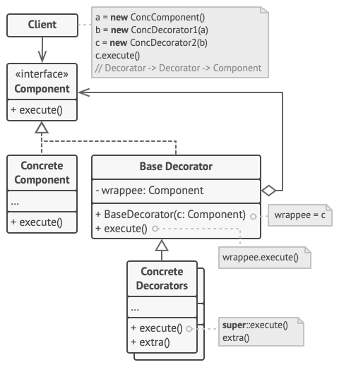
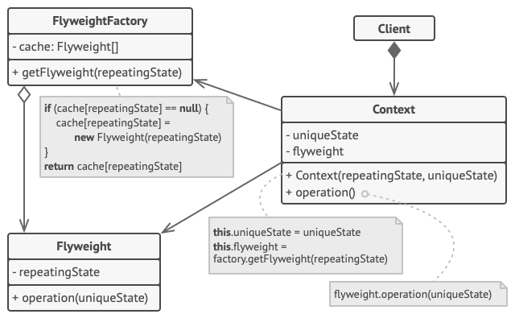

## Decorator and Flyweight Design Patterns

## Scope / Agenda

* Decorator Pattern
* Flyweight Pattern

---

## Class Notes and Videos

1. [Class Notes](/Notes/class_Notes/LLD/Design%20Patterns/Decorator%20and%20Flyweight%20Design%20Pattern.pdf)
2. [Class/Lecture Video](https://youtu.be/PkF001lYdm0)

---

## Decorator Pattern

### 🎯 Intent

> **Decorator Pattern** is a structural design pattern that allows you to dynamically add behavior to an object at runtime without modifying its structure.

---

### 🧩 Problem

You want to add additional functionality to objects, but inheritance may not be suitable due to class hierarchies becoming rigid or complex. You want a flexible solution to extend object behavior.

---

### ✅ Solution

The **Decorator** pattern involves creating a set of decorator classes that are used to wrap concrete components. These decorators add extra functionalities without changing the underlying object structure.

---

### 💡 Real-World Analogy

Think of a **coffee**: You have a basic coffee (like a black coffee), and you can add extra features (like milk, sugar, whipped cream, etc.) without changing the original coffee. The decorator (milk, sugar, etc.) adds features to the basic coffee dynamically.

---

### 📦 Structure




---

### 🧑‍💻 Java Example

#### 1. Component Interface

```java
public interface Coffee {
    double cost();
}
````

#### 2. Concrete Component

```java
public class SimpleCoffee implements Coffee {
    @Override
    public double cost() {
        return 5.0; // Basic coffee cost
    }
}
```

#### 3. Decorator Class

```java
public class CoffeeDecorator implements Coffee {
    protected Coffee decoratedCoffee;

    public CoffeeDecorator(Coffee coffee) {
        this.decoratedCoffee = coffee;
    }

    @Override
    public double cost() {
        return decoratedCoffee.cost();
    }
}
```

#### 4. Concrete Decorators

```java
public class MilkDecorator extends CoffeeDecorator {
    public MilkDecorator(Coffee coffee) {
        super(coffee);
    }

    @Override
    public double cost() {
        return decoratedCoffee.cost() + 2.0; // Add milk cost
    }
}

public class SugarDecorator extends CoffeeDecorator {
    public SugarDecorator(Coffee coffee) {
        super(coffee);
    }

    @Override
    public double cost() {
        return decoratedCoffee.cost() + 1.5; // Add sugar cost
    }
}
```

#### 5. Client Code

```java
public class DecoratorClient {
    public static void main(String[] args) {
        Coffee coffee = new SimpleCoffee();
        System.out.println("Cost of Simple Coffee: " + coffee.cost());

        coffee = new MilkDecorator(coffee);
        System.out.println("Cost of Coffee with Milk: " + coffee.cost());

        coffee = new SugarDecorator(coffee);
        System.out.println("Cost of Coffee with Milk and Sugar: " + coffee.cost());
    }
}
```

---

### ✅ Pros

* **Flexibility**: You can add features to an object at runtime.
* **Avoids class inheritance**: It avoids the complexity of creating a large inheritance hierarchy.
* **Better Extensibility**: New decorators can be added without changing existing code.

---

### ❌ Cons

* **Complexity**: Adding too many decorators can make the code harder to understand and maintain.
* **Overhead**: The system may become slower with too many nested decorators.

---

### 🧠 Key Points

* **Decorator Pattern** allows you to dynamically add new behavior to objects without altering their class.
* It is often used when you need to add responsibilities to an object in a flexible and reusable way.
* Multiple decorators can be applied to an object, providing different combinations of behavior.

---

## Flyweight Pattern

### 🎯 Intent

> **Flyweight Pattern** is a structural design pattern that allows sharing of large numbers of fine-grained objects efficiently by storing and reusing them, thus reducing memory usage.

---

### 🧩 Problem

You need to create many objects that have similar data and behavior. Creating each object individually consumes memory and processing time, leading to inefficiency.

---

### ✅ Solution

The **Flyweight** pattern introduces the concept of sharing objects that are similar. These objects are split into **intrinsic** (shared) and **extrinsic** (unique) states. The intrinsic state is shared among objects, while the extrinsic state is stored separately, often outside the object.

---

### 💡 Real-World Analogy

Think of a **character in a video game**. Multiple characters may have the same skin, shape, and features (intrinsic state), but each character has a different location or score (extrinsic state). The shared features are stored only once, and only the unique features are kept separately.

---

### 📦 Structure



---

### 🧑‍💻 Java Example

#### 1. Flyweight Interface

```java
public interface Shape {
    void draw();
}
```

#### 2. Concrete Flyweight

```java
public class Circle implements Shape {
    private String color;  // Intrinsic state

    public Circle(String color) {
        this.color = color;
    }

    @Override
    public void draw() {
        System.out.println("Drawing Circle with color: " + color);
    }
}
```

#### 3. FlyweightFactory

```java
import java.util.HashMap;
import java.util.Map;

public class ShapeFactory {
    private Map<String, Shape> shapes = new HashMap<>();

    public Shape getCircle(String color) {
        if (!shapes.containsKey(color)) {
            shapes.put(color, new Circle(color)); // Create new Circle if not present
        }
        return shapes.get(color); // Return existing Circle
    }
}
```

#### 4. Client Code

```java
public class FlyweightClient {
    public static void main(String[] args) {
        ShapeFactory shapeFactory = new ShapeFactory();

        Shape redCircle = shapeFactory.getCircle("Red");
        redCircle.draw();

        Shape greenCircle = shapeFactory.getCircle("Green");
        greenCircle.draw();

        Shape anotherRedCircle = shapeFactory.getCircle("Red");
        anotherRedCircle.draw(); // This will use the existing Red Circle
    }
}
```

---

### ✅ Pros

* **Memory Efficient**: Shares common parts of objects, significantly reducing memory usage.
* **Improved Performance**: Reduces the overhead of creating multiple similar objects.
* **Scalability**: Can handle a large number of objects efficiently.

---

### ❌ Cons

* **Complexity**: Requires careful separation of intrinsic and extrinsic states.
* **Increased complexity of code**: Managing the Flyweight Factory and extrinsic state can be challenging.

---

### 🧠 Key Points

* **Flyweight Pattern** is used when you need to efficiently handle large numbers of objects with similar states.
* It works by sharing the intrinsic state between objects and keeping the extrinsic state separate.
* Ideal for applications like games, graphics rendering, or any scenario where objects share common features.

---

## 🏁 When to Use

* **Decorator Pattern** is useful when you need to add responsibilities to an object dynamically and flexibly without affecting other objects.
* **Flyweight Pattern** is ideal when you need to manage large numbers of similar objects, saving memory and improving performance.

---

### ⚖️ Pros and Cons

| Aspect       | Decorator Pattern                               | Flyweight Pattern                                             |
| ------------ | ----------------------------------------------- | ------------------------------------------------------------- |
| Purpose      | Dynamically adds behavior to an object          | Shares common state to save memory                            |
| Complexity   | Adds flexibility but may increase complexity    | Requires careful management of intrinsic and extrinsic states |
| Client Usage | Wraps concrete objects with additional features | Reuses existing objects, storing only unique states           |
| Memory Usage | Increases object size due to decorators         | Significantly reduces memory usage                            |

---
