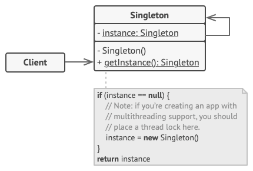

## Design Patterns Introduction and Singleton

## Scope / Agenda
* Intro to design pattern
* Singleton
  

## Problems and solutions

1. [Assignments]()
2. [Additional Problems]()
3. [Self Practise Problems]()

## Class Notes and Videos

1. [Class Notes](/Notes/class_Notes/LLD/Design%20Patterns/Introduction%20and%20Singleton.pdf)
2. [Class/Lecture Video](https://youtu.be/SSYSxvCmrQk)


## Intro to design pattern
### What is design patterns?
    Design patterns are typical solutions to commonly occurring problems in software design. They are like pre-made blueprints that you can customize to solve a recurring design problem in your code.

    In simple word, it is the solution of common problem across project in software industry.

### Why should I learn patterns?
* Design patterns are a toolkit of tried and tested solutions to common problems in software design. Even if you never encounter these problems, knowing patterns is still useful because it teaches you how to solve all sorts of problems using principles of object-oriented design.
* Design patterns define a common language that you and your teammates can use to communicate more efficiently. You can say, **“Oh, just use a Singleton for that,”** and everyone will understand the idea behind your suggestion. No need to explain what a singleton is if you know the pattern and its name.

### Classification of patterns
    Design patterns differ by their complexity, level of detail and scale of applicability to the entire system being designed.
* **Creational patterns** provide object creation mechanisms that increase flexibility and reuse of existing code.
* **Structural patterns** explain how to assemble objects and classes into larger structures, while keeping these structures flexible and efficient.

* **Behavioral patterns** take care of effective communication and the assignment of responsibilities between objects.
## Singleton
    Singleton is a creational design pattern that lets you ensure that a class has only one instance, while providing a global access point to this instance.
### Problem, which should be solved by singleton design pattern
> The Singleton pattern solves two problems at the same time, **violating the Single Responsibility Principle**
* Ensure that a class has just a single instance : Why would anyone want to control how many instances a class has? **The most common reason for this is to control access to some shared resource** for example, a database or a file.

* Provide a global access point to that instance : As of now we have global varible which fullfil the single instance requirement but it has other issue like anyone can change the value of global variable and it will break the code.
    
    **Just like a global variable, the Singleton pattern lets you access some object from anywhere in the program. However, it also protects that instance from being overwritten by other code.**

### Solution/Implemenation : How to achive above requirement
* Make the default constructor private, to prevent other objects from using the new operator with the Singleton class.
* Create a static creation method that acts as a constructor. Under the hood, this method calls the private constructor to create an object and saves it in a static field. All following calls to this method return the cached object.

### Structure


### Pro's and Con's
#### Pro's
* You can be sure that a class has only a single instance.
* You gain a global access point to that instance.
* The singleton object is initialized only when it’s requested for the first time.

#### Con's
*  Violates the Single Responsibility Principle. The pattern solves two problems at the time.
* The Singleton pattern can mask bad design, for instance, when the components of the program know too much about each other.
* The pattern requires special treatment in a multithreaded environment so that multiple threads won’t create a singleton object several times.
* It may be difficult to unit test the client code of the Singleton because many test frameworks rely on inheritance when producing mock objects. Since the constructor of the singleton class is private and overriding static methods is impossible in most languages, you will need to think of a creative way to mock the singleton. Or just don’t write the tests. Or don’t use the Singleton pattern.

### Single threaded Singleton
> It’s pretty easy to implement a sloppy Singleton. You just need to hide the constructor and implement a static creation method.
```java
public final class Singleton {
    private static Singleton instance;

    private Singleton() {
    }

    public static Singleton getInstance() {
        if (instance == null) {
            instance = new Singleton();
        }
        return instance;
    }
}
```
### Multithreaded singleton
> The same class behaves incorrectly in a multithreaded environment. Multiple threads can call the creation method simultaneously and get several instances of Singleton class.
```java
public final class Singleton {
    private static Singleton instance;

    private Singleton() {
    }

    public static Singleton getInstance() {
        if (instance == null) {
            instance = new Singleton();
        }
        return instance;
    }
}
```
### Thread-safe Singleton with lazy loading and double lock
```java
public final class Singleton {
    // The field must be declared volatile so that double check lock would work
    // correctly.
    private static volatile Singleton instance;

    private Singleton() {
    }

    public static Singleton getInstance() {
        // A local variable result is used to minimize the need to access the volatile field directly, improving performance by reducing synchronization overhead.
        Singleton result = instance;
        if (result != null) {
            return result;
        }
        synchronized(Singleton.class) {
            if (instance == null) {
                instance = new Singleton();
            }
            return instance;
        }
    }
}
```

### Thread-safe Singleton with lazy loading and double lock without extra local variable
```java
public final class Singleton {
    // The field must be declared volatile so that double check lock would work
    // correctly.
    private static volatile Singleton instance;

    private Singleton() {
    }

    public static Singleton getInstance() {
        // First check without synchronization
        if (instance != null) {
            return instance;
        }
        // Synchronization block to create instance
        synchronized (Singleton.class) {
            // Second check within synchronized block
            if (instance == null) {
                instance = new Singleton();
            }
        }
        return instance;
    }
}
```