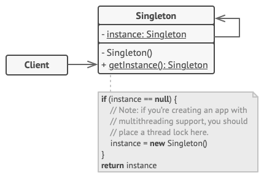

---

# 🧰 Design Patterns Introduction and Singleton

---

## 📚 Scope / Agenda

* Intro to design pattern
* Singleton

---

## 📒 Class Notes and Videos

1. [📄 Class Notes](/Notes/class_Notes/LLD/Design%20Patterns/Introduction%20and%20Singleton.pdf)
2. [🎥 Class/Lecture Video](https://youtu.be/SSYSxvCmrQk)

---

## 💡 Intro to Design Pattern

### ❓ What is a Design Pattern?

> Design patterns are typical solutions to commonly occurring problems in software design.
> They are like pre-made blueprints that you can customize to solve a recurring design problem in your code.

In simple words: **It is the solution to common problems across projects in the software industry.**

---

### 🧠 Why Should I Learn Patterns?

* Design patterns are a toolkit of tried and tested solutions to common problems in software design.
* Even if you never encounter these problems directly, knowing patterns teaches good principles of object-oriented design.
* Patterns define a **common language** between developers.
  You can say, *“Just use a Singleton for that,”* and everyone understands.

---

### 🧱 Classification of Patterns

Design patterns differ by their complexity, level of detail, and scope.

* **Creational Patterns** – Object creation mechanisms that increase flexibility and reuse.
* **Structural Patterns** – Help assemble objects and classes into larger, flexible structures.
* **Behavioral Patterns** – Manage communication and responsibilities among objects.

---

## 🔂 Singleton Pattern

> Singleton is a **Creational Design Pattern** that ensures a class has only one instance, and provides a global access point to it.

---

### 🧩 Problems Solved by Singleton

The Singleton pattern addresses two key issues:

1. **Ensure that a class has only one instance**

   * Useful when controlling access to shared resources like a database or file.

2. **Provide a global access point**

   * Acts like a global variable, but safely controls access and avoids unwanted overwrites.

---

### 🛠️ Implementation Strategy

To achieve this:

* Make the constructor `private`.
* Create a static method that returns the instance.
* Store the instance in a static field.

---

### 🧱 Structure



---

### ✅ Pros and ❌ Cons

#### ✅ Pros

* Guarantees only a single instance.
* Provides global access to that instance.
* Lazy initialization is possible.

#### ❌ Cons

* Violates **Single Responsibility Principle** by solving two problems at once.
* Can hide bad design where too many components know about each other.
* Needs care in multithreaded environments.
* Difficult to unit test due to private constructor and static access.

---

## 👨‍💻 Code Implementations

### 🔹 Single-threaded Singleton (Not Thread-Safe)

```java
public final class Singleton {
    private static Singleton instance;

    private Singleton() {
    }

    public static Singleton getInstance() {
        if (instance == null) {
            instance = new Singleton();
        }
        return instance;
    }
}
```

---

### 🔸 Multithreaded Version (Still Not Thread-Safe)

```java
public final class Singleton {
    private static Singleton instance;

    private Singleton() {
    }

    public static Singleton getInstance() {
        if (instance == null) {
            instance = new Singleton();
        }
        return instance;
    }
}
```

---

### 🧵 Thread-safe with Lazy Loading (Double-Checked Locking)

```java
public final class Singleton {
    private static volatile Singleton instance;

    private Singleton() {
    }

    public static Singleton getInstance() {
        Singleton result = instance;
        if (result != null) {
            return result;
        }
        synchronized (Singleton.class) {
            if (instance == null) {
                instance = new Singleton();
            }
            return instance;
        }
    }
}
```

---

### 🔒 Thread-safe Double-Checked Locking (Without Local Variable)

```java
public final class Singleton {
    private static volatile Singleton instance;

    private Singleton() {
    }

    public static Singleton getInstance() {
        if (instance != null) {
            return instance;
        }
        synchronized (Singleton.class) {
            if (instance == null) {
                instance = new Singleton();
            }
        }
        return instance;
    }
}
```

---

### 🧙 Bill Pugh Singleton using Static Inner Class

```java
public class Singleton {

    // Private constructor to prevent instantiation
    private Singleton() {
        System.out.println("Singleton instance created");
    }

    // Static nested class - loaded only when referenced
    private static class SingletonHelper {
        private static final Singleton INSTANCE = new Singleton();
    }

    // Global access point
    public static Singleton getInstance() {
        return SingletonHelper.INSTANCE;
    }
}
```

#### 🔍 Key Points

* `SingletonHelper` is not loaded until `getInstance()` is called.
* ✅ Lazy-loaded
* ✅ Thread-safe
* ✅ No synchronization needed
* 🔁 Singleton instance is created only when required.

---

### 🧾 Enum Singleton

```java
public enum EnumSingleton {
    INSTANCE;

    public void additionalMethod() {
        System.out.println("Doing something with EnumSingleton");
    }
}
```

#### 🔍 Key Points

* 🔒 **Thread-safe by default** — Enums ensure only one instance, no `synchronized` blocks needed.
* 🛡️ **Serialization-safe** — Enum prevents instance duplication during deserialization.
* 🧪 **Reflection-proof** — Enum types can’t be instantiated via reflection.
* 📘 **Recommended by Joshua Bloch** — Author of *Effective Java*.

---

