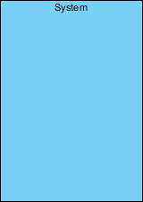
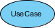

## UML Diagrams

## Scope / Agenda
* [Introduction to UML](#introduction-to-uml)
* [Classification of UML](#classification-of-uml)
* [Structural UML](#structural-uml)
* [Behavioral UML](#behavioral-uml)

## Reference
* [UML Org](https://www.uml-diagrams.org/)
  

## Problems and solutions

1. [Assignments]()
2. [Additional Problems]()
3. [Self Practise Problems]()

## Class Notes and Videos

1. [Class Notes]()
2. [Class/Lecture Video](https://youtu.be/iTql32hZEz4)

## Introduction to UML
    A UML diagram is a partial graphical representation (view) of a model of a system under design, implementation, or already in existence. UML diagram contains graphical elements (symbols) - UML nodes connected with edges (also known as paths or flows) - that represent elements in the UML model of the designed system. The UML model of the system might also contain other documentation such as use cases written as templated texts.
## Classification of UML
    UML specification defines two major kinds of UML diagram: structure diagrams and behavior diagrams.

## Structural UML
**Structure diagrams** show the static structure of the system and its parts on different abstraction and implementation levels and how they are related to each other. The elements in a structure diagram represent the meaningful concepts of a system, and may include abstract, real world and implementation concepts.

### Some of the important diagram of Structural UML
* Class Diagram
* Package Diagram
* Object Diagram
* Component Diagram

## Behavioral UML
**Behavior diagrams** show the dynamic behavior of the objects in a system, which can be described as a series of changes to the system over time.
### Some of the important diagram of Behavioral UML
* Activity Diagram
* Use case Diagram
* Sequence Diagram

### Class Diagram
    A class diagram is a type of static structure diagram used in software engineering to describe the structure of a system by showing the system's classes, their attributes, methods, and the relationships between the classes.

### Use case diagram
> Use case diagrams are typically developed in the early stage of development and people often apply use case modeling for the following purposes:

* Specify the context of a system
* Capture the requirements of a system
* Validate a systems architecture
* Drive implementation and generate test cases
* Developed by analysts together with domain experts
### keywords
* **System Boundary** : Scope of the system / Limitation of the system
> it does not include any third party functionality.

* **Use case** : Behaviour or functionality of the system
> Represented  by oval shape
> * System function (process - automated or manual)
> * Named by verb + Noun (or Noun Phrase). i.e. Do something
> * Each Actor must be linked to a use case, while some use cases may not be linked to actors.

* **Actor** : User of the system
> Represented by Stick diagram, an action will be shown as action from actor to use case
* **Incldues** : One use case dependent on other use case to complete its action.
> Parent use should include child use case if it is depend on any. It means parent use case is dependent on child use case to complete its duty. 
* **Extension** : When a use case has multiple options to perform its work.
> It represent as an arrow from options to use case and added extends as label of arrow.
* **Generalization** : A generalization relationship is a parent-child relationship between use cases.
> * The child use case is an enhancement of the parent use case.
> * Generalization is shown as a directed arrow with a triangle arrowhead.
> * The child use case is connected at the base of the arrow. The tip of the arrow is connected to the parent use case.